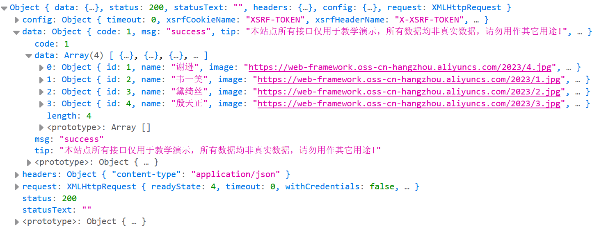
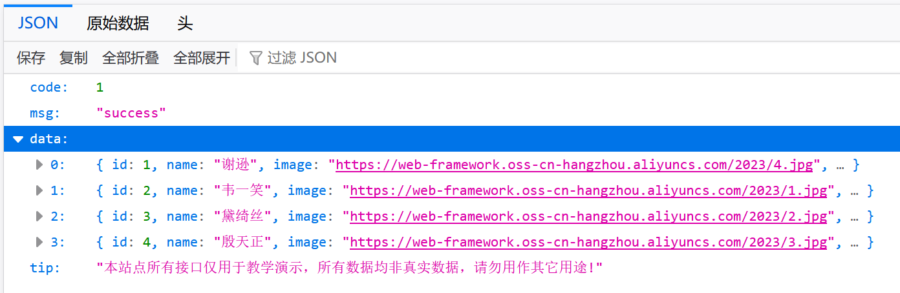

## 1. Ajax 简介

Ajax 是一种**异步**通信方式，能够与服务器端交换数据

注：异步是指服务器端在处理浏览器发来的请求的过程中，浏览器页面可以继续做其他的操作；同步则是指服务器在处理请求时，浏览器只能等待服务器处理结束并返还数据后，才能继续做其他的操作

Axios 是一种简单的发送 Ajax 请求的技术

引入 Axios 的代码：

```JavaScript
<srcipt src="https://unpkg.com/axios/dist/axios.min.js"></srcipt>
```

下面是一段通过 Axios 向服务器端发送 GET / POST请求的代码：

```JavaScript
// GET
document.querySelector("#btn1").addEventListener('click', () => {
    axios({
        url: 'https://mock.apifox.cn/m1/3083103-0-default/emps/update', // 发送到服务器端的地址
        method: "GET" // 使用 GET 方法
    }).then((result) => {
        console.log(result) // 成功回调函数
    }).catch((err) => {
        console.log(err) // 失败回调函数
    })
})

// POST
document.querySelector("#btn1").addEventListener('click', () => {
    axios({
        url: 'https://mock.apifox.cn/m1/3083103-0-default/emps/update', // 发送到服务器端的地址
        method: "POST" // 使用 GET 方法
        data: 'id=1' //请求体中携带的数据
    }).then((result) => {
        console.log(result) // 成功回调函数
    }).catch((err) => {
        console.log(err) // 失败回调函数
    })
})
```

这里使用了 JS 中处理 click 交互的方法`addEventListener`，其中`click`表示用户的操作

成功回调函数：请求成功则执行；失败回调函数：请求失败时执行

axios 部分还可以简写如下：

```JavaScript
// GET
axios.get('https://mock.apifox.cn/m1/3083103-0-default/emps/update').then((result) => {
    console.log(result)
}).catch((err) => {
    console.log(err)
})

// POST
axios.post('https://mock.apifox.cn/m1/3083103-0-default/emps/update', 'id=1').then((result) => {
    console.log(result)
}).catch((err) => {
    console.log(err)
})
```

注：`then().catch()` 部分可简写为`thenc`，Vscode会自动弹出

## 2. Ajax 请求案例

```JavaScript
<script type="module">
    import {createApp} from 'https://unpkg.com/vue@3/dist/vue.esm-browser.js'
    createApp({
        data(){
            return{
                searchForm: {
                    name: '',
                    gender: '',
                    job: ''
                },
                empList: []
            }
        },
        methods: {
            search(){
                axios.get(`https://web-server.itheima.net/emps/list?name=${this.searchForm.name}&gender=${this.searchForm.gender}&job=${this.searchForm.job}`).then((result) => {
                    this.empList = result.data.data
                }).catch((err) => {
                    alert("GET请求失败")
                });
            },
            clear(){
                this.searchForm = {
                    name: '',
                    gender: '',
                    job: ''
                }
                this.search()
            }
        }
    }).mount("#container")
</script>
```

在上段代码中，当前 Vue 实例的 search 方法和“查询”按钮相互绑定。当用户点击查询按钮时，search 方法被调用，向服务器发送请求。请求的内容为模板表达式中的内容，包含了 name, gender, job 等查询字段

值得注意的是`this.empList = result.data.data`，result 是服务器返回的对象，包含了 data, status, headers, statusText 等属性，其中result 和 result.data 内容如下：


<p style="text-align: center">图1. result的内容</p>


<p style="text-align: center">图2. result.data的内容</p>

而我们要获取的是其中的 data 字段，因此将当前实例下的 empList 赋值为 result.data.data

## 3. 异步变同步：async & await

`aysnc`和`await`能够让异步操作变为同步操作，让代码从上到下按顺序执行，增强代码的可维护性

`async`用来声明异步操作，`await`用于让异步操作等待服务器端返回数据

```JavaScript
createApp({
    data(){...},
    methods: {
        async search(){
            let result = await axios.get('target_url') // 无需成功回调函数
            this.empList = result.data.data
        }
    }
}).mount("#container")
```

## 4. Vue 的生命周期/钩子方法

Vue 有八个生命周期，如下表所示

<table center id="vue-table">
    <thead center>
        <tr>
            <th>阶段周期</th>
            <th>状态/钩子方法</th>
        </tr>
    </thead>
    <tbody center>
        <tr>
            <td>beforCreate</td>
            <td>创建前</td>
        </tr>
        <tr>
            <td>created</td>
            <td>创建后</td>
        </tr>
        <tr>
            <td>beforeMount</td>
            <td>挂载前</td>
        </tr>
        <tr>
            <td>mounted</td>
            <td>挂载完成</td>
        </tr>
        <tr>
            <td>beforUpdate</td>
            <td>数据更新前</td>
        </tr>
        <tr>
            <td>updated</td>
            <td>数据更新后</td>
        </tr>
        <tr>
            <td>beforeUnmount</td>
            <td>组件销毁前</td>
        </tr>
        <tr>
            <td>unmounted</td>
            <td>组件销毁后</td>
        </tr>
    </tbody>
</table>

每触发一个生命周期时间，系统会自动执行对应的钩子方法，需要重点关注的是`mounted`

`mounted`钩子方法在挂载完成后触发，可通过下面的代码在一开始就展示所有的数据：

```JavaScript
createApp({
    data(){...},
    methods: {
        async search(){
            let res = awit axios.get('target_url')
            this.empList = res.data.data
        }
    },
    mounted(){
        this.search()
    }
}).mount("#container")
```

注意：`mounted`方法要和`data`，`methods`在同一级别