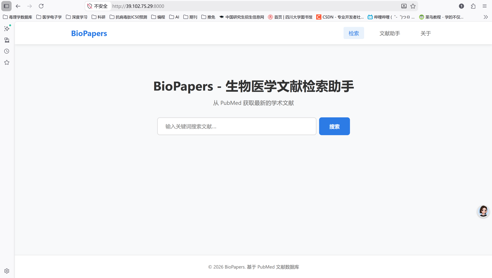
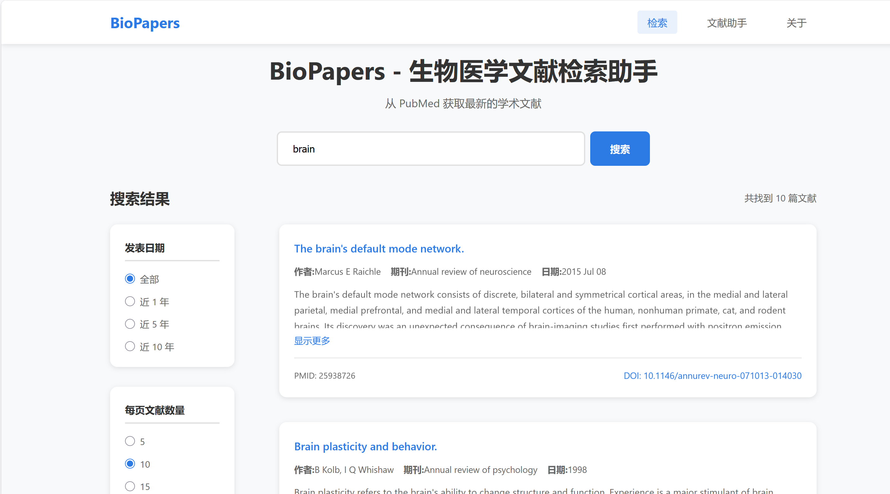
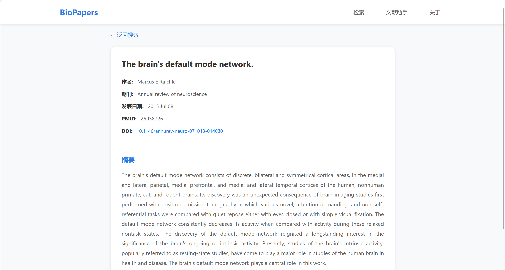
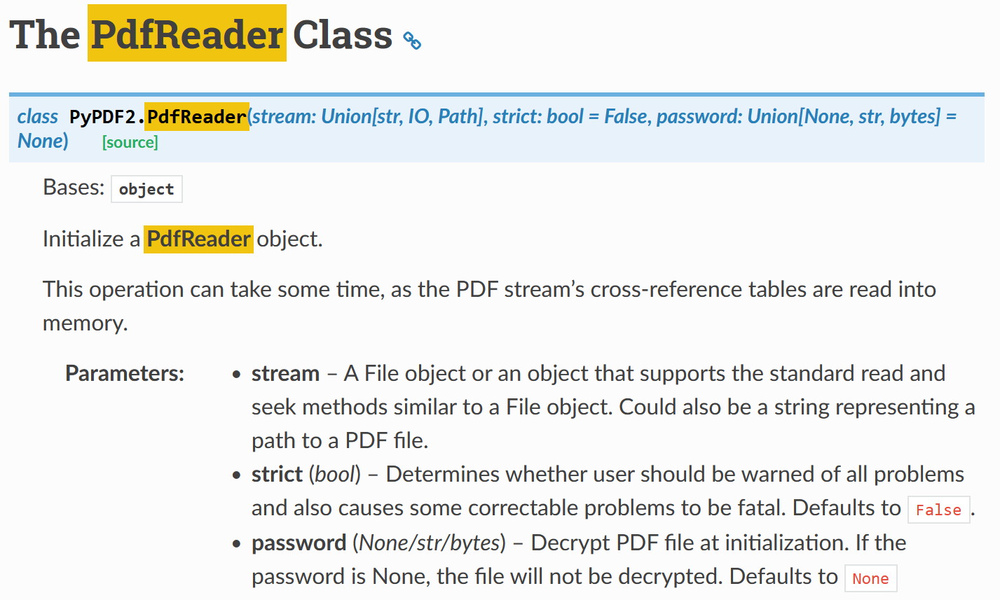
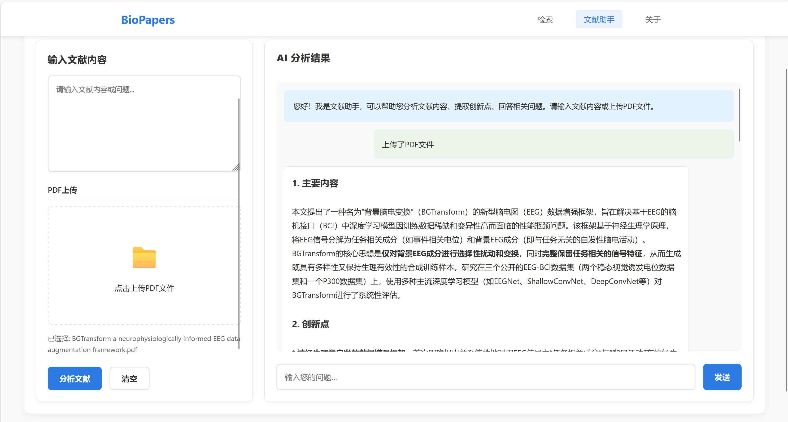
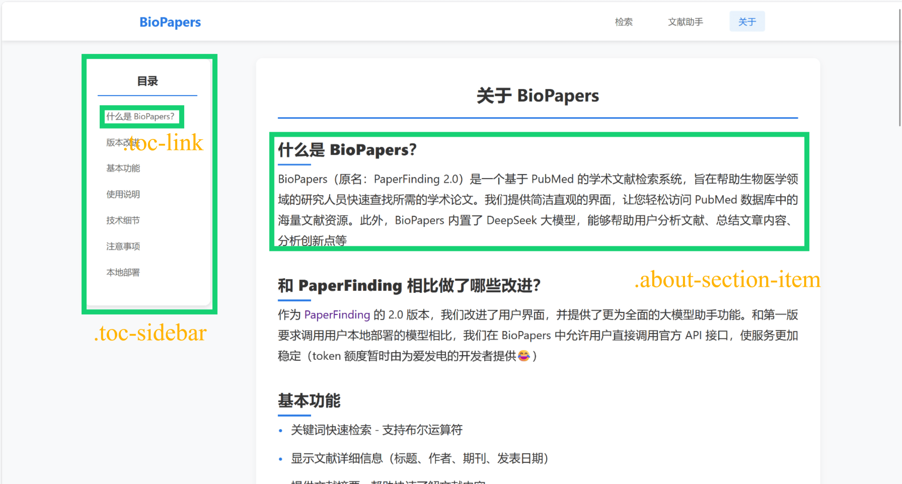
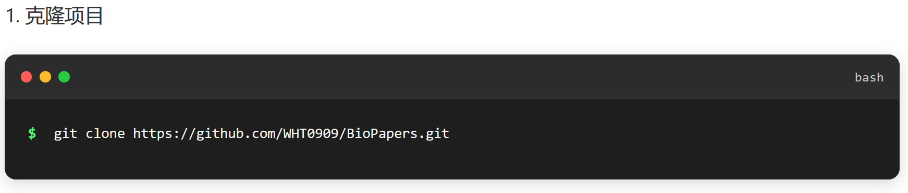

import { Aside } from 'astro-pure/user'

<font size="2">封面画作：Peter Brown ***December Morning, The Brazen Head, Glasgow***</font>

<br/>
<br/>

前段时间正好有空，就想着把上个暑假开发的项目（PaperFinding）更新一下，再重做一版。编写完代码后，我在阿里云租了一台2核2G的轻量级服务器，成功部署了项目。这台服务器即将到期，出于费用原因不再续费（1个月四十五块钱，不是很划算）。于是写一篇博客记录一下BioPapers的一些技术细节、部署方法等，可以当做项目的README文档，也可以作为一个网页开发的技术指南。

github链接：[BioPapers](https://github.com/WHT0909/BioPapers)

## 1. 项目初衷

BioPapers的前身是[PaperFinding](https://github.com/WHT0909/PaperFinding)，完成于2025年8月。当时刚完成保研夏令营的一堆琐事，度过了一段还算是清闲的时光。PaperFinding的功能很简单：做一个类似于PubMed的主界面，通过调用PubMed提供的api接口获取文献信息，以卡片形式展示。用户点击文献卡片就能跳转到文献详情页面，展示文献作者、摘要等信息。和PubMed不同的是，我在文献详情页面加入了一个大模型文献助手。文献助手能够帮助用户分析文献内容、创新点等，还可以和用户互动回答问题。作为一个Vibe Coding的产物（我的代码功底确实很有限），借助AI便能够完成其中大部分的功能。在一切正常进行的时候，大模型的部署出现了一点问题，卡住了很久。我当时的想法是去阿里云的某个api平台（好像是火山引擎，不太记得了）调用大模型，但搞了好几天一直报错。最后没办法，我在本地借助ollama部署了一个0.2B的deepseek，勉强实现了需求。本地部署暴露的问题很明显：如果我想在服务器上部署这个项目，要连着模型文件一起打包进去，文件大小剧增；如果用户想要本地部署我的项目，还要自己准备一个大模型，流程非常复杂。由于这些问题的存在，PaperFinding的可利用性大大降低，只能当作玩具了。再后来我忙于保研，就没再完善这个项目。

BioPapers的部分灵感来源于一次和朋友（下文用他的姓名首字母M代替）的聊天。那天我正在和M等三个朋友打麻将，M提到他前几天开发了一个用deepseek自动分析文献的网站，能并行地分析很多个pdf。提及具体的代码实现，M说deepseek的官网就提供了api服务。受此启发，我修改了BioPapers的api源头，从阿里云改到了deepseek。又考虑到我只从PubMed的文献数据库中获取文章，就把项目改名为了BioPapers。

## 2. 构思与实现

BioPapers要完成三个页面：**文献检索页（主页面）、大模型文献助手页和项目介绍页（About）**。

BioPapers的大部分代码都由AI完成。我发现AI在前端页面的设计上还是很不错的，能完成绝大部分需求。剩下的部分，如卡片间距、布局等只需要微调即可。我通常使用浏览器的开发者模式（F12）微调页面，用鼠标选中要微调的盒子模型，改改间距什么的，非常方便。

在PaperFinding中，我使用html+css+Js的传统组合搭建前端页面，用Python Flask框架构建后端。这次我使用Python FastAPI作为后端框架。据官方文档说FastAPI是目前最快的框架之一。而且FastAPI和Flask比较像，应该相对容易上手。

### 2.1 文献检索页

文献检索页的功能如下：用户在检索框输入关键词，点击查询按钮，等待片刻在主页面显示文章卡片。点击文章卡片时，跳转到文献详情页面，展示作者、发表年份、摘要等信息。点击按钮触发事件的这部分肯定是交给JS了。核心的问题是如何获取并展示文献。好在NCBI提供了Entrez库，里面给了PubMed文献的api接口。Entrez的部分函数介绍可以看这篇文章：[Biopython从入门到精通之Entrez:esearch,efetch和elink](https://zhuanlan.zhihu.com/p/619251748)。我这里用了两个比较关键的函数：`Entrez.esearch`和`Entrez.efetch`。涉及到的部分代码如下：

```python
handle = Entrez.esearch(
    db="pubmed",
    term=query,
    retmax=max_results,
    retstart=start,
    sort="relevance",
    retmode="xml",
    api_key=PUBMED_API_KEY
)

record = Entrez.read(handle)
handle.close()
```

这段代码写在`search_pubmed`函数里，目标是获取文章的pmid。在此之前，我定义了两个类：一个是*Article*，用来存储文章信息，包括pmid、标题、作者等；一个是*SearchResult*，它是一个包含了一堆*Article*的列表。上面代码里获取的record是一个包含了pmid和一些其他信息的字典。通过解析record，我们就获取到了关键的pmid。

```python
handle = Entrez.efetch(
    db="pubmed",
    id=",".join(pmids),
    rettype="xml",
    retmode="xml",
    api_key=PUBMED_API_KEY
)

records = Entrez.read(handle)
handle.close()
```

这段代码的目的是获取文章的具体信息。我们已经有了每篇文献唯一的标识符pmid，可以用它获取具体内容了。在后续的代码中，我们只需要把需要的信息写在*Article*类里面，在前端页面上解析并显示就可以了。

剩下的的功能比较琐碎，像翻页、每页显示的文献数量、按时间筛选等。但只要有了文献的具体信息，按规则筛选就是件很容易的事了，我选择全部交给AI😂

展示几张效果图吧~


<p style="text-align: center;font-size: 15px">检索页</p>


<p style="text-align: center;font-size: 15px">查询结果</p>


<p style="text-align: center;font-size: 15px">文献详情</p>

### 2.2 大模型文献助手页

这部分基于[LangChain](https://langchain-doc.cn/)框架调用deepseek大模型，api从[deepseek开放平台](https://platform.deepseek.com/usage)获取。LangChain是比较主流的大模型框架了，提供了非常多的常用接口。文献助手的功能分为三个部分：**根据用户提供的文本分析、根据pdf分析和对话（Chat）**。

首先是文本分析。这部分的逻辑是：先检查用户有没有配置deepseek api key，如果没有的话自然就用不了这个功能了（在我的网站上，api key由本人提供）。在分析文本之前需要先设置一些提示词（prompt），帮助用户分析文章内容、创新点等（现在看到创新点这个词都有点PTSD了）。再构建LangChain调用链，把提示词和文本内容拼起来喂给大模型。大模型返回的内容是一个*AnalysisResponse*对象，类型是字符串。代码展示如下：

```python
@app.post("/api/assistant/analyze-text", response_model=AnalysisResponse)
async def analyze_text(request: TextAnalysisRequest):
    if not llm:
        raise HTTPException(status_code=500, detail="DeepSeek API key not configured")
    
    try:
        prompt = ChatPromptTemplate.from_template("""
        你是一个专业的文献分析助手，请分析以下文献内容，总结其主要内容、创新点、研究方法和结论。
        
        文献内容：
        {text}
        
        请按照以下结构输出分析结果：
        1. 主要内容
        2. 创新点
        3. 研究方法
        4. 结论
        5. 潜在的研究方向
        """)
        
        chain = prompt | llm
        response = chain.invoke({"text": request.text})
        
        return AnalysisResponse(response=response.content)
    except Exception as e:
        print(f"Analysis error: {e}")
        raise HTTPException(status_code=500, detail="分析失败，请稍后重试")
```

这里有一个有意思的LangChain语法：`chain = prompt | llm`。在LangChain中，上面代码里的`llm`、`chain`都是*Runnable*类型。根据[LangChain官方文档](https://reference.langchain.org.cn/python/langchain_core/runnables/)的说法，“Runnable是一个可以被调用、批量处理、流式传输、转换和组合的工作单元”。`|`运算符起到串联的作用，将前一个*Runnable*的输出作为后一个*Runnable*的输入。关于LangChain的链式调用规则可以看这篇博客<a href="#ref1">[1]</a>。

<Aside type="tip">
[invoke 方法](https://github.langchain.ac.cn/langgraph/agents/run_agents/#input-format)

invoke 用于可调用对象（比如LLM）的执行操作。它的输入是一个包含message的消息字典，输出是一个包含执行期间交换的所有消息列表（用户输入、助手回复、工具调用）等信息的字典。
</Aside>

pdf分析也很类似，只不过多了一个读取pdf内容的环节。这里通过*PyPDF2.PdfReader*实现。首先使用fastapi提供的*UploadFile*接收用户上传的文件。根据[fastapi官方文档](https://fastapi.org.cn/reference/uploadfile/#fastapi.UploadFile.headers)，*UploadFile*类的read方法从文件中读取的是字节数据。那么*PyPDF2.PdfReader*类在初始化时需要什么样的参数呢？我又去查看了[*PyPDF2.PdfReader*的相关文档](https://pypdf2.readthedocs.io/en/3.x/modules/PdfReader.html#PyPDF2.PdfReader)，如下图：


<p style="text-align: center;font-size: 15px">PyPDF2.PdfReader</p>

可以看到，参数中包括一个*stream*。翻译过来就是：他需要“一个File对象，或一个支持与File对象类似的标准读取和定位方法的对象。也可以是一个表示PDF文件路径的字符串”。也就是说，他需要一个类似于文件流的参数，能让*PyPDF2.PdfReader*对象进行读取操作。这就是使用`io.BytesIO(content)`的原因了！简单来说，`io.BytesIO(content)`可以把这些字节拼起来，伪装成一个内存里的文件，这样就能够读取了。

```python
@app.post("/api/assistant/analyze-pdf", response_model=AnalysisResponse)
async def analyze_pdf(file: UploadFile = File(...)):
    if not llm:
        raise HTTPException(status_code=500, detail="DeepSeek API key not configured")
    
    try:
        # 读取PDF文件
        content = await file.read()
        pdf_reader = PyPDF2.PdfReader(io.BytesIO(content))
        
        # 提取文本
        text = ""
        for page_num in range(len(pdf_reader.pages)):
            page = pdf_reader.pages[page_num]
            text += page.extract_text()
        
        if not text:
            raise HTTPException(status_code=400, detail="无法从PDF中提取文本")
        
        # 分析文本
        prompt = ChatPromptTemplate.from_template("""
        你是一个专业的文献分析助手，请分析以下PDF文献内容，总结其主要内容、创新点、研究方法和结论。
        
        文献内容：
        {text}
        
        请按照以下结构输出分析结果：
        1. 主要内容
        2. 创新点
        3. 研究方法
        4. 结论
        5. 潜在的研究方向
        """)
        
        chain = prompt | llm
        response = chain.invoke({"text": text})
        
        return AnalysisResponse(response=response.content)
    except Exception as e:
        print(f"PDF analysis error: {e}")
        raise HTTPException(status_code=500, detail="PDF分析失败，请稍后重试")
```

最后是文献对话。文献对话的逻辑是：要让LLM记住对话历史，当用户提问时，把对话历史和用户新提出的问题拼接到一起进行思考，进而给出回答。也就是说，我们需要一个消息列表存储对话，还要区分每段对话是人类（用户）说的还是AI（LLM）说的。这就涉及到两个类：*HumanMessage*和*AIMessage*。在构建好列表时候，我们只需要使用invoke方法传递给模型即可。

```python
@app.post("/api/assistant/chat", response_model=AnalysisResponse)
async def chat(request: ChatRequest):
    if not llm:
        raise HTTPException(status_code=500, detail="DeepSeek API key not configured")
    
    try:
        # 构建对话历史
        messages = []
        for msg in request.history:
            if msg["role"] == "user":
                messages.append(HumanMessage(content=msg["content"]))
            elif msg["role"] == "assistant":
                messages.append(AIMessage(content=msg["content"]))
        
        # 添加当前消息
        messages.append(HumanMessage(content=request.message))
        
        # 生成回复
        response = llm.invoke(messages)
        
        return AnalysisResponse(response=response.content)
    except Exception as e:
        print(f"Chat error: {e}")
        raise HTTPException(status_code=500, detail="对话失败，请稍后重试")
```

展示一下成果吧~


<p style="text-align: center;font-size: 15px">LLM对话</p>

### 2.3 项目介绍页

这个页面用来介绍一下整个BioPapers项目，包括用法、技术栈、模型版本等。我想在这里完成三个功能：
- 在左侧设置一个随页面滑动条滚动的目录
- 读到哪个章节，目录对应位置高亮
- 点击目录上的章节，右侧页面自动跳转

这些功能主要通过JavaScript实现。和AI对话多轮，终于达成了我想要的效果。一起看看代码吧：

```javascript
document.addEventListener('DOMContentLoaded', function() {
    const tocLinks = document.querySelectorAll('.toc-link');
    const sections = document.querySelectorAll('.about-section-item');
    const tocSidebar = document.querySelector('.toc-sidebar');
    
    function setActiveLink() {
        let currentSection = '';
        
        sections.forEach(section => {
            const sectionTop = section.offsetTop - 100;
            const sectionHeight = section.offsetHeight;
            
            if (window.scrollY >= sectionTop && window.scrollY < sectionTop + sectionHeight) {
                currentSection = section.getAttribute('id');
            }
        });
        
        tocLinks.forEach(link => {
            link.classList.remove('active');
            if (link.getAttribute('href') === '#' + currentSection) {
                link.classList.add('active');
            }
        });
    }
    
    tocLinks.forEach(link => {
        link.addEventListener('click', function(e) {
            e.preventDefault();
            const targetId = this.getAttribute('href');
            const targetSection = document.querySelector(targetId);
            
            if (targetSection) {
                const offsetTop = targetSection.offsetTop - 80;
                window.scrollTo({
                    top: offsetTop,
                    behavior: 'smooth'
                });
            }
        });
    });
    
    window.addEventListener('scroll', function() {
        setActiveLink();
    });
    
    setActiveLink();
});
```

总觉得JS这门语言怪怪的，和常规的C、C++、Python这些编程语言的写法不太一样。特别是这个匿名函数满天飞，看得非常不习惯。代码逻辑如下：首先要获取页面上的三个类：`.toc-link`、`.about-section-item`、`.toc-sidebar`。这三个类代表的组件如下图：


<p style="text-align: center;font-size: 15px">项目介绍页</p>

遍历每个`.about-section-item`组件，检测每个section和页面滚动条的相对位置。如果当前滚动条的位置在章节的顶部和底部之间，就认为正在阅读该章节。获取该章节的id，修改左侧目录对应位置的css样式，改为*active*（需要提前在style.css中写好高亮样式*active*）。至于点击目录跳转，只需要监听用户的*click*事件，找到对应的章节id就可以了。

这里还实现了一个类似于Mac风格的代码块样式：
```css
/* Bash Terminal Styles */
.bash-terminal {
    background-color: #1e1e1e;
    border-radius: 12px;
    overflow: hidden;
    box-shadow: var(--shadow-hover);
    margin: 1.5rem 0;
    border: 1px solid #333;
}

.terminal-header {
    background-color: #2c2c2c;
    padding: 0.75rem 1rem;
    display: flex;
    align-items: center;
    justify-content: space-between;
    border-bottom: 1px solid #444;
}

.terminal-buttons {
    display: flex;
    gap: 0.5rem;
}

.terminal-buttons .button {
    width: 12px;
    height: 12px;
    border-radius: 50%;
    display: inline-block;
}

.terminal-buttons .button.close {
    background-color: #ff5f57;
}

.terminal-buttons .button.minimize {
    background-color: #ffbd2e;
}

.terminal-buttons .button.maximize {
    background-color: #28ca42;
}

.terminal-title {
    color: #cccccc;
    font-size: 0.875rem;
    font-weight: 500;
    font-family: 'Consolas', 'Monaco', 'Courier New', monospace;
}

.terminal-body {
    padding: 1.5rem;
    font-family: 'Consolas', 'Monaco', 'Courier New', monospace;
    font-size: 0.95rem;
    line-height: 1.6;
    color: #f8f8f2;
}

.command-line {
    margin-bottom: 0.75rem;
    display: flex;
    align-items: center;
    gap: 0.75rem;
}

.prompt {
    color: #50fa7b;
    font-weight: 600;
    min-width: 15px;
}

.command {
    color: #f8f8f2;
    white-space: pre-wrap;
    word-break: break-all;
}
```

```html
<p class="section-content">1. 克隆项目</p>
<div class="bash-terminal">
    <div class="terminal-header">
        <div class="terminal-buttons">
            <span class="button close"></span>
            <span class="button minimize"></span>
            <span class="button maximize"></span>
        </div>
        <div class="terminal-title">bash</div>
    </div>
    <div class="terminal-body">
        <div class="command-line">
            <span class="prompt">$</span>
            <span class="command">git clone https://github.com/WHT0909/BioPapers.git</span>
        </div>
    </div>
</div>
```

效果如下：


<p style="text-align: center;font-size: 15px">Mac风格代码块</p>

最后简单提一下这个项目怎么启动吧：

```bash
uvicorn main:app --host 0.0.0.0 --port 8000
```

## 3. 功能展示

放个视频展示一下BioPapers的功能~

<video controls width="100%" preload="metadata">
  <source src="/biopapers_video.mp4" type="video/mp4" />
  您的浏览器无法播放视频，请检查文件是否存在。
</video>

## 4. 总结

BioPapers是一个融合了大模型问答助手的文献检索系统，能够帮助用户快速掌握文献内容。整个系统还存在一些问题，比如NCBI的服务器在境外，导致检索的速度很慢；deepseek的思考时间较长等。如果我有时间的话会再优化一下这个项目。感兴趣的话就在github上star一下吧😊~


其他参考文献：

[1] <a id="ref1" href="https://juejin.cn/post/7588092534163111936" target="_blank">【LangChain学习笔记】链式调用</a>