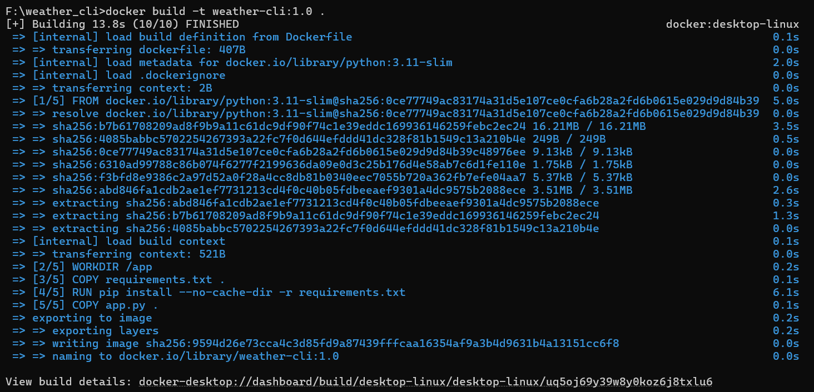
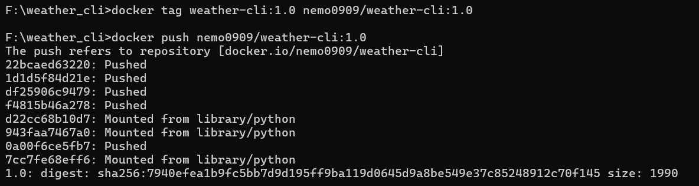
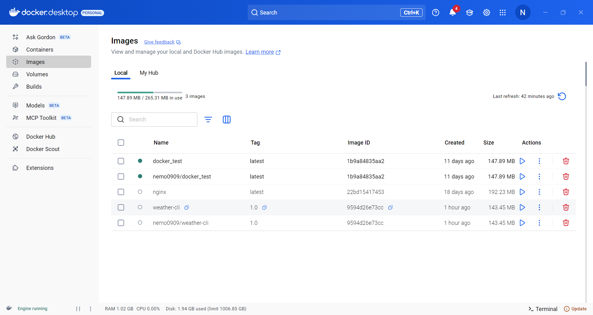
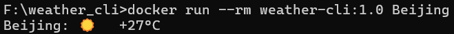

本文参考了以下文章 / 资源，如有侵权请联系作者，作者将立刻删除：

- [40分钟的Docker实战攻略，一期视频精通Docker](https://www.bilibili.com/video/BV1THKyzBER6/?spm_id_from=333.337.search-card.all.click&amp;vd_source=0ea0c7956df75b2935422822b2001158)

- [深度学习入门老司机必备，利用Docker快速构建深度学习镜像，实现开箱即用的深度学习环境](https://www.bilibili.com/video/BV18Ztme2E1u/?spm_id_from=333.337.search-card.all.click&amp;vd_source=0ea0c7956df75b2935422822b2001158)

作者在搭建机器学习实验环境时，常遇到这样的问题：通常情况下本地需要搭建一个环境，调试代码能否正常运行；而真正的计算过程往往在服务器上进行，又需要搭一次环境，并不便捷而且增加了时间成本；而且有时会忘记搭建过程中的某些细节（如版本号对应等）导致各种报错。Docker 就提供了一种这样的部署方式：只需在本地搭建一次环境，在其他机器上运行时，可以直接“获取”这个环境并运行，非常的方便。这就是这篇笔记要解决的问题。

## 1. 什么是 Docker

Docker 是一种通过容器化技术，为应用程序封装独立的运行环境，每个运行环境就是一个**容器**，运行容器的计算机称为**宿主机**

**镜像**是容器的模板，镜像和容器的关系类似于用模具（镜像）做糕点（容器）

**Docker 仓库**是用来保存、分享镜像的地方，Docker 的官方仓库是 Docker hub

## 2. 准备项目文件

我们以一个 Python 项目为例，将其封装为一个镜像，项目结构如下： 

```bash
weather_cli/
├── app.py
├── requirements.txt
└── Dockerfile
```

这个项目的功能是：获取某个城市的天气

app.py 文件内容如下：

```python
import requests
import sys

def get_weather(city: str) -> None:
    url = f"https://wttr.in/{city}?format=3"
    try:
        r = requests.get(url, timeout=10)
        r.raise_for_status()
        print(r.text.strip())
    except Exception as e:
        print("获取天气失败:", e, file=sys.stderr)

if __name__ == "__main__":
    city = sys.argv[1] if len(sys.argv) > 1 else "Beijing"
    get_weather(city)
```

requirements.txt 文件内容如下：
```txt
requests==2.31.0
```

除了项目文件外，还需要一个 Dockerfile 文件，Dockerfile 描述了镜像的具体构建过程，计算机通过执行该文件内容构建镜像

Dockerfile 内容如下： 

```Dockerfile
# 使用官方 Python 3.11 运行镜像作为基础
FROM python:3.11-slim

# 设置工作目录
WORKDIR /app

# 先把 requirements 复制进去，利用缓存
COPY requirements.txt .

# 安装依赖
RUN pip install --no-cache-dir -r requirements.txt

# 复制应用代码
COPY app.py .

# 容器启动时执行的命令
ENTRYPOINT ["python", "app.py"]
```

## 3. 构建镜像

cd 到项目文件夹中，使用以下指令构建镜像
```bash
docker build [OPTIONS] PATH | URL | -
```

通常我们只需使用 -t 指定镜像名称，例如：

```bash
docker build -t weather-cli:1.0 .
```

后面的`.`即为当前目录，意思是：把这个目录里的所有文件当作构建材料，交给 Docker 引擎去处理。


<p style="text-align:center;">构建镜像</p>

## 4. 推送到 Docker Hub

依次运行下列指令将构建好的镜像推送至 Docker hub:

```bash
docker tag weather-cli:1.0 你的用户名/weather-cli:1.0
docker push 你的用户名/weather-cli:1.0
```


<p style="text-align:center;">推送镜像</p>

在我们的镜像仓库中即可看到刚刚推送的镜像


<p style="text-align:center;">镜像仓库界面</p>

## 5.运行容器

接下来使用刚刚推送的镜像生成容器并运行

```bash
# 查询北京天气
docker run --rm weather-cli:1.0 Beijing

# 查询上海天气
docker run --rm weather-cli:1.0 Shanghai
```

终端输出如下，说明程序正确运行：


<p style="text-align:center;">程序运行结果</p>