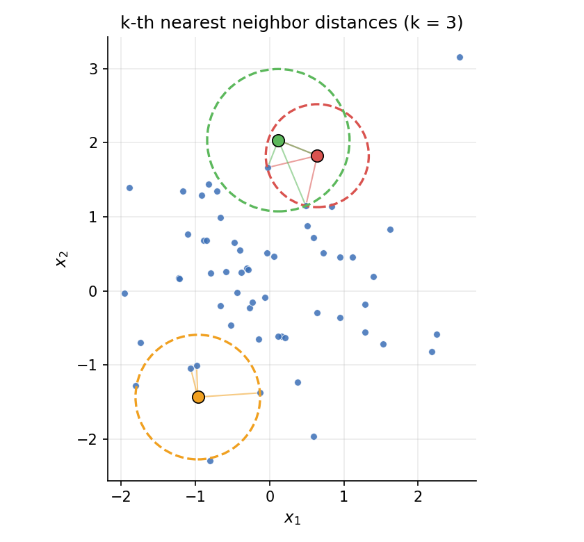
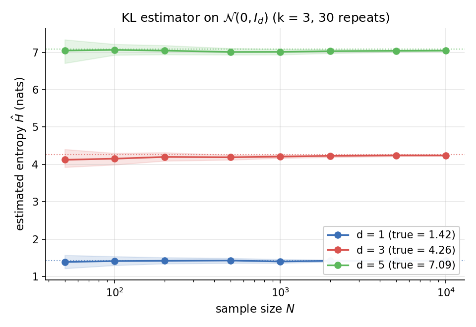
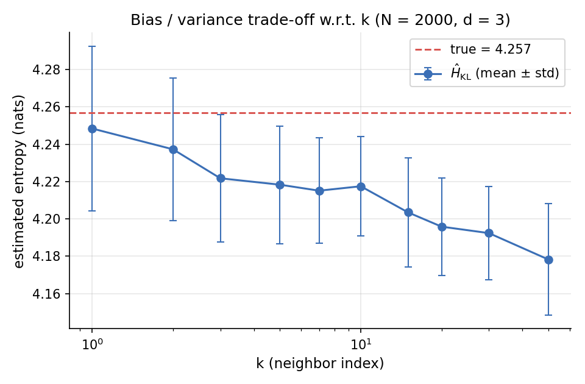

import { Aside } from 'astro-pure/user'

在分析连续型随机变量的不确定性、做特征选择或估计互信息（Mutual Information）时，常常需要从有限的样本中估计**微分熵**（Differential Entropy）。直方图法（Histogram）和核密度估计（KDE）都可以使用，但前者维度一高就会陷入"维度诅咒"，后者则严重依赖核函数和带宽的选择。1987 年，Kozachenko 和 Leonenko 提出了一种巧妙的估计方法<a href="#note1">[1]</a>：只需要计算每个样本点到其第 k 个近邻的距离，就能给出微分熵的渐近无偏估计。这种方法常被简称为 **KL 估计**或 **k-NN 估计**，在信息论、神经科学等领域被广泛使用，也是著名的 KSG 互信息估计器<a href="#note2">[2]</a>的核心组件。

## 1. 微分熵的定义

设连续型随机变量 $X \in \mathbb{R}^{d}$ 服从概率密度 $p(x)$，则其**微分熵**（以 nats 为单位）定义为：

$$
H(X) = -\int_{\mathbb{R}^{d}} p(x) \ln p(x)\, dx = -\mathbb{E}\!\left[\ln p(X)\right]
$$

这是离散熵 $H(X) = -\sum p_i \ln p_i$ 在连续情形下的自然推广。但实际问题中，我们通常只能拿到独立同分布的样本 $\{x_1, x_2, \dots, x_N\}$，并不知道 $p(x)$ 的解析形式。如何**直接从样本**估计 $H(X)$，就是本文要回答的问题。

<Aside type="tip">
和离散熵不同，微分熵可以为负数。例如方差极小的高斯分布，密度函数会在均值附近取极大值，使得 $\ln p(x) > 0$，从而 $H(X) < 0$。
</Aside>

## 2. 估计的思想

KL 估计的核心想法可以用一句话概括：**用第 k 个近邻的距离来反推局部密度**。

考虑样本点 $x_i$，记其到样本集中第 k 个近邻（不含自身）的欧几里得距离为 $\varepsilon_i$。直观上，如果 $x_i$ 周围密度较大，邻居就密集，$\varepsilon_i$ 就小；反之 $\varepsilon_i$ 就大。换句话说，$\varepsilon_i$ 隐含了 $p(x_i)$ 的信息。下图直观展示了三个样本点各自的 k=3 近邻和包含这些近邻的圆（即半径为 $\varepsilon_i$ 的球）：


<p style="text-align: center;font-size: 15px">k 近邻距离示意（k = 3）</p>

我们沿着这个直觉做一次"非严谨"的推导。以 $x_i$ 为球心、$\varepsilon_i$ 为半径的 d 维欧氏球的体积为：

$$
V_d(\varepsilon_i) = c_d \, \varepsilon_i^{d}, \qquad c_d = \frac{\pi^{d/2}}{\Gamma(d/2 + 1)}
$$

如果在这个球内密度大致为常数 $p(x_i)$，则该球内"包含某个样本"的概率约为 $p(x_i) \cdot V_d(\varepsilon_i)$。在 N-1 个其他样本中，恰好有 k 个落入这个球的事件可以用二项分布近似，由此可以推出：

$$
\mathbb{E}\!\left[\ln p(x_i) + \ln V_d(\varepsilon_i)\right] \approx \psi(k) - \psi(N)
$$

其中 $\psi(\cdot)$ 是 **digamma 函数**（$\psi(x) = \frac{d}{dx}\ln \Gamma(x)$），它在这里替代了朴素直觉里的 $\ln k - \ln N$。digamma 的引入修正了二项分布的有限样本偏差（即所谓的 Miller-Madow 类校正），是 KL 推导中最关键的一步。

<Aside title="为什么是 digamma？">
对 $X \sim \mathrm{Beta}(k, N-k)$，可以证明 $\mathbb{E}[\ln X] = \psi(k) - \psi(N)$。

而第 k 个近邻所定义的概率球，其"球内概率质量"恰好服从 $\mathrm{Beta}(k, N-k)$ 分布（在密度近似为常数的小邻域内）。这个事实是 KL 估计中 digamma 出现的根源，详细推导可参考<a href="#note1">[1]</a>。
</Aside>

整理上式，对所有样本取平均，得到 KL 估计的最终形式：

$$
\boxed{\;\;\hat{H}_{\mathrm{KL}}(X) = -\psi(k) + \psi(N) + \ln c_d + \frac{d}{N}\sum_{i=1}^{N}\ln \varepsilon_i\;\;}
$$

这个公式有几个值得品味的地方：

- 它**没有**显式地估计概率密度 $p(x)$，但通过 $\varepsilon_i$ 间接利用了局部密度信息；
- 当 $N \to \infty$ 时，$\psi(N) \approx \ln N$，第二项就退化成普通对数；
- 维度 $d$ 同时影响 $\ln c_d$ 项和 $\varepsilon_i$ 的尺度，这也是高维下估计变得困难的根源；
- 选取 $k$ 是一个**偏差-方差权衡**：$k$ 小则方差大，$k$ 大则偏差大（局部密度近似失效）。一般推荐 $k \in \{3, 4, 5\}$。

## 3. 代码实现

下面给出一份基于 numpy 和 scikit-learn 的简洁实现。借助 `NearestNeighbors`，我们可以在 $O(N \log N)$ 内完成所有 k 近邻距离的计算（背后是 kd-tree 或 ball-tree）。

```python
import numpy as np
from scipy.special import digamma, gamma
from sklearn.neighbors import NearestNeighbors

def kl_entropy(X, k=3):
    """Kozachenko-Leonenko 微分熵估计 (单位: nats)

    Parameters
    ----------
    X : ndarray, shape (N, d)
        独立同分布样本
    k : int
        近邻索引 (推荐 3~5)
    """
    X = np.asarray(X, dtype=float)
    N, d = X.shape

    # 注意要把自身算进去, 因此查询 k+1 个邻居
    nbrs = NearestNeighbors(n_neighbors=k + 1, metric="euclidean").fit(X)
    dists, _ = nbrs.kneighbors(X)
    eps = np.maximum(dists[:, k], 1e-12)  # 第 k 个近邻 (不含自身)

    log_c_d = (d / 2.0) * np.log(np.pi) - np.log(gamma(d / 2.0 + 1.0))

    return -digamma(k) + digamma(N) + log_c_d + d * np.mean(np.log(eps))
```

<Aside type="caution">
实现中有两个容易踩的坑：

1. 必须**排除样本点自身**。`NearestNeighbors` 在 `kneighbors(X)` 时会把每个点自己算作第 0 个邻居（距离为 0），因此需要查询 `k+1` 个并取索引 `k`。
2. 当样本中存在重复点（distance = 0）时，$\ln \varepsilon_i = -\infty$。代码里用 `np.maximum(eps, 1e-12)` 做了简单的截断，更严谨的做法是给样本加微小扰动或直接去重。
</Aside>

## 4. 实验验证

为了检验估计器是否正确，我们在多元标准正态分布 $\mathcal{N}(0, I_d)$ 上做实验，因为此时存在解析解：

$$
H(\mathcal{N}(0, I_d)) = \frac{d}{2}\ln(2\pi e)
$$

### 4.1 对样本量 N 的收敛性

固定 $k = 3$，在 $d \in \{1, 3, 5\}$ 三种维度下，扫描样本量从 50 到 10000，每个组合重复 30 次取均值，并以阴影显示 10%~90% 分位区间。


<p style="text-align: center;font-size: 15px">KL 估计在 N(0, I_d) 上的收敛性 (k = 3)</p>

可以看到：

- 即便在 $N = 50$ 这样的小样本下，估计就已经非常接近真值（虚线）；
- 随着 $N$ 增加，方差快速收缩；
- 维度越高，估计需要更多样本才能取得相同精度，这与 k 近邻方法在高维下的退化表现一致<a href="#note3">[3]</a>。

### 4.2 对 k 的敏感性

固定 $N = 2000$, $d = 3$，扫描 $k$ 从 1 到 50，每组重复 80 次：


<p style="text-align: center;font-size: 15px">估计精度随 k 的变化 (N = 2000, d = 3)</p>

这张图清晰地展示了之前提到的偏差-方差权衡：

- $k$ 很小时（如 $k = 1$）方差较大，但偏差小、估计接近真值；
- $k$ 增大时方差缩小，但**偏差稳定向下偏移**，因为大 k 意味着球的半径变大，"局部密度近似为常数"的假设不再成立；
- $k = 3 \sim 5$ 是经验上比较稳健的折中。

## 5. 一些实践建议

最后总结几条工程化使用 KL 估计时的经验：

1. **数据要去重 / 加扰动**。重复点会让 $\varepsilon_i = 0$，整个估计就会爆炸。
2. **数据应做归一化或白化**。KL 估计基于欧氏距离，对各维度的尺度极为敏感，建议预处理时对每个维度做 z-score 标准化。
3. **维度不要太高**。当 $d \gtrsim 20$ 时，k 近邻距离会趋于退化（所有距离都接近），估计偏差迅速增大，此时应考虑专门的高维估计器或先做降维。
4. **想估计互信息？用 KSG**。KL 估计是 KSG 估计器<a href="#note2">[2]</a>的基础，KSG 通过巧妙的"边缘空间近邻计数"避免了三个独立 KL 估计相加导致的偏差累积，是工程上更推荐的做法。

至此，我们从直觉、数学推导、代码实现和实验验证四个维度对 Kozachenko-Leonenko 估计做了一次完整的剖析。如有疏漏，敬请指正。

相关资源和参考文献

- [1]&nbsp;&nbsp;<span id="note1">L. F. Kozachenko and N. N. Leonenko, "Sample estimate of the entropy of a random vector," *Problems of Information Transmission*, vol. 23, no. 2, pp. 95-101, 1987.</span>
- [2]&nbsp;&nbsp;<span id="note2">A. Kraskov, H. Stögbauer, and P. Grassberger, "Estimating mutual information," *Physical Review E*, vol. 69, no. 6, p. 066138, 2004. doi: 10.1103/PhysRevE.69.066138.</span>
- [3]&nbsp;&nbsp;<span id="note3">N. Leonenko, L. Pronzato, and V. Savani, "A class of Rényi information estimators for multidimensional densities," *The Annals of Statistics*, vol. 36, no. 5, pp. 2153-2182, 2008.</span>
- [4]&nbsp;&nbsp;[scipy.special.digamma 文档](https://docs.scipy.org/doc/scipy/reference/generated/scipy.special.digamma.html)
- [5]&nbsp;&nbsp;[sklearn NearestNeighbors 文档](https://scikit-learn.org/stable/modules/generated/sklearn.neighbors.NearestNeighbors.html)
