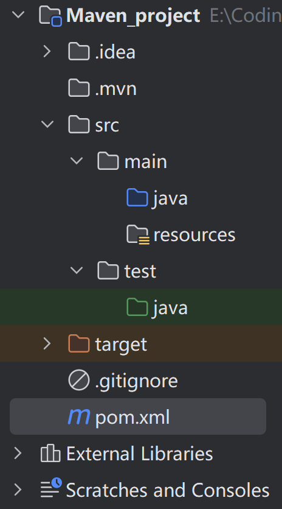
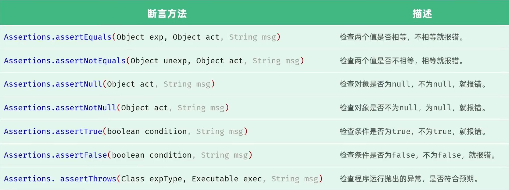
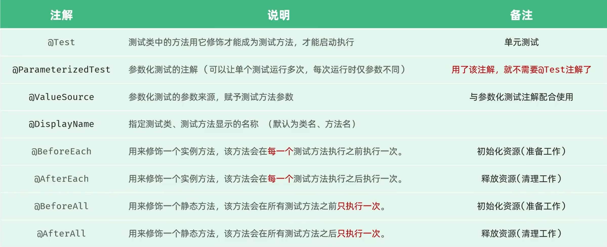

## 1. Maven 简介

Maven 是一个用于创建和管理 Java 项目的工具，其功能包括：

- 依赖管理
- 项目构建
- 统一项目结构

### 1.1 依赖管理

在 Maven 项目中，可通过修改 pom.xml 添加所需依赖，示例代码如下：

```xml
<dependencies>
    <dependency>
        <groupId>commons-io</groupId> <!-- 依赖的组织/公司标识 -->
        <artifactId>commons-io</artifactId> <!-- 依赖的项目/库名称 -->
        <version>2.16.1</version> <!-- 依赖的版本号 -->
    </dependency>
</dependencies>
```

POM 是项目对象模型（Project Object Model）的缩写。Maven 的仓库分为本地仓库、远程仓库（私服）和中央仓库（全球唯一，由 Maven 官方维护）。在 dependency 声明依赖后，系统会依次从本地仓库 —— 私服（如果有的话，一般是公司的服务器）—— 中央仓库搜索并下载。

### 1.2 项目构建

Maven 提供了跨平台的自动构建项目方法，在 IDEA 的 Lifecycle 中，可通过指令（如compile package）自动编译、打包

### 1.3 统一项目结构

在 IntelliJ IDEA 中可直接创建 Maven 项目，项目结构如下图：


<p style="text-align:center;">图1. Maven项目结构</p>

其中 src 为主程序文件夹，其下的 java 文件夹存放 java 源代码，resources 文件夹存放依赖；test 文件夹存放测试程序；target 文件夹存放编译、打包出来的文件或临时文件；pom.xml 为核心配置文件

## 2. Maven 坐标

Maven 坐标是资源（jar 包）的**唯一标识**。下面是一个新创建的 Maven 项目的 pom.xml 文件：

```Java
<?xml version="1.0" encoding="UTF-8"?>
<project xmlns="http://maven.apache.org/POM/4.0.0"
         xmlns:xsi="http://www.w3.org/2001/XMLSchema-instance"
         xsi:schemaLocation="http://maven.apache.org/POM/4.0.0 http://maven.apache.org/xsd/maven-4.0.0.xsd">
    <modelVersion>4.0.0</modelVersion>

    // Maven 坐标
    <groupId>com.itheima</groupId>
    <artifactId>maven-project01</artifactId>
    <version>1.0-SNAPSHOT</version>

    <properties>
        <maven.compiler.source>25</maven.compiler.source>
        <maven.compiler.target>25</maven.compiler.target>
        <project.build.sourceEncoding>UTF-8</project.build.sourceEncoding>
    </properties>

</project>
```

- groupId：项目隶属的组织
- artifactId：模块名/项目名称
- version：版本号

在 verson 中，SNAPSHOT表示快照版本，即仍在开发中的版本；RELEASE表示正式发行的版本

## 3. Maven 依赖管理

引入依赖的方法：

1. 在项目的 pom.xml 文件中引入 `<dependencies>` 标签
2. 在 `<dependencies>` 标签下引入 `<dependency>`，补充 Maven 坐标信息；如果不知道具体的组织名 / 模块名称，可去 Maven 的中央仓库 https://mvnrepository.com/ 查询
3. 点击刷新引入依赖

示例如下：

```JavaScript
<dependencies>
    <dependency>
        <groupId>org.springframework</groupId>
        <artifactId>spring-context</artifactId>
        <version>6.1.4</version>
    </dependency>
</dependencies>
```

排除依赖：在引入一些依赖时，所引入的依赖可能会带来一些本项目不需要的资源（jar 包），我们可以通过`<exclusions>`标签主动断开依赖

```JavaScript
<dependencies>
    <dependency>
        <groupId>org.springframework</groupId>
        <artifactId>spring-context</artifactId>
        <version>6.1.4</version>

        {/* 排除依赖 */}
        <exclusions>
            <exclusion>
                <groupId>io.micrometer</groupId>
                <artifactId>micrometer-observation</artifactId>
            </exclusion>
        </exclusions>
    </dependency>
</dependencies>
```

**注意：依赖变更时，记得手动刷新**

## 4. Maven 的生命周期

Maven 有三套相互独立的生命周期：clean, default, site

- clean: 清理上次编译、运行后的参与文件
- default: 核心工作，负责编译、打包、部署等
- site: 生成报告、发布站点等

五个重要的生命周期阶段：clean, compile, test, package, install

其中 clean 属于 clean 周期，其他四个属于 default 周期

- clean: 移除上一次构建生成的文件
- compile: 编译项目源代码
- test: 使用合适的单元测试框架运行测试（JUnit）
- package: 将编译后的文件打包（jar, war）
- install: 将项目安装到本地仓库

注意：在**同一套生命周期**中，后面的操作执行时，一定执行前面的操作（如执行 install 时，compile一定执行）

## 5. Maven 单元测试

JUnit: Java 测试框架

单元测试的三步操作：

1. 在 pom.xml 中，引入 JUnit 依赖

```JavaScript
<dependency>
    <groupId>org.junit.jupiter</groupId>
    <artifactId>junit-jupiter</artifactId>
    <version>5.9.1</version>
    <scope>test</scope>
</dependency>
```

2. 在 test/java 目录下，创建测试类，并编写对应的测试方法，并在方法上声明 @Test 注解

```Java
package com.itheima;

import org.junit.jupiter.api.Test;

public class UserServiceTest {

    @Test
    public void testGetAge(){
        UserService userService = new UserService();
        Integer age = userService.getAge("211231200409090198");
        System.out.println(age);
    }
}
```

3. 运行单元测试：绿色通过，红色未通过

注意：测试类的命名规范为：XxxxTest，测试方法的命名规定为：`public void xxx(){...}`，**返回值必须为 void 类型**

### 5.1 JUnit 断言

断言：判断程序输出的结果是否符合预期

常用的断言方法如下：


<p style="text-align:center;">断言</p>


其中 exp 是预期的输出结果，act 是实际的输出结果，msg 是报错的提示信息

```Java
@Test
public void getGenderTestWithAssert(){
    UserService userService = new UserService();
    String gender = userService.getGender("211231200409090215");
    Assertions.assertEquals(gender, "男");
}
```

`assertThrows`用来判断程序抛出的异常和期望的异常是否一致，expType 是程序预期会抛出的异常，exec 是一个函数式接口，用于调用我们自己的方法，示例代码如下：

```Java
@Test
public void getGenderTestWithAssert2(){
    UserService userService = new UserService();
    Assertions.assertThrows(IllegalArgumentException.class, () -> {
        userService.getGender(null);
    });
}
```

### 5.2 JUnit 常见注解


<p style="text-align:center;">JUnit常见注解</p>

注意：BeforeAll 和 AfterAll 只能用于静态（static）方法

ParameterizedTest 和 ValueSource 的使用方法如下：

```Java
@DisplayName("测试用户性别") // 用于给测试类起别名
@ParameterizedTest
@ValueSource(strings = {"211231200409090013", "211231200409090053", "211231200409090033"})
public void getGenderTest2(String idCard){
    UserService userService = new UserService();
    String gender = userService.getGender(idCard);
    Assertions.assertEquals("男", gender, "性别错误");
}
```