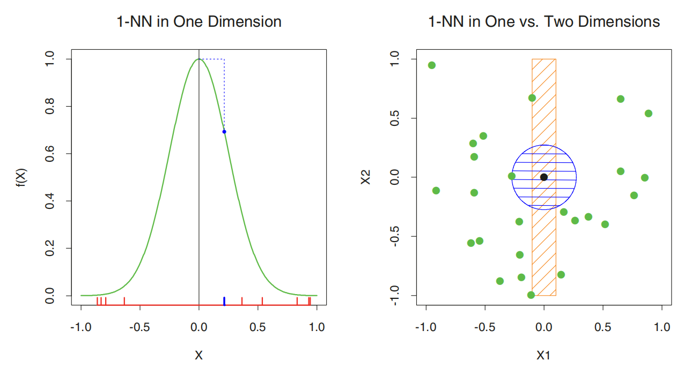
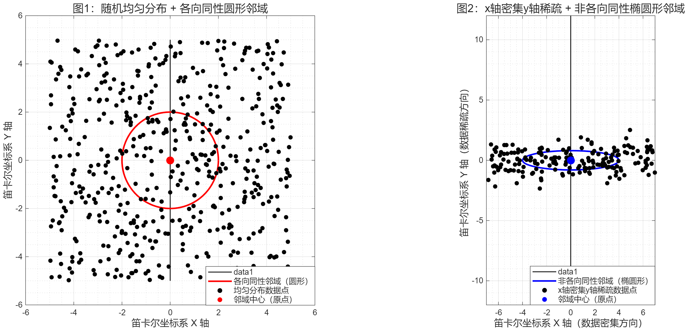

import { Aside } from 'astro-pure/user'

Chapter2: Overview of Supervised Learning

## 1. 最小二乘法与 K 近邻

### 1.1 线性模型

输入：$ X^{T}=(X_{1}, X_{2}, \ldots , X_{p}) $

输出（估计值）：$ \hat{Y}=\hat{\beta_{0}}+\sum_{j=1}^{p}X_{j}\hat{\beta_{j}} $

向量形式：$ \hat{Y}=X^{T}\hat{\beta} $

<Aside type="tip">在机器学习中，带有 "hat" 的变量是实际估计出来的，有误差的结果；不带 "hat" 的是真实但未知的参数</Aside>

$f(x, y)=X^{T}\hat{\beta}$ &nbsp;的梯度&nbsp; $\nabla f=\beta$

**直观理解：如果你站在 p 维的输入空间里，想要最快地爬到 $f(x,y)$（输出值）最高的地方，你应该沿着 $\beta$ 这个向量的方向走**

<Aside>
Page12: Viewed as a function over the p-dimensional input space, $f(X)=X^{T}\beta$ is linear, and the gradient $f^{'}(X)=\beta$ is a vector in input space that points in the steepest uphill direction.
</Aside>

### 1.2 最小二乘法

注：这一章节的最小二乘法和 k 近邻方法，实际上都是在寻找一个“决策边界”

找到使残差平方和（RSS）最小的$\beta$向量训练模型

$$ RSS(\beta)=\sum_{i=1}^{N} (y_{i}-x_{i}^{T}\beta)=(\mathbf{y}-\mathbf{X}\beta)^{T}(\mathbf{y}-\mathbf{X}\beta) $$

数学基础：当$\mathbf{X}^{T}\mathbf{X}$不奇异时可求得

$$\beta=(\mathbf{X}^{T}\mathbf{X})^{-1}(\mathbf{X}^{T}y)$$

理解：线性二分类的本质就是找一个超平面将空间划分为两类。在二维平面里该超平面表现为决策曲线，通过$f(\mathbf{X})=\mathbf{X}^{T}\beta=t$进行划分（$t$为阈值，比如说$t=0.5$）

<Aside type="tip">超平面是高维空间中的一个线性子空间，其维度比所包含的空间少一维，通常用于划分空间</Aside>

### 1.3 K 近邻

通过 $x_{i}$ 附近的 $k$ 个样本的平均值估计 $\hat{y}$

$$
\hat{Y}(x)=\frac{1}{k} \sum_{x_{i} \in N_{k}(x)}y_{i}
$$

训练集上的误差近似为 $k$ 的递增函数，且当$k=1$时训练集上的误差总为 0。因此，K 近邻方法不能通过最小化误差平方和优化

与线性模型的比较：k 近邻方法的有效参数数量通常为 $\frac{N}{k}$，通常大于 p（即线性方法中要优化的$\beta$参数数量：$
\beta=
\begin{pmatrix}
\beta_{1} \\
\beta_{2} \\
\vdots    \\
\beta_{p}
\end{pmatrix}
$）

<Aside>
Page15: Although this is the case, we will see that the <em>effective</em> number of parameters of $k$-nearest neighbors is $N/k$ and is generally bigger than $p$, and decreases with increasing $k$.
</Aside>

对比：
- 最小二乘法得出的决策边界平滑、稳定，但高度依赖于线性决策边界的适用性假设
- k 近邻方法不对数据分布做假设，适用范围广泛，但波动性大（决策边界上的任何特定子区域都取决于少数输入点及其具体位置）

## 2. 统计决策理论

在预测标准采用“最小化均方误差原则”的条件下，对于任意的$X=x$，$Y$的最优预测值就是“$Y$关于$X=x$的条件期望”，即：
$$
f(x)=E(Y|X=x)
$$
这个$f(x)$也被称为回归函数

这也就解释了为什么 k 近邻原则在数学上能够成立：在 k 近邻中，选取$x_{i}$点的$k$个近邻并计算其平均值的过程，实际上就是计算$E(Y|X=x)$的过程

<Aside type="tip">
条件期望：给定某个条件下，随机变量的平均值

对于随机变量 $X$ 和 $Y$，当给定 $X$ 取某个具体值 $x$ 时，$Y$ 的条件期望 $E(Y∣X=x)$ 是 在 $X=x$ 这个条件下，$Y$ 的概率分布对应的均值
</Aside>

对于 k 近邻方法，当样本总数$N\rightarrow+\infty$，$k\rightarrow+\infty$且$\frac{k}{N}\rightarrow0$时，k 近邻的预测值$\hat{f}(x)$会无限接近最优的回归函数$f(x)$

局限性：当维度$p$升高时，k 近邻的收敛速度将变慢

数据分布假设
- 最小二乘法：最小二乘法的核心假设，是回归函数$f(x)$在整个输入空间上可以用线性函数来近似。也就是说，整个输入空间中，$f(x)$都用同一个线性函数来拟合—— 不管$x$落在输入空间的哪个位置，都用这一组$\beta$对应的直线 / 平面 / 超平面来近似$f(x)$
- k 近邻：k 近邻算法假设，在输入空间中某一点 $x$ 的微小局部邻域内，回归函数 $f(x)$ 的值是大致恒定的

当使用 L1 损失（$\lvert (Y-f(X)) \rvert$）时，最小化"期望预测误差$E(Y-f(X))$"的解变成了条件中位数（$median(Y|X=x)$）

条件中位数相比于均值更加稳健，但其导数不连续

当输出是分类变量$G$时，损失函数将改变，变为"损失矩阵$L$"。$L$的大小为$K \times K$，其中$K=card(G)$，即$G$结合中元素的个数（比如说$G=\left\{猫, 狗, 老鼠\right\}$，则$card(G)=3$）。矩阵的对角线元素$L(k, k)=0$，即分类正确时损失为 0；$L(k, l)$表示将第$k$类错分为第$l$类时的损失

小结：线性模型和 <em>k-NN</em> 模型的优劣
- 线性模型：稳定但有偏（方差小偏差大）
- <em>k-NN</em>：不太稳定，但明显较少有偏（偏差小方差大）

## 3. 高维空间中的局部方法

高维空间中数据的分布：
- 所有样本点都会靠近样本的边缘
- 训练样本稀疏地分布在输入空间

偏差-方差分解

估计在$x=x_{0}$处的均方根误差 $MSE$，训练集为$\tau$：
$$
\begin{align*}
MSE(x_{0}) &= E_{\tau}[f(x_{0})-\hat{y_{0}}]^{2} \\
&= E_{\tau}[\hat{y_{0}}-E_{\tau}(\hat{y_{0}})]^{2}+[E_{\tau}(\hat{y_{0}})-f(x_{0})]^{2} \\
&= Var_{\tau}(\hat{y_{0}})+Bias^{2}(\hat{y_{0}})
\end{align*}
$$

下图展示了维度升高时最近邻变远的一维和二维情况。随着维度的增加，最近邻会离目标点越来越远，最终分布在单位超立方体的边缘上

维度灾难

在不同的数据分布和维度下，有时偏差占主导地位，有时方差占主导地位

## 4. 统计模型、监督学习和函数逼近

监督学习的一种理解方式：假定定义域是在$p$维欧式空间$\mathbb{R}^{p}$，监督学习的目标是给定在$\tau$（训练集）上的表达，在$\mathbb{R}^{p}$的某个区域对全体$x$获得对$f(x)$的有用逼近

<Aside>
Page 30: The goal is to obtain a useful approximation to $f(x)$ for all $x$ in some region of $\mathbb{R}^{p}$, given the representations in $\tau$.
</Aside>

函数逼近的一个方法：线性基展开（linear basis expansions）
$$
f(\theta_{x})=\sum_{k=1}^{k}h_{k}(x)\theta_{k}
$$
其中$h_{k}(x)$是关于$x$的多项式或三角函数式等，$\theta_{k}$是待优化的参数

除了最小二乘法外，最大似然估计是一种更普遍的参数优化方式：
$$
L(\theta)=\sum_{i=1}^{N}\log Pr_{\theta}(y_{i})
$$
概率密度函数$Pr_{\theta}(y_{i})$是指在参数$\theta$下，事件$y_{i}$发生的概率

最大似然估计的目标是找到$\theta$使得$L(\theta)$最大

对于定性输出$G$的回归函数$P_{r}(G|X)$的多项式似然（也称为交叉熵）：
$$
L(\theta)=\sum_{i=1}^{N}\log p_{g,\theta_{i}}(x_{i})
$$
其中$P_{r}(G=G_{k}|X=x)=p_{k, \theta}(x)$

## 5. 结构化的回归模型

有无限种$f(x)$能够使 RSS 最小，通过添加不同的限制条件便能获得不同的$\hat{f}(x)$<em>：“存在无限多的可能限制条件，每种限制条件均会导致唯一解，因此这种模糊性仅被转移至约束条件的选择上。”</em>

<Aside>
Page 33: There are infinitely many possible restrictions, each leading to a unique solution, so the ambiguity has simply been transferred to the choice of constraint.
</Aside>

选取的邻域越大，约束越强：当选取的邻域非常小时，相当于没有约束；但当选取的邻域很大时，例如在很大的邻域范围内线性拟合，则相当于对全局进行了线性拟合，这是一个很强的约束

k-NN 的数学假设：对于输入$x_{0}$，其邻域内的$f(x)$是平滑变化（不突变）的，因此能用$x_{0}$邻域的$f(x)$估计当前的$f(x_{0})$

<em>任何试图在小的各向同性邻域内生成局部变化函数的方法，在高维空间中都会遭遇问题 —— 这再次体现了维度诅咒。反之，所有克服维度问题的方法都需采用一种隐式或自适应的度量标准来衡量邻域，这种标准本质上不允许邻域在所有方向上同时保持微小</em>

<Aside>
Page 33: One fact should be clear by now. Any method that attempts to produce locally varying functions in small isotropic neighborhoods will run into problems in high dimensions—again the curse of dimensionality. And conversely, all methods that overcome the dimensionality problems have an associated—and often implicit or adaptive—metric for measuring neighborhoods, which basically does not allow the neighborhood to be simultaneously small in all directions.
</Aside>

如果一个空间中的域（可以理解为“一个范围内”）在所有维度上的方向都均匀，则称其是“各向同性的”，例如三维空间中的球体。而如果域在某些维度上方向不均匀，如三维空间中的椭球体，则称其是“非各向同性的”。在高维空间中，数据非常稀疏，数据点之间的距离很远，因此小邻域内的数据量非常少。如果仍用“各向同性的”邻域度量规则，将面临数据数量不足的“维度诅咒”。而能解决维度诅咒的度量方法的共同点便是不让邻域在所有维度上都保持“小”，而是在数据密集分布的方向上扩大邻域范围，在数据稀疏的方向上缩小邻域范围，以此保证邻域内含有足量的数据，避免维度灾难。

邻域数据分布可视化

## 6. 受限估计器的种类

粗糙度惩罚（Roughness Penalty）
$$
PRSS(f, \lambda)=RSS(f)+\lambda J(f)
$$

其中$J(f)$为惩罚函数

核方法（Kernel Methods）：局部邻域由核函数$K_{\lambda}(x, x_{0})$指定，将权重分配到$x_{0}$周围区域的$x$上。其中$x_{0}$是邻域中心，$x$是周边待分配权重的点，$\lambda$是核的宽度。$K_{\lambda}(x, x_{0})$越大，表示$x$对$x_{0}$的贡献越大

基函数（Basis Function）
$$
f_{\theta}(x)=\sum_{m=1}^{M}\theta_{m}h_{m}(x)
$$

径向基函数（Radial Basis Functions）：位于特定质心的，对称的 p 维核
$$
f_{\theta}(x)=\sum_{m=1}^{M}K_{\lambda_{m}}(\mu_{m}, x)\theta_{m}
$$
高斯核$K_{\lambda}(\mu, x) = e^{-\frac{\|\|x - \mu\|\|^2}{2\lambda}}$比较常用，其中$\|\|$表示向量的范数，即两向量间的欧氏距离