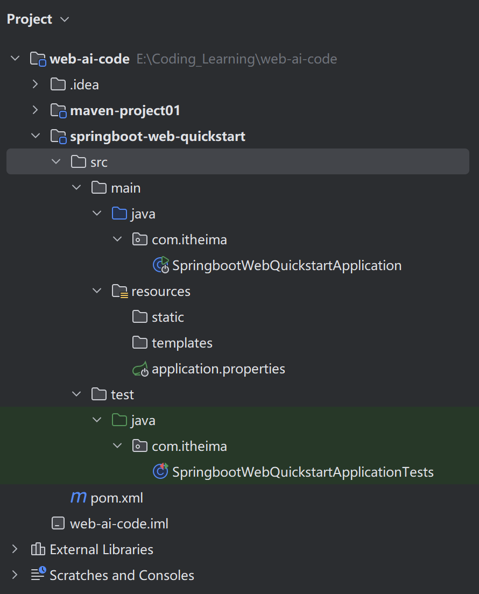
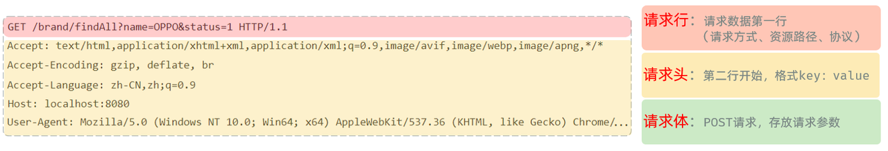
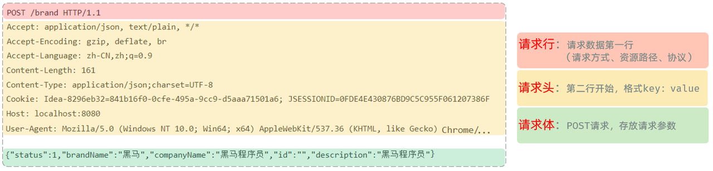
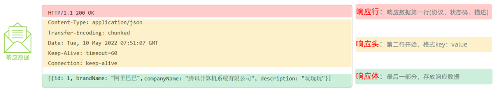
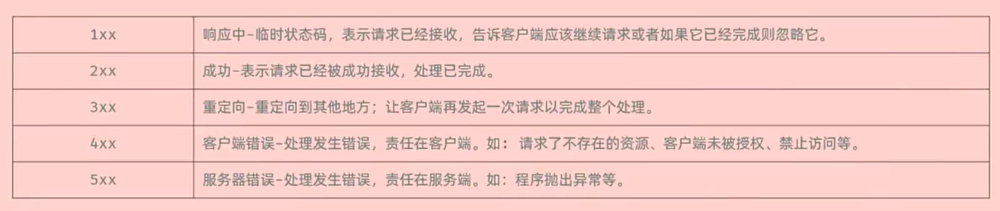
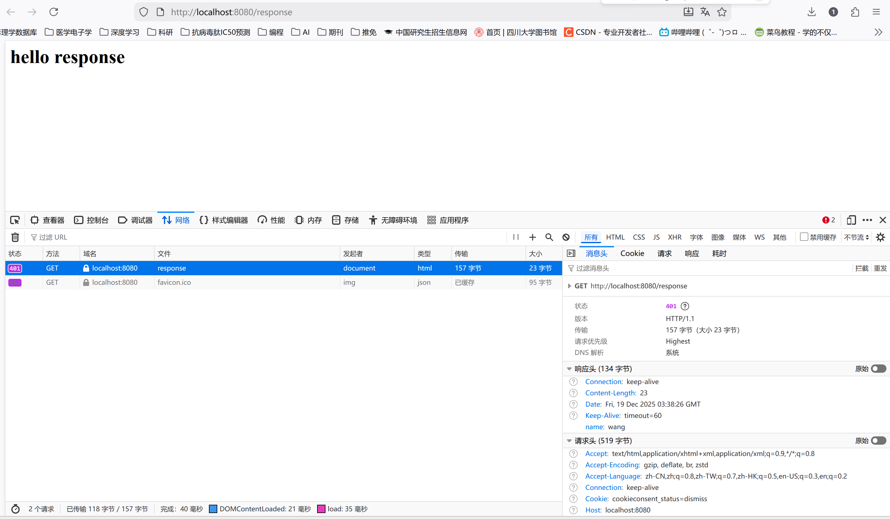

import { Aside } from 'astro-pure/user'

## 1. 资源和架构

静态资源：服务器上存储的，不会改变的资源

动态资源：随用户请求的变化而变化的资源

B/S 架构：浏览器/服务器架构，如京东、12306等，应用逻辑和数据存放在服务器

C/S 架构：客户端/服务器架构，如 QQ 等，应用逻辑和数据存放在本地

## 2. Spring 框架

Spring：最流行的 Java 框架，其项目涵盖了各个应用场景

SpringBoot：快速开发 Web 项目，简化开发，提高效率

## 3. SpringBoot 入门

需求：基于SpringBoot的方式开发一个web应用，浏览器发起请求/hello后，给浏览器返回字符串 "Hello xxx ~"

创建好的 SpringBoot 项目结构如下：


<p style="text-align:center;">SpringBoot项目结构</p>

这里已经删掉了不需要的项目结构，只保留了核心：src 文件夹和 pom.xml

`SpringbootWebQuickstartApplication`是项目的启动类 / 引导类，其内容如下：

```Java
package com.itheima;

import org.springframework.boot.SpringApplication;
import org.springframework.boot.autoconfigure.SpringBootApplication;

@SpringBootApplication // 启动类的标识
public class SpringbootWebQuickstartApplication {

    public static void main(String[] args) {
        SpringApplication.run(SpringbootWebQuickstartApplication.class, args);
    }

}
```

里面是一个 main 函数，需要启动项目时直接运行这个 main 函数即可

resources/static 用于存放静态页面（html, css, JS）

application.properties 是项目的核心配置文件

接下来编写请求处理类 HelloController，请求处理类一般以 Controller 结尾：

```Java
package com.itheima;

import org.springframework.web.bind.annotation.RequestMapping;
import org.springframework.web.bind.annotation.RestController;

@RestController // 表示这是一个请求处理类
public class HelloController {
    @RequestMapping("/hello") // 指向请求路径
    public String hello(String name){
        System.out.println("name" + name);
        return "Hello" + name + "~";
    }
}
```

注解：
- `@RestController`：当使用RestController注解一个类时，Spring会将该类视为控制器（Controller），并处理传入的HTTP请求
- `@RequestMapping(value = "/{id}", method = RequestMethod.GET)`：将 HTTP 请求映射到控制器方法

### 3.1 SpringBoot 入门程序剖析

构建入门程序时自动引入的依赖：

- `springboot-starter-web`：包含了 web 应用开发常用的依赖
- `springboot-starter-test`：包含了单元测试常用的依赖

## 4. HTTP 协议

HTTP：超文本传输协议，规定了浏览器和服务器之间数据传输的规则

特点：

1. 基于TCP协议: 面向连接，安全

2. 基于请求-响应模型:   一次请求对应一次响应（先请求后响应）

3. HTTP协议是无状态协议:  对于数据没有记忆能力。每次请求-响应都是独立的

- 无状态指的是客户端发送HTTP请求给服务端之后，服务端根据请求响应数据，响应完后，不会记录任何信息。
- 缺点：多次请求间不能共享数据
- 优点:  速度快

### 4.1 HTTP 请求协议


<p style="text-align:center;">GET 请求数据格式</p>


<p style="text-align:center;">POST 请求数据格式</p>

POST 请求数据的请求头和请求体之间有一个空行

### 4.2 请求数据获取

Web服务器（Tomcat）对HTTP协议的请求数据进行解析，并进行了封装，封装为一个 HttpServletRequest 对象，并在调用Controller方法的时候传递给了该方法。这样就使得程序员不必直接对协议进行操作，让Web开发更加便捷

获取数据示例代码：

```Java
package com.itheima;

import jakarta.servlet.http.HttpServletRequest;
import org.springframework.web.bind.annotation.RequestMapping;
import org.springframework.web.bind.annotation.RestController;

@RestController
public class RequestController {
    @RequestMapping("/request")
    public String request(HttpServletRequest request){
        // 1. 获取请求方式 - GET / POST
        String method = request.getMethod();
        System.out.println("请求方式：" + method);

        // 2. 获取请求 url 地址
        String url = request.getRequestURL().toString();
        System.out.println("url: " + url); // http://localhost:8080/request

        String uri = request.getRequestURI();
        System.out.println("uri: " + uri); // /request

        // 3. 获取请求协议
        String protocal = request.getProtocol();
        System.out.println("请求协议：" + protocal);

        // 4. 获取请求参数 - name, age
        String name = request.getParameter("name");
        System.out.println("name: " + name);
        String age = request.getParameter("age");
        System.out.println("age: " + age);

        // 5. 获取请求头 - Accept
        String header = request.getHeader("Accept");
        System.out.println("header: " + header);

        return "OK";
    }
}
```

在浏览器输入：`http://localhost:8080/request?name=wang&age=21`，控制台输出如下：

```bash
请求方式：GET
url: http://localhost:8080/request
uri: /request
请求协议：HTTP/1.1
name: wang
age: 21
header: text/html,application/xhtml+xml,application/xml;q=0.9,*/*;q=0.8
```

### 4.3 HTTP 响应协议


<p style="text-align:center;">响应协议</p>


<p style="text-align:center;">状态码</p>

### 4.4 响应数据设置

Web服务器对HTTP协议的响应数据进行了封装(HttpServletResponse)，并在调用Controller方法的时候传递给了该方法。这样，就使得程序员不必直接对协议进行操作，让Web开发更加便捷

示例代码：

```Java
package com.itheima;

import jakarta.servlet.http.HttpServletResponse;
import org.springframework.web.bind.annotation.RequestMapping;
import org.springframework.web.bind.annotation.RestController;

import java.io.IOException;


@RestController
public class ResponseController {
    /**
     * 方式一  HttpServletResponse 设置响应数据
     * @param response
     * @throws IOException
     */
    @RequestMapping("/response")
    public void response(HttpServletResponse response) throws IOException {
        // 1. 设置响应状态码
        response.setStatus(401);

        // 2. 设置响应头
        response.setHeader("name", "wang");

        // 3. 设置响应体
        response.getWriter().write("<h1>hello response</h1>");
    }
}
```

在浏览器中输入`http://localhost:8080/response`，请求结果如下：


<p style="text-align:center;">response请求结果</p>

Spring 中提供了 ResponseEntity，将请求结果封装为一个对象供程序员调用，示例如下:

```Java
/**
 * 方式二 ResponseEntity
 */
@RequestMapping("/request2")
public ResponseEntity<String> response2(){
    return ResponseEntity
            .status(402) // 响应状态码
            .header("name", "javaweb") // 响应头
            .body("<h1>hello java-web!</h1>"); // 响应体
}
```

<Aside title="Java泛型">
`public ResponseEntity<String> response2()`这里使用了 Java 中泛型的语法。泛型的本质是类型参数化，把类型（比如 String、Integer、自定义类）当作 “参数” 传给类 / 方法 / 接口，让它们能适配多种类型，而不用写重复代码。定义类 / 方法时用占位符（如 T）代替具体类型，使用时再指定真实类型（如 String），核心解决 “代码冗余” 和 “类型不安全” 问题。
</Aside>

举个例子：

```Java
// 泛型类：用<T>作为类型占位符（T是Type的缩写，也可以用E、K、V等）
class Box<T> {
    private T content; // 成员变量的类型是T（占位符）
    
    // 方法参数/返回值的类型都是T
    public void put(T content) { this.content = content; }
    public T get() { return content; }
}

// 使用时：给<T>传入具体类型（这就是代码里<String>的本质）
Box<String> strBox = new Box<>(); // 此时T=String
strBox.put("hello");
String str = strBox.get(); // 无需强制类型转换，安全

Box<Integer> intBox = new Box<>(); // 此时T=Integer
intBox.put(123);
Integer num = intBox.get(); // 类型安全，不会出错

Box<Double> doubleBox = new Box<>(); // 还能适配Double，无需改Box类
doubleBox.put(3.14);
Double d = doubleBox.get();
```