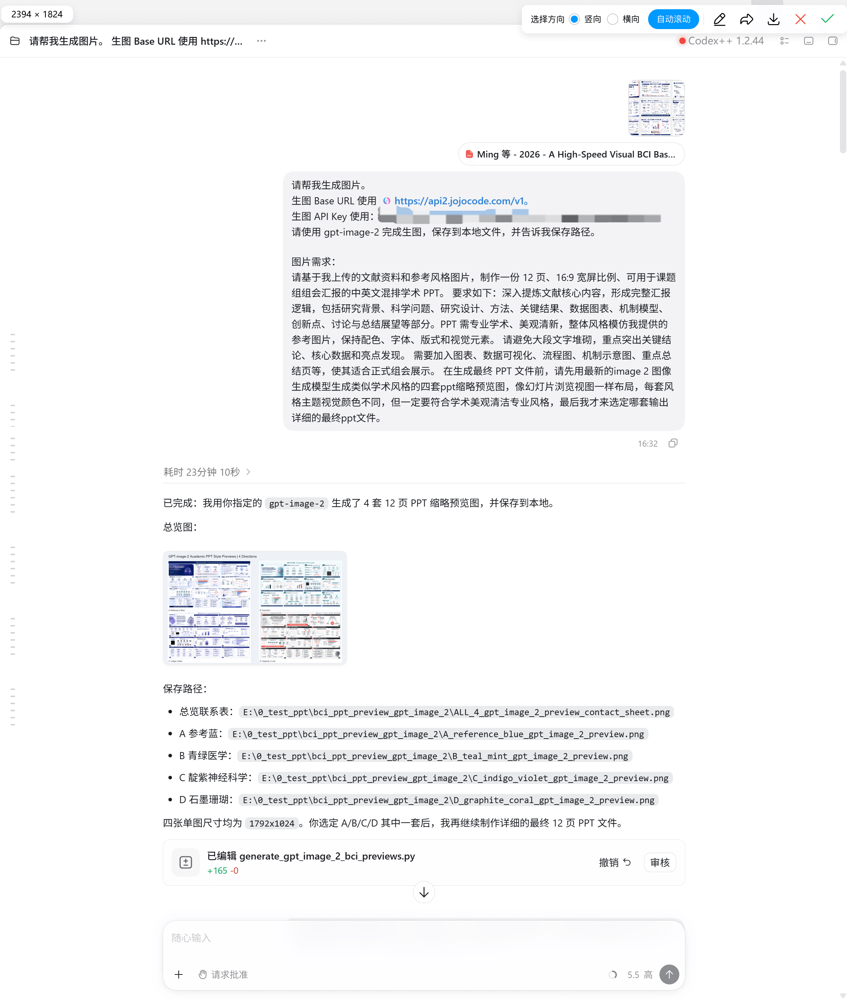
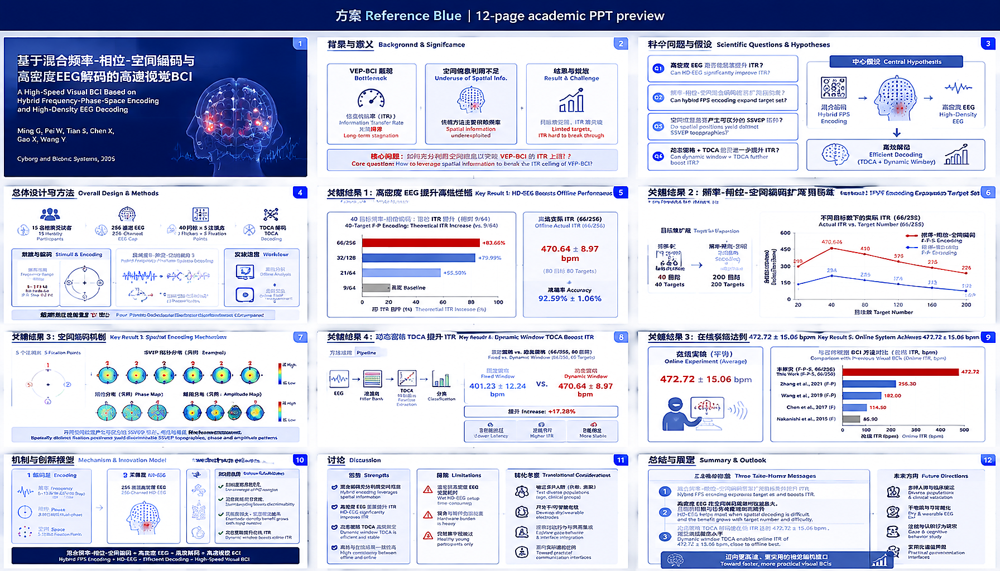
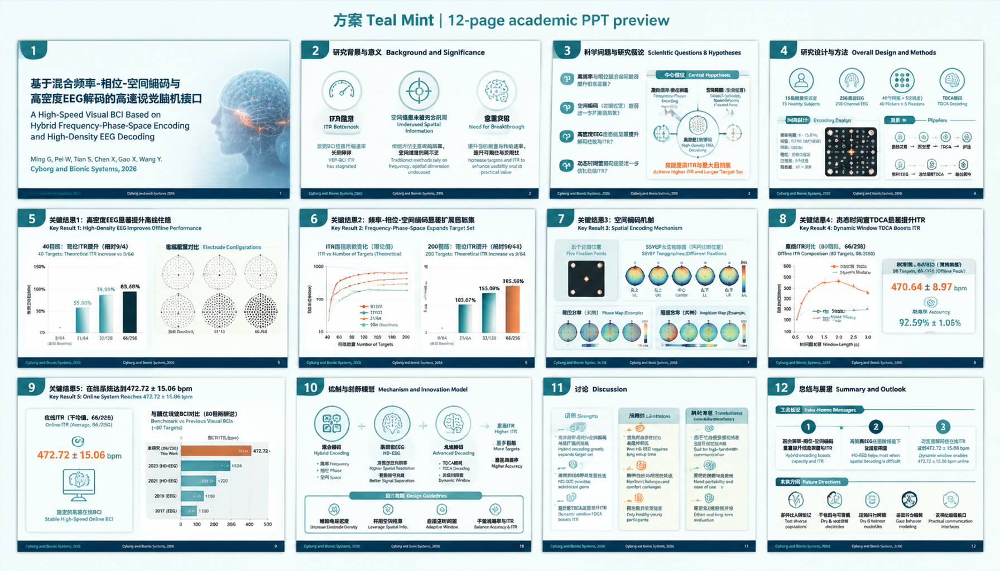
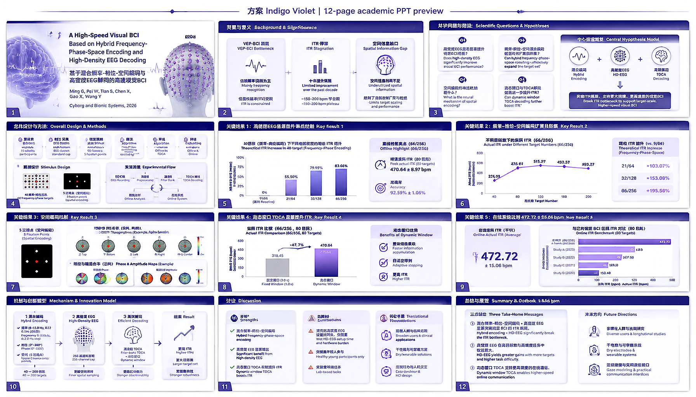
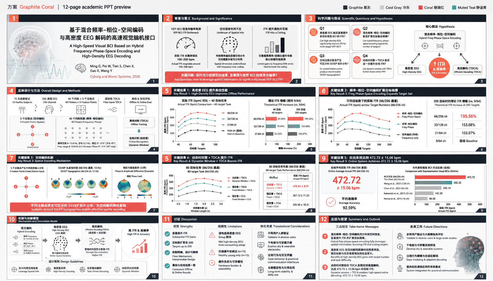
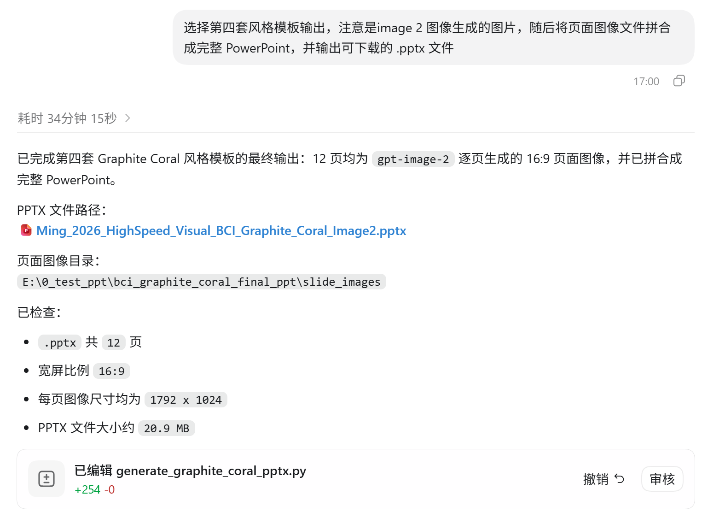
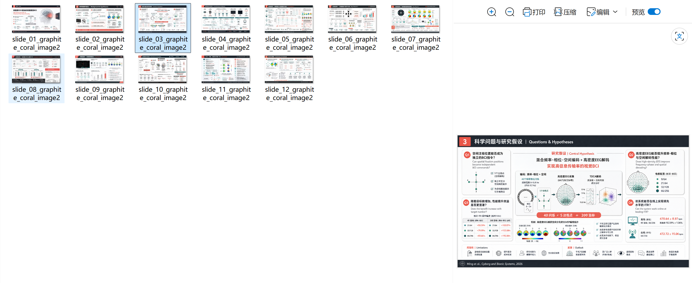
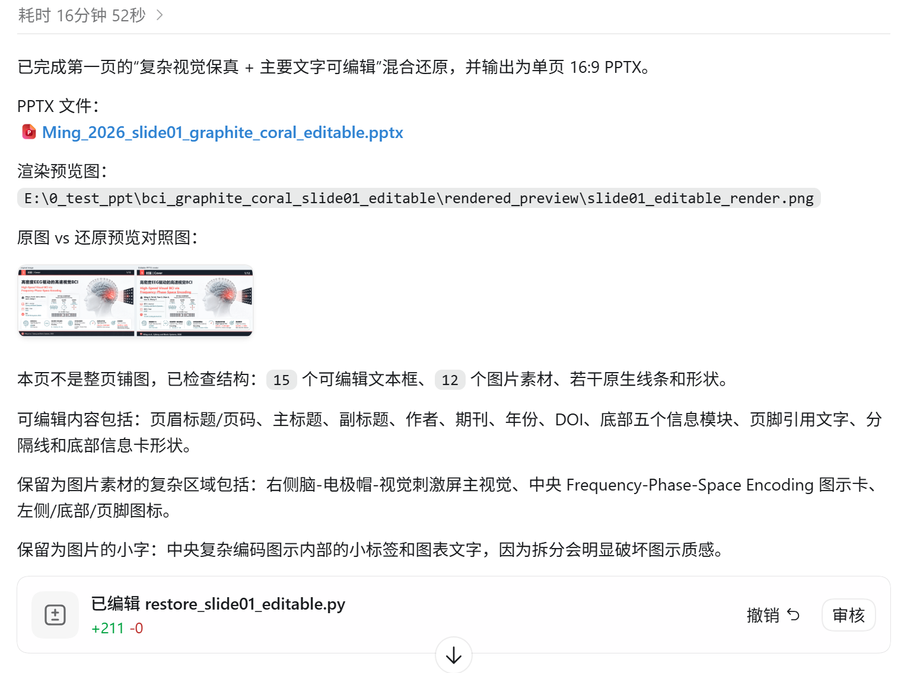
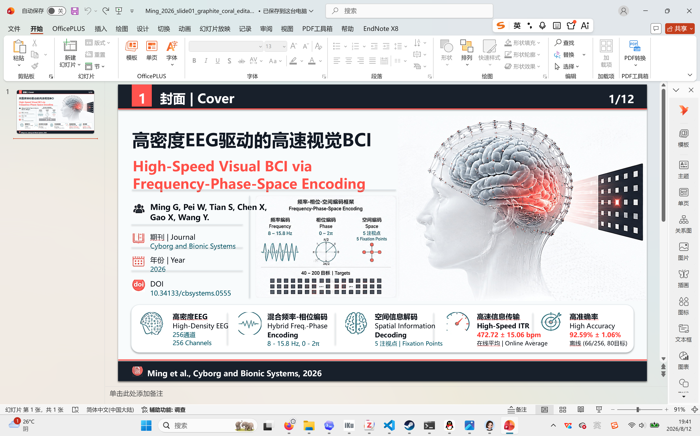

import { Collapse } from 'astro-pure/user'

本篇博客旨在介绍如何使用 codex 制作学术风格的、能够用于汇报的 PPT。在查询了许多相关教程后，笔者发现现有的 AI PPT 普遍存在：PPT 不够美观、每页 PPT 都是无法编辑的图片、内容过于简略不够学术等问题。经过多次搜索，笔者发现 b 站上的这个教程：[最新gpt5.6+image2，三步法输出高质量学术PPT](https://www.bilibili.com/video/BV1mgNj6MEuX/?spm_id_from=333.788.recommend_more_video.-1&trackid=web_related_0.router-related-2479604-9kkcc.1786517908318.1005&vd_source=0ea0c7956df75b2935422822b2001158)（up主：[一往无前河井](https://space.bilibili.com/404420852?spm_id_from=333.788.upinfo.detail.click)）制作出来的 PPT 比较符合要求，遂将过程总结如下（具体内容请查看原作者的视频和 up 主提供的网页链接：[https://wievf29s6ca.feishu.cn/wiki/L8mOwmm0KiApwZkfy8JcN7tonHg](https://wievf29s6ca.feishu.cn/wiki/L8mOwmm0KiApwZkfy8JcN7tonHg)，本文仅做整理）：

## 1. 准备材料

首先你需要：
- 一个 codex 账号，能正常使用 codex 的基本对话功能
- 后端模型：**gpt-image-2**、gpt-5.5 模型
- 足够的 token 额度（真的很烧钱！）

## 2. 生成缩略图

在正式生成 pptx 文件之前，我们需要先生成几套缩略图，并选择自己想要的一版。这里我选择的文章是*A High-Speed Visual BCI Based on Hybrid Frequency–Phase–Space Encoding and High-Density EEG Decoding*，提示词如下：

<Collapse title='生成缩略图 Prompt'> 请基于我上传的文献资料和参考风格图片，制作一份 12 页、16:9 宽屏比例、可用于课题组组会汇报的中英文混排学术 PPT。 要求如下：深入提炼文献核心内容，形成完整汇报逻辑，包括研究背景、科学问题、研究设计、方法、关键结果、数据图表、机制模型、创新点、讨论与总结展望等部分。PPT 需专业学术、美观清新，整体风格模仿我提供的参考图片，保持配色、字体、版式和视觉元素。 请避免大段文字堆砌，重点突出关键结论、核心数据和亮点发现。 需要加入图表、数据可视化、流程图、机制示意图、重点总结页等，使其适合正式组会展示。 在生成最终 PPT 文件前，请先用最新的image 2 图像生成模型生成类似学术风格的四套ppt缩略预览图，像幻灯片浏览视图一样布局，每套风格主题视觉颜色不同，但一定要符合学术美观清洁专业风格，最后我才来选定哪套输出详细的最终ppt文件。 </Collapse>

**注意**：这里一定要强调用 image-2 模型进行图像生成，gpt 5.5 生成的图像和 image-2 差别很大

可以看到 gpt 生成的这四幅图还是不错的

## 3. 确认输出风格

接下来我们选择自己想要的风格输出 PPT：

<Collapse title='确认输出风格 Prompt'> 选择第四套风格模板输出，注意是image 2 图像生成的图片，随后将页面图像文件拼合成完整 PowerPoint，并输出可下载的 .pptx 文件 </Collapse>

做好的 PPT 大概这样：

## 4. 输出为可编辑 PPT 文件

接下俩输出为可编辑 PPT 文件，这一步十分重要，记得要**一页一页输出**：

<Collapse title='输出为可编辑 PPT 文件'> 请把这个ppt的第一页还原成16:9的pptx文件​核心目标​采用“复杂视觉保真 + 主要文字可编辑”的混合还原策略。​优先保留原图的整体设计质感、构图、视觉完成度和高级感，同时保证主要文字可在 PPT 中直接编辑。​不要将整页简单铺成一张背景图。​还原原则​先识别页面结构，将内容拆分为：​复杂视觉资产层​可编辑信息层​复杂视觉资产层可优先从原图裁切/提取为高清图片嵌入 PPT，包括：​品牌 Logo、商标、产品 UI、人物、商品图、官方图标​照片、插画、3D 图、复杂背景、纹理、光影、玻璃拟态、金属质感​复杂图表、复杂流程图、循环图、拼图等高复杂视觉区域​可编辑信息层需尽量使用 PPT 原生元素重建，包括：​主标题、副标题、正文段落​金句、关键数字、关键词​结论框文字、注释文字、页脚说明、章节名、页码​简单线条、分隔线、基础几何框、轻量标签、按钮、色块、基础表格和简单图表​主要文字必须尽量使用 PPT 原生文本框重建，不得为了视觉保真将所有文字压成图片。​复杂视觉区域中的小字，如拆分会明显破坏质感，可保留为图片，但需在最终说明中标注。​文字处理要求​可编辑文字需尽量匹配原图的字体气质、字号层级、字重、颜色、行距、字距、对齐方式和位置。​如无法识别字体，选择最接近原图风格的系统字体：​中文：黑体、思源黑体、微软雅黑等​英文/数字：接近原图的无衬线或衬线字体​若原图文字需改为可编辑文本，应使用背景色、渐变近似或局部遮罩覆盖原文字，再叠加可编辑文本，避免重影。​不得出现明显错字、漏字、换行错误、文本溢出、文字重叠或位置漂移。​设计还原要求​保持原图的版式比例、视觉重心、阅读顺序和留白节奏。​保持原图的颜色、对比度、明暗关系、光源方向、阴影强度和空间层级。​复杂视觉区域应保留原始质感，不要替换成低质感的 PPT 默认图形、默认图标、默认阴影或模板化卡片。​元素的位置、大小、层级、裁切方式、圆角、描边、阴影、透明度和对齐关系应尽量贴近原图。​图表数据无法准确反推时，可按视觉比例近似重建，并在说明中标注“数据为视觉近似”。输出要求：输出可编辑 PPTX 文件。同时渲染 PPTX 预览图，并与原始图片进行视觉对照。如预览图与原图在质感、比例、间距、颜色、层级或整体观感上差距明显，应继续迭代修改。最终简要说明：哪些元素是可编辑文本、形状或图表，哪些元素是从原图裁切或提取的图片素材，哪些文字因嵌入复杂视觉区域而保留为图片 </Collapse>

最终输出的结果如下：

到目前 PPT 上所有的内容就都是可编辑的了

## 5. 小结

本文主要梳理了一种利用 codex 生成学术风格可编辑 PPT 的方法。通过这种方法，我们能借助 AI Agent 直接生成用于组会的 PPT。总结一下这种方法的优势：
- 比较省心，不用自己动手手搓了
- 生成的 PPT 美观、学术性强，便于展示
- 最主要的优点是可编辑

但目前这种方法也有一些不足：
- PPT 生成的非常慢，当然这可能和笔者用的中转站今天下午连接不太顺畅有关系。“生成缩略图”部分用了 23min10s，“输出特定风格的模板”用时 34min15s，“还原单页PPT为可编辑页”用时 16min52s。
- 最后的“输出为可编辑 PPT 文件”环节需要一页一页输出，比较麻烦。笔者尝试一次性生成全部页面，并没有达到预期的效果，看来目前只能一页一页生成
- 真的好烧钱，不过制作 PPT 这种大工程确实比较费 token

以上就是本文的全部内容了，更多内容请参考[最新gpt5.6+image2，三步法输出高质量学术PPT](https://www.bilibili.com/video/BV1mgNj6MEuX/?spm_id_from=333.788.recommend_more_video.-1&trackid=web_related_0.router-related-2479604-9kkcc.1786517908318.1005&vd_source=0ea0c7956df75b2935422822b2001158)（up主：[一往无前河井](https://space.bilibili.com/404420852?spm_id_from=333.788.upinfo.detail.click)）