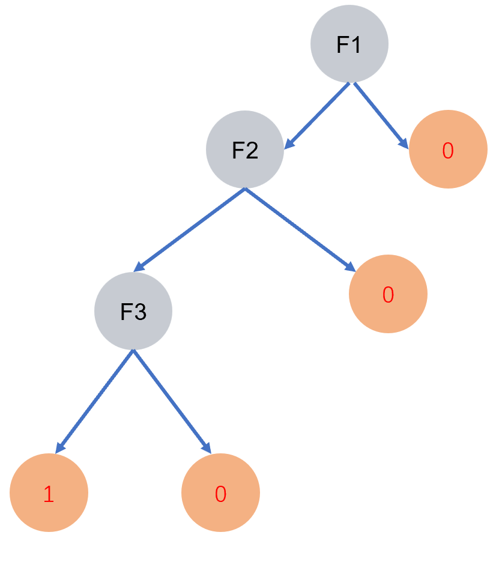
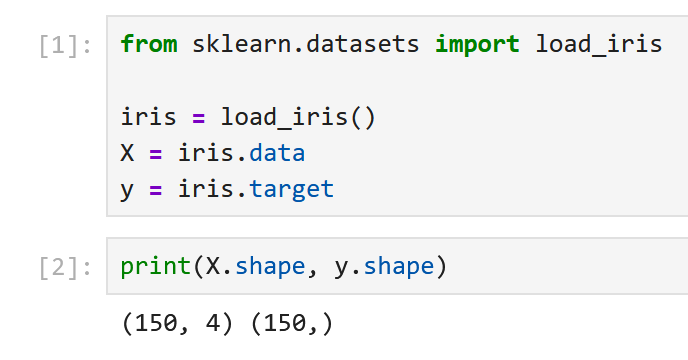
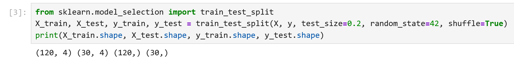
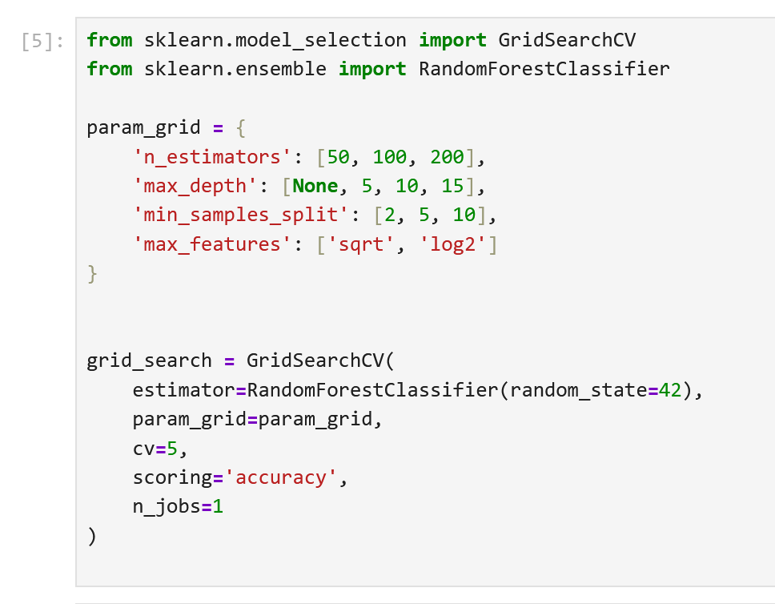
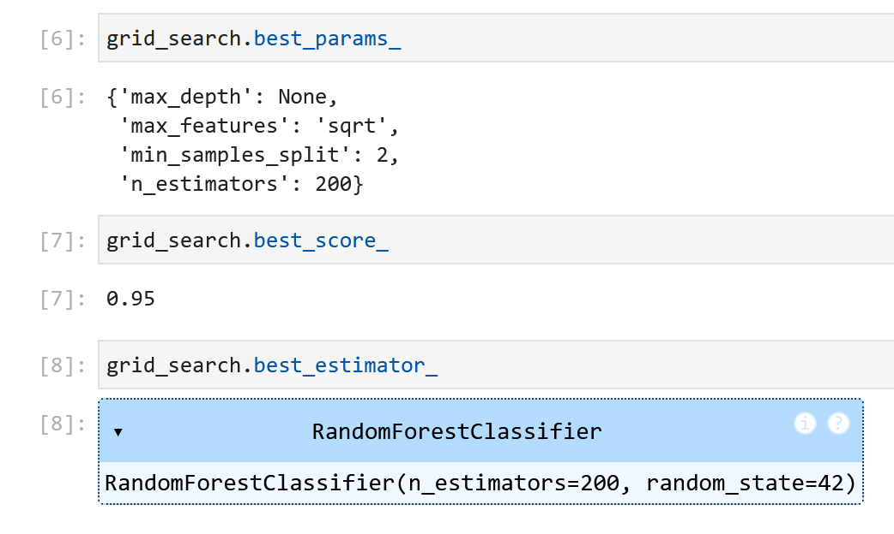
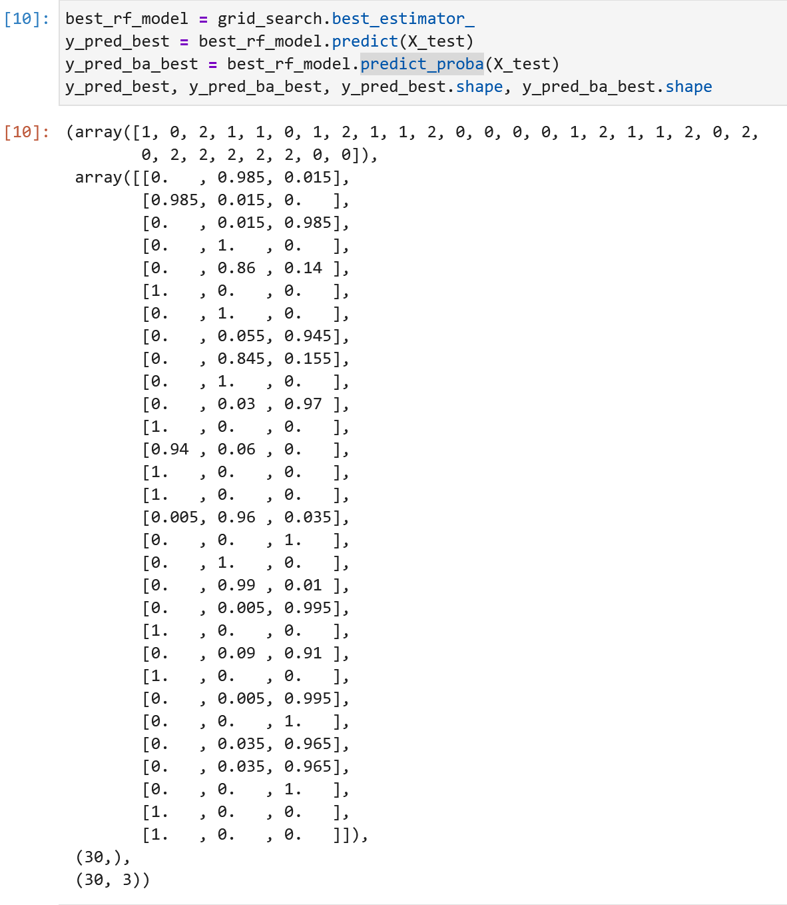
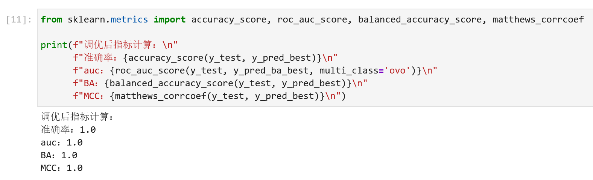
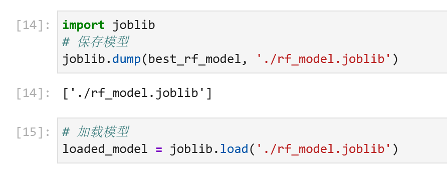

一个多月没写博客了，感觉表达能力退化了不少。新年的第一条博客就开一个新坑吧：本系列将介绍 scikit-learn 内置的一些机器学习模型的构建和训练方法，以及其他的相关知识。主要学习资源来自最近发现的一个 b 站 up 主“java1234官方”的系列视频[2026版 Scikit-learn Python机器学习 视频教程(无废话版) 玩命更新中~](https://www.bilibili.com/video/BV11reUzEEPH?spm_id_from=333.788.videopod.episodes&vd_source=0ea0c7956df75b2935422822b2001158)。这个栏目的主要目的是学习并记录一些常用的调库方法以及相关的模型训练工作流，对机器学习模型的工作原理、数学基础等不作过多介绍（致力于先把代码跑起来）。本系列第一个要介绍的机器学习模型是随机森林（Random Forest）


## 1. scikit-learn 简介

什么是 scikit-learn？根据 scikit-learn 中文社区给出的官方介绍：scikit-learn 是一个免费的 Python 软件机器学习库，提供各种分类，回归和聚类算法，如 SVM ，随机森林，梯度提升等。简单来说，scikit-learn 是一个 Python 库，这个库提供了多种模型的实现，用户只需要调用相关的 API 即可完成模型构建、训练等任务，而无需从头构建模型。在本文的叙述过程中，有时会使用 scikit-learn 的简写：sklearn，读者需清楚二者表示的是同一个库。要使用 sklearn，需要先安装 scikit-learn 库，安装指令如下：
```bash
pip install scikit-learn
```
sklearn 的官方资源详见以下网址:

- [scikit-learn 官方网址](https://scikit-learn.org/stable/index.html)
- [scikit-learn 中文社区](https://scikit-learn.org.cn/)


## 2. 随机森林算法（Random Forest）

在介绍随机森林之前，我们需要引入另一个机器学习算法：决策树（Decision Tree）。决策树的核心思想是**不断挑选特征分裂节点，直到最后一层叶子结点时实现分类**。下图展示了一个简易的决策树：其中 F1、F2、F3 均为特征，0 / 1 分别代表分类结果是阴性 / 阳性。以示意图为例，根节点特征是 F1，若该样本的 F1 特征满足对应的条件，则进入左孩子节点继续分裂，否则进入右孩子节点，分类结果为 0（阴性）；这个过程将地递归进行，直到到达叶子结点。决策树的节点分裂依据是**信息增益**[1]，这里我们先不展开介绍，后续的博客中我们将为决策树算法单开一个专题。


<p style="text-align:center;">决策树示意图</p>


随机森林算法和决策树高度相关，简单来说，随机森林是多个决策树的集成学习算法。集成学习（Ensemble Learning）旨在通过融合多个基分类器的预测结果以提高模型的泛化能力，常用的策略有 Bagging，Boosting，Stacking 等。随机森林属于 Bagging 集成的一种，其核心过程如下[2]：

1. 数据集采样：按一定比例**有放回地**选取整个训练集的子数据集进行训练。也就是说，在整个训练过程中，可能有一些样本被选择了多次，也可能有一些样本从未被选择到

2. 随机选择特征子集：按一定比例**随机选取**部分特征进行节点划分

3. 训练决策树：用上述数据集和特征子集训练多棵决策树模型

4. 集成学习：若目标是分类任务，则使用多数投票的方法输出最终的分类结果；若是回归任务，则取平均输出回归结果


## 3. 代码逐步拆解

为便于演示，本文中的所有演示代码均在 jupyter lab 上编写。数据集采用 sklearn 提供的鸢尾花数据集，加载数据如下：


<p style="text-align:center;">加载鸢尾花数据集</p>

通过打印 numpy 数组的形状，我们可以发现：样本共有 150 条，特征有四列。在构建模型前，我们需要划分训练集、验证集和测试集：


<p style="text-align:center;">划分数据集</p>

接下来构建随机森林模型。随机森林在 sklearn 库中的接口是`RandomForestClassifer`。理论上来说，我们直接实例化这个类，使用默认参数即可完成预测。但在实际的模型构建过程中，有许多未确定的模型参数。为了使算法的性能尽可能达到最高，需要对模型进行**调参**。寻找最佳参数组合的过程即为模型的调参过程。在本实验中，我们选择网格搜索（Grid Search）方法调参（除了网格搜索外，也有一些其他的调参方法，如贝叶斯优化、随机搜索等[3]）。网格搜索的核心思想是：遍历程序设置的参数网格中所有可能的参数组合，根据定义的指标寻找最优模型。因此，需要我们自己显式地给出参数网格。

随机森林的可调整参数比较多，官方文档中给出了全部可调参数及对应的含义[4]。本文主要介绍几个常用的可调参数：

1. `n_estimators`：随机森林中的决策树的数量，默认值是 100（旧版本的默认值是 10）。

2. `max_depth`：树的最大深度，默认值是 None。如果为 None，则节点会扩展直到所有叶子都是纯的，或者直到所有叶子包含的样本数少于 min_samples_split。

3. `min_samples_split`：分割内部节点所需的最小样本数，默认值是 2。

4. `max_features`：寻找最佳分割时要考虑的特征数量，常设置为 None 或 sqrt 或 log2。以 sqrt 为例，如果 max_features 设置为 sqrt，则每次选取的特征子集数量为全部特征数量的开平方。

5. `n_jobs`:并行运行的处理器数，默认值为 None，即为 1。如果设置为 -1，则相当于调用 CPU 的所有处理器进行并行计算。**一定要根据服务器的运行情况合理地设置该参数，不要直接设置为 -1**

在设计好参数网格后，需要实例化 GridSearch 对象实现网格搜索。我们选择准确率（Accuracy）作为优化指标，示例代码如下图。经尝试后发现，笔者的计算机只能设置`n_jobs=1`，否则会报错。


<p style="text-align:center;">网格参数</p>

调用 GridSearchCV 对象的 fit 方法即可实现模型的训练，即

```python
grid_search.fit(X)
```

模型训练后，GridSearchCV 对象提供了一系列属性供我们调用，以获取交叉验证结果，最佳模型等。`cv_results_`属性给出了一个包含所有的交叉验证结果的字典。`best_params_`给出了最佳的参数组合，衡量模型性能指标是 GridSearchCV 对象中设置的 `scoring="accuracy"`。`best_score_`给出了最佳交叉验证分数。`best_estimator_`给出了最佳模型。以上属性获取结果如下：


<p style="text-align:center;">gridsearch属性</p>

获取到最佳的模型后，我们在独立测试集上进行测试，以验证模型在各项指标上的性能。具体的指标计算可直接调用 sklearn 中提供的 API。有些指标的计算不仅要模型输出预测标签，还需要输出预测概率，可分别通过`predict`方法和`predict_proba`方法获取。


<p style="text-align:center;">预测标签和概率</p>

由于 iris 数据集是一个三分类任务，所以`predict_proba`有三列，分别对应每个类别的预测概率。通过以下代码计算各个指标：


<p style="text-align:center;">指标计算</p>

最后，调用 joblib 库将模型保存下来，方便后续使用：


<p style="text-align:center;">模型保存与加载</p>

## 4. 代码实现

整体代码实现如下：

```python
from sklearn.datasets import load_iris
from sklearn.ensemble import RandomForestClassifier
from sklearn.metrics import accuracy_score, roc_auc_score, balanced_accuracy_score, \
    matthews_corrcoef
from sklearn.model_selection import train_test_split, GridSearchCV
import joblib

# 1. 加载数据
iris = load_iris()
X = iris.data # numpy 类型，形状(150,4)
y = iris.target # numpy 类型，形状(150, )

# 2. 数据预处理
X_train, X_test, y_train, y_test = train_test_split(X, y, test_size=0.2, random_state=42, shuffle=True)

# 3. 定义网格参数
param_grid = {
    'n_estimators': [50, 100, 200],
    'max_depth': [None, 5, 10, 15],
    'min_samples_split': [2, 5, 10],
    'max_features': ['sqrt', 'log2']
}

# 4. 创建 gridsearch 对象
grid_search = GridSearchCV(
    estimator=RandomForestClassifier(random_state=42),
    param_grid=param_grid,
    cv=5,
    scoring='accuracy',
    n_jobs=1 # 启用所有 CPU 核心并行计算
)

# 5. 在训练集上进行网格搜索
grid_search.fit(X_train, y_train)

# 6. 输出最佳参数
print(f"最佳参数：{grid_search.best_params_}")
print(f"最佳交叉验证分数：{grid_search.best_score_}")

# 7. 使用最佳参数的模型进行预测
best_rf_model = grid_search.best_estimator_
y_pred_best = best_rf_model.predict(X_test)
y_pred_ba_best = best_rf_model.predict_proba(X_test)
print(f"调优后指标计算：\n"
      f"准确率：{accuracy_score(y_test, y_pred_best)}\n"
      f"auc：{roc_auc_score(y_test, y_pred_ba_best, multi_class='ovo')}\n"
      f"BA：{balanced_accuracy_score(y_test, y_pred_best)}\n"
      f"MCC：{matthews_corrcoef(y_test, y_pred_best)}\n")

# 8. 保存模型
joblib.dump(best_rf_model, './models/rf_model.joblib')
```

相关资源和参考文献

1. [一文看懂决策树（Decision Tree）](https://zhuanlan.zhihu.com/p/133838427)
2. [五分钟速通随机森林（附实战案例与数据集）](https://zhuanlan.zhihu.com/p/481560459)
3. A. R. M. Rom, S. Ibrahim, A. F. A. Fadzil, N. N. A. Mangshor and N. A. M. Ghani, "A Review of Hyperparameter Tuning Methods in Machine Learning," 2025 6th International Conference on Artificial Intelligence and Data Sciences (AiDAS), West Java, Indonesia, 2025, pp. 1-6, doi: 10.1109/AiDAS67696.2025.11213530.
4. [RandomForestClassifier 官方文档](https://scikit-learn.cn/stable/modules/generated/sklearn.ensemble.RandomForestClassifier.html)