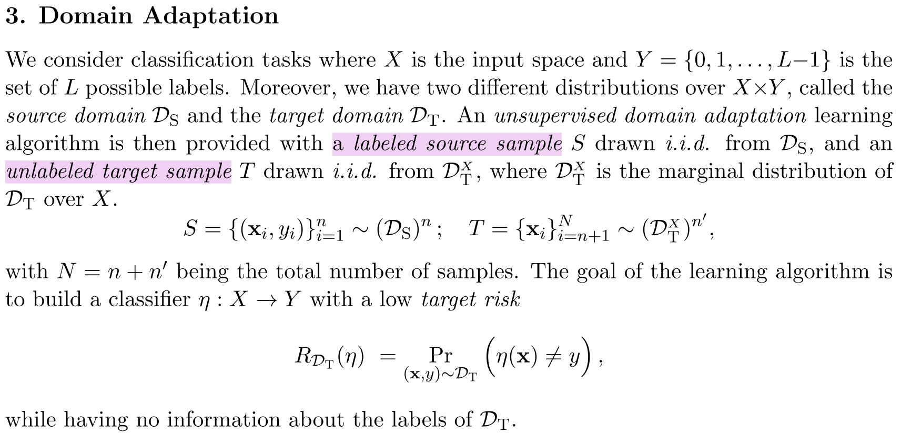
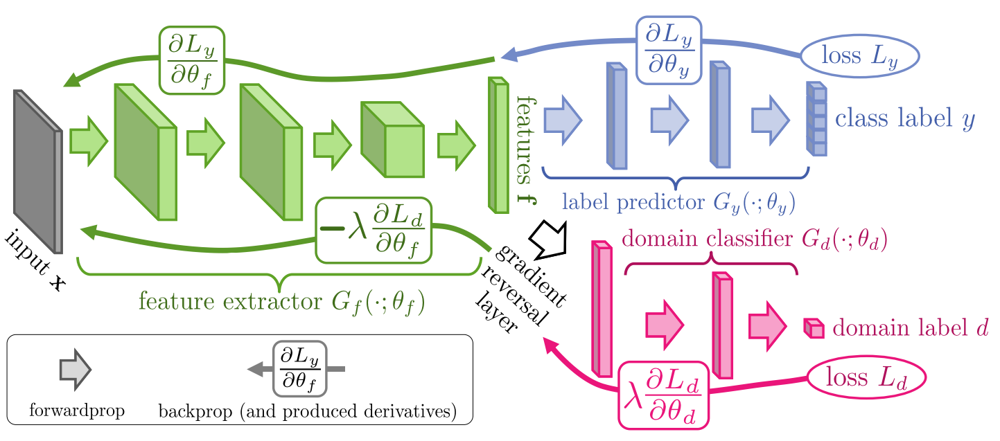

import { Aside } from 'astro-pure/user'

## 1. 研究背景：域适应问题

域适应神经网络（DANN）由 Yaroslav Ganin 等人在文章"Domain-Adversarial Training of Neural Networks"中首次提出，主要用于解决域适应问题。常规的机器学习算法包含一个潜在的数学假设，即要求训练集和独立测试集是**独立同分布**的。举例来说，如果任务目标是训练一个能够识别不同犬类品种图片的机器学习算法，那么训练集和测试集必须都是狗的图片。如果训练集里都是狗的图片，而测试集里都是猫的图片，那模型一定会失效。然而，出于数据量稀少或数据本身性质的原因（如脑电信号的类内特异性），一些数据集难以保证训练集和测试集的数据分布情况相同，这就是“跨域”问题。训练集的样本空间被称为“源域”（Source Domain），测试集的样本空间被称为“目标域”（Target Domain）。基于以上背景，“域适应”问题被提出：对于分布不同但有相似性质的训练集和测试集，如何使得在源域上训练的模型能正常在目标域上使用？

在 DANN 以前，已有一些相关工作提出了解决方法。常见的解决方案包括对齐统计矩、基于几何结构的对齐方法、基于权重的对齐方法等等。DANN 提出了一个基于深度学习的解决方案，其核心结构包括三部分：**特征提取器**、**标签预测器**和**域分类器**。稍后我们将在“算法结构”小节加以解释。

## 2. 数学原理

训练数据和测试数据的特征分布不一致的现象称为**协变量偏移**。设样本特征为$X$，标签为$y$，模型学习到的规律便是$P(y|X)$。值得注意的是，$P(y|X)$在源域和目标域是相同的，也就是说模型学习到的规律本身没有发生改变。结合第一小节的阐述，模型失效的原因是源域和目标域的$X$不服从同一种分布。源域的样本服从$$D_{S}(X,y)$$的联合分布，目标域的样本服从$$D_{T}^{X}$$的边缘分布。依据协变量偏移假设，两域标签条件分布$P(y|x)$一致，只需对齐源域与目标域在特征空间中的输入边缘分布，即可让源域训练的分类器泛化至目标域。

<Aside title="边缘分布">
边缘分布（也叫边际分布）是多维随机变量的联合分布中，对其中一部分变量“求和/积分”，消去其他变量后，剩下的那部分变量的概率分布。它描述了单个/部分变量的整体概率规律，不再考虑其他变量的取值。

数学定义（以二维离散情况为例）：

设二维随机变量$(x,y)$的联合分布为$P(x,y)$，则:
$$P_{X}(x)=\sum_{y}P(x,y)$$

在域适应问题中，源域（训练集）是带标签的，既知道$X$也知道$y$，因此能够得到联合分布；而目标域（测试集）是不带标签的，只知道$X$不知道$y$，因此只能得到边缘分布。
</Aside>

原文摘录如下：

> 从源域$D_{S}$中获取带标签的数据$(x_{i},y_{i})$（样本服从$D_{S}(x,y)$的联合分布），从目标域中获取无标签的数据$\textbf{x}_{i}$（样本服从$D_{T}^{X}$的边缘分布）。寻找一个从样本空间映射到标签空间的分类器$\eta$（模型），使得$\eta(\textbf{x})$尽可能的等于真实标签$y$。

## 3. 算法思路

DANN 尝试让特征提取器学习“域无关”的特征（这一步就是在进行“域对齐”操作），再将学习到的特征输入标签预测器，实现准确的预测。“域无关”在这里指的是那些**不包含领域专属信息**的特征。比如说，源域是充足光照下的猫咪图片，目标域是夜晚时的猫咪图片，任务目标是识别图中的小猫品种。我们当然希望模型去学习和“猫”有关的特征，而不是和“光照”相关的特征。在这个例子中，光照信息就是域相关的，猫的特征就是域无关的。

DANN 的域分类器和特征提取器将进行**对抗学习**。域分类器尽可能地区分来自源域和来自目标域的样本，而特征提取器则尽可能提取能够让域分类器混淆的特征。我们可以举例说明这个训练过程：特征提取器提取了特征$A$，输入到域分类器中，域分类器识别特征$A$来自源域。在训练过程中，域分类器的分类能力会越来越强；而特征提取器也会越来越强，提取出让域分类器难以区分的特征。最终情况是：域分类器已经很强了，但还是无法准确识别特征提取器提取的特征$A$是来自源域还是目标域。当达到这个效果时，我们就说特征提取器成功提取出了“域无关”的特征。在更新参数时，用到的重要结构便是**梯度反转层（GRL）**，也是 DANN 的主要创新点之一。

总结一下模型训练的流程：我们通过特征提取器$f$，学习到一个**域不变的特征表示**，使得源域和目标域在特征空间的分布尽可能接近；然后在这个共享的特征空间上训练分类器$\eta$，让它在源域上分类正确，同时因为特征分布对齐，它也能在目标域上表现良好。

$$样本空间 \stackrel{特征提取器f}{\longrightarrow} 特征空间 \stackrel{分类器\eta}{\longrightarrow} 标签空间$$

## 4. 算法结构

如前文所述，DANN 的核心结构包括三部分：**特征提取器**、**标签预测器**和**域分类器**。其中域分类器用于判别样本所属领域，特征提取器负责剔除域专属信息、学习域无关特征，标签预测器输出最终的预测结果。DANN 的算法结构如下图：

特征提取器$G_{f}$，其参数为$\theta_{f}$（上图绿色部分）；标签预测器$G_{y}$，参数为$\theta_{y}$；域分类器$G_{d}$，参数为$\theta_{d}$

前向传播过程如下：输入向量$\mathbf{x}$在经过特征提取器$G_{f}$后，提取到特征向量$f$。$f$随后进入两个模块：（1）标签预测器。$f$在经过$G_{y}$预测后，得到预测值$\hat{y}$，可计算和真实标签$y$之间的损失$L_{y}$。（2）域分类器。$f$在经过梯度反转层后，经过$G_{d}$得到域标签$\hat{d}$，可计算和真实域标签$d$之间的损失$L_{d}$。在前向传播时，梯度反转层不起任何作用，相当于一个$f\rightarrow f$的恒等映射。

DANN 的训练是一个**极大极小问题**。在同一轮反向传播中自动实现三模块不同优化目标，整体构成极小极大优化博弈。（1）训练标签预测器。这部分的目标是**最小化**损失$L_{y}$，使标签预测尽可能准确。梯度更新的方向是$-\frac{\partial L_{y}}{\partial \theta_{y}}$，反向传播后得到更新好的参数$\theta_{y}$。（2）训练域分类器。这部分的目标是**最小化**损失$L_{d}$，使域分类尽可能准确。梯度更新的方向是$-\frac{\partial L_{d}}{\partial \theta_{d}}$。反向传播后得到更新好的参数$\theta_{d}$。（3）训练特征提取器。特征提取器的损失来源于$L_{d}$和$L_{y}$。训练目标是：在最大化分类准确率的同时尽可能地混淆域分类器（让标签预测器尽量准确，域分类器尽量不准确），也就是在让$L_{y}$尽可能小的同时让$L_{d}$尽可能大，因此梯度是：

$$\nabla_{\theta_{f}} L= \frac{\partial L_{y}}{\partial \theta_{f}}-\lambda \frac{\partial L_{d}}{\partial \theta_{f}}$$

在反向传播时，梯度反转层的作用便是上式的$-\lambda$（其中$\lambda$是超参数）。经过对抗达到平衡时，域分类器已经是最强状态，无法再进一步区分两个域的特征；特征提取器也已经学到了域无关特征，既能让分类器分准类别，又能让域分类器无法区分来源。

SGD的更新规则就是（$\alpha$是学习率）：

$$\theta_{f} \leftarrow \theta_{f}-\alpha \cdot (\frac{\partial L_{y}}{\partial \theta_{f}}-\lambda \frac{\partial L_{d}}{\partial \theta_{f}})$$

<Aside title="参数更新的链式法则">
$$\frac{\partial L_{y}}{\partial \theta_{f}}=\frac{\partial L_{y}}{\partial f} \cdot \frac{\partial f}{\partial \theta_{f}}$$
</Aside>

<Aside type="caution" title="DANN 的损失函数">

$$Loss = \min_{\theta_{f},\theta_{y}} \max_{\theta_{d}} (L_{y} - \lambda L_{d})$$

解读：

参数$\theta_{f}$、$\theta_{y}$的更新目标是让$L_{y} - \lambda L_{d}$尽可能小（式子中的$\min$），也就是让$L_{y}$尽可能小，$L_{d}$尽可能大。参数$\theta_{d}$的更新目标是让$L_{d}$尽可能小（$\theta_{d}$无法调控$L_{y}$，因为它只是域分类器的参数）。
</Aside>