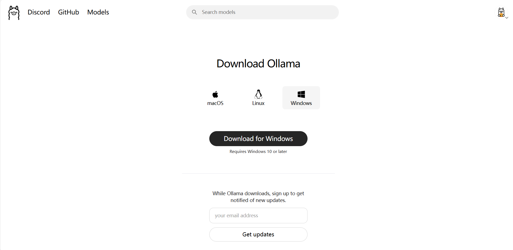
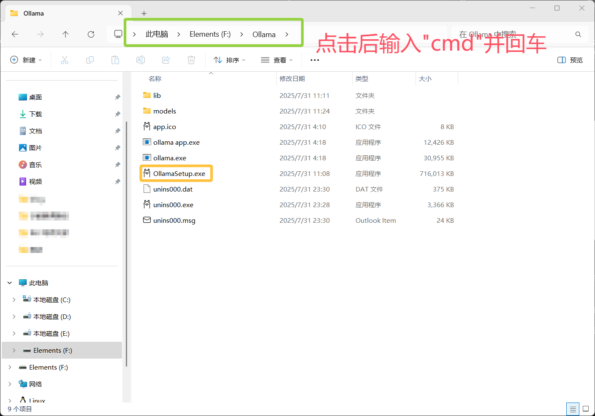
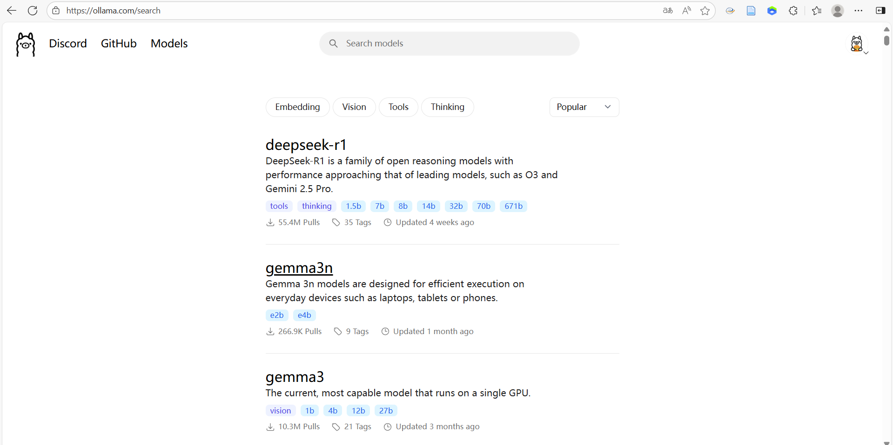
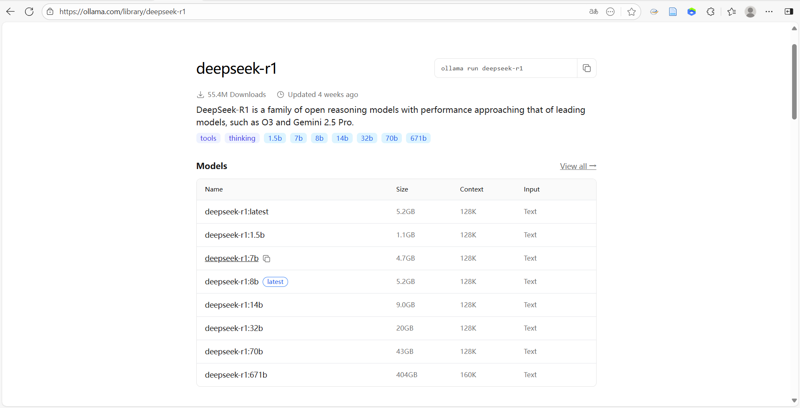
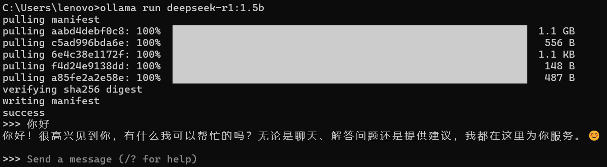
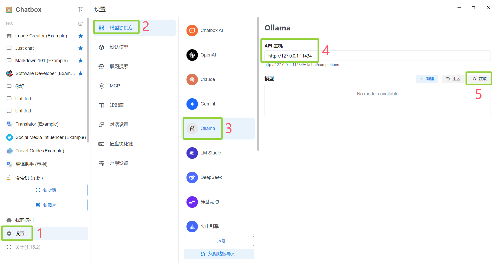
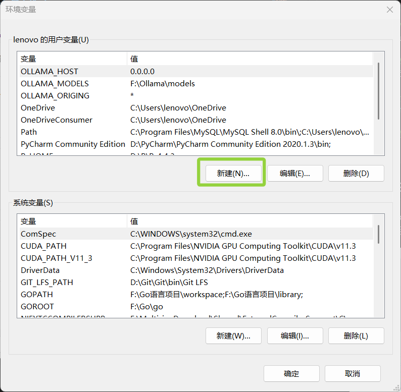
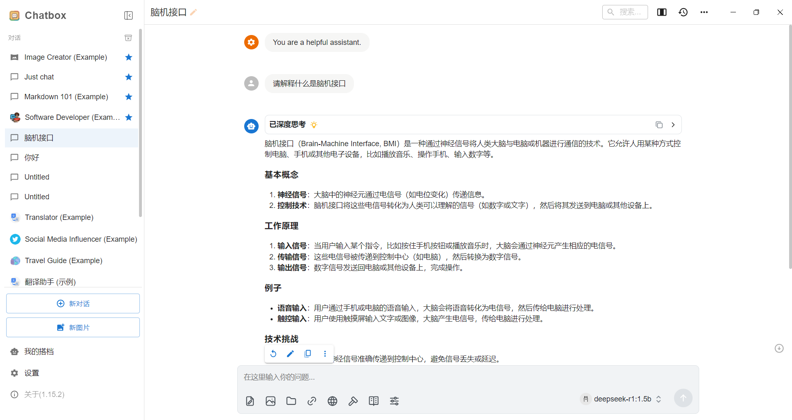

import { Aside } from 'astro-pure/user'

本文参考了以下文章，如有侵权请联系作者，作者将立刻删除：

- [记录在本地电脑部署自己的 DeepSeek 大模型AI](https://www.cnblogs.com/LaiYun/p/18695293)

- [使用 Ollama 在本地部署 AI 大模型： 安装、部署和 API 调用的分步指南](https://apifox.com/apiskills/ollama-deploy/)

- [自定义Ollama安装路径](https://www.cnblogs.com/LaiYun/p/18696931)

在日常使用大模型时，我们往往会选择直接登录模型官网调用 API，但这种方法常受到收费标准、网络环境的限制。相比之下，将模型部署在本地不仅能实现离线使用，还能有效规避数据泄露的风险。本文将详细记录大模型的本地部署方法。

## 1. 下载 Ollama

Ollama 是一个“傻瓜式”本地大模型启动器——一条命令就能把 Llama、Qwen、Gemma 等开源大模型下载、安装并运行在你的电脑或服务器上，无需安装复杂依赖，也无需把数据传上云端。

官网下载 Ollama ：https://ollama.com/

进入官网后选择适合自己操作系统的版本，点击 Download 即可


<p style="text-align:center;">下载ollama</p>

<Aside>默认情况下，Ollama 是下载在 C 盘的，并且安装软件时用户无法自定义目标盘符。</Aside>

由于 C 盘空间有限，我们选择将软件和模型文件安装在 F 盘（想安装到 C 盘的可以直接跳过以下部分）

首先打开下载好的 OllamaSetup.exe 所在的文件夹，点击上方的文件路径搜索栏，输入`cmd`后回车进入命令行界面


<p style="text-align:center;">安装ollama</p>

输入指令

```bash
OllamaSetup.exe /DIR=Path_To_File
```

`Path_To_File` 用 OllamaSetup.exe 所在的文件夹地址代替，比如我的指令就是

```bash
OllamaSetup.exe /DIR=F:\Ollama
```

<Aside>”/DIR=“后面的路径重要使用反斜杠（ \ ）或双斜杠（ // ）</Aside>

这样 Ollama 软件和 models 文件夹就都在 F 盘了

## 2. 下载 ChatBox

ChatBox 是一个接入了大模型的客户端界面，理论上我们完成本地部署之后可以直接在命令行界面和 LLM 对话，但 ChatBox 提供了一个 UI 界面，通过它我们可以更清楚地看到对话记录等信息

官网下载 ChatBox：https://chatboxai.app/zh

安装过程比较简单，就不演示了 (・ω・)

## 3. 下载模型文件并运行

进入 Ollama 官网，点击官网左上角的 “Models”，进入模型选择界面


<p style="text-align:center;">模型选择页面</p>

我们本次要部署的大模型是 deepseek-r1 ，点击 deepseek-r1 后进入如下界面


<p style="text-align:center;">deepseek-r1模型</p>

在 Models 中，Name 为模型名称，模型后面的数字表示参数量，如 7b 表示该模型的参数量为 70 亿(7 billion)；Size 为模型占用的磁盘空间大小；Context 为上下文长度，如 128K 表示模型可处理 128,000 个 token 的前文信息；Input 为输入类型，这几个模型的输入信息均为文本类型

大家可以根据设备的硬件性能选择合适的模型，我选择的模型为 deepseek-r1:1.5b

打开终端，输入

```bash
ollama run deepseek-r1:1.5b
```

即可看到模型的下载过程

下载完成后可直接和模型对话


<p style="text-align:center;">模型下载与对话</p>

常用指令:

```bash
# 模型文件下载与运行
ollama run model_name

# 查看本地模型列表
ollama list

# 删除某个模型
ollama rm model_name

# 结束和模型的对话
/bye
```

## 4. ChatBox 接入本地模型

打开 ChatBox，按下图顺序操作，在序号 4 处按图中方式填写，在序号 5 处点击获取后添加对应模型即可


<p style="text-align:center;">ChatBox接入本地模型</p>

打开”编辑系统环境变量”，进入”环境变量”，点击”新建”，新建两个环境变量：

变量名：OLLAMA_HOST 变量值：0.0.0.0

变量名：OLLAMA_ORIGING 变量值：*


<p style="text-align:center;">新建环境变量</p>

保存后退出 Ollama，并重启 Ollama

再打开 ChatBox，即可正常对话


<p style="text-align:center;">使用ChatBox和模型对话</p>