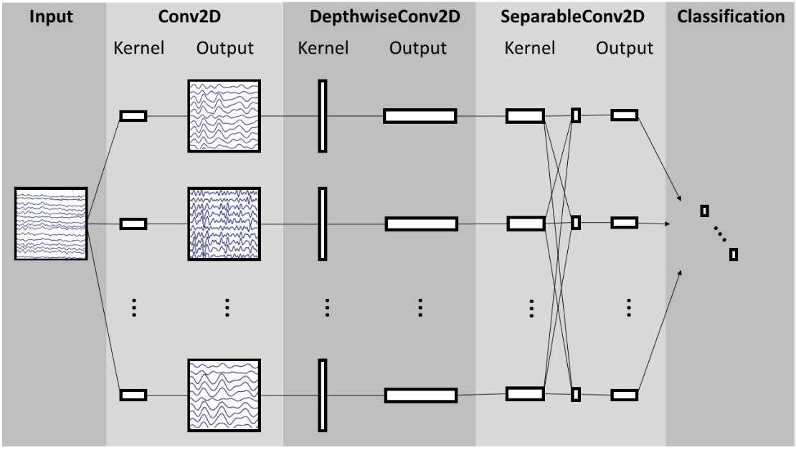
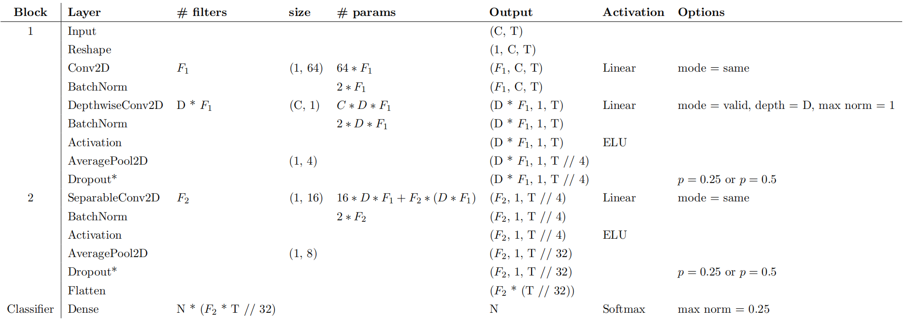
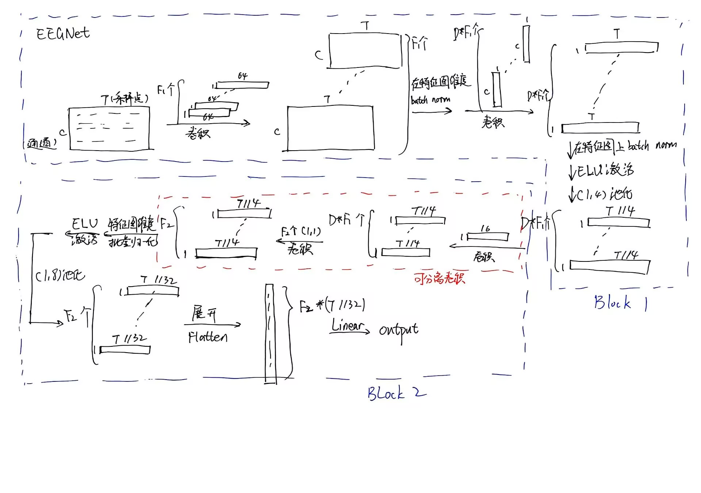
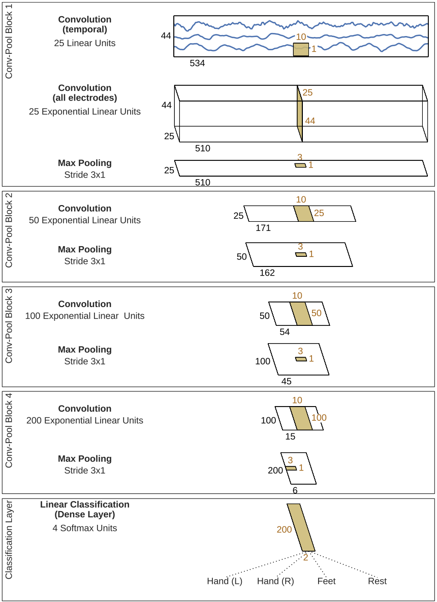
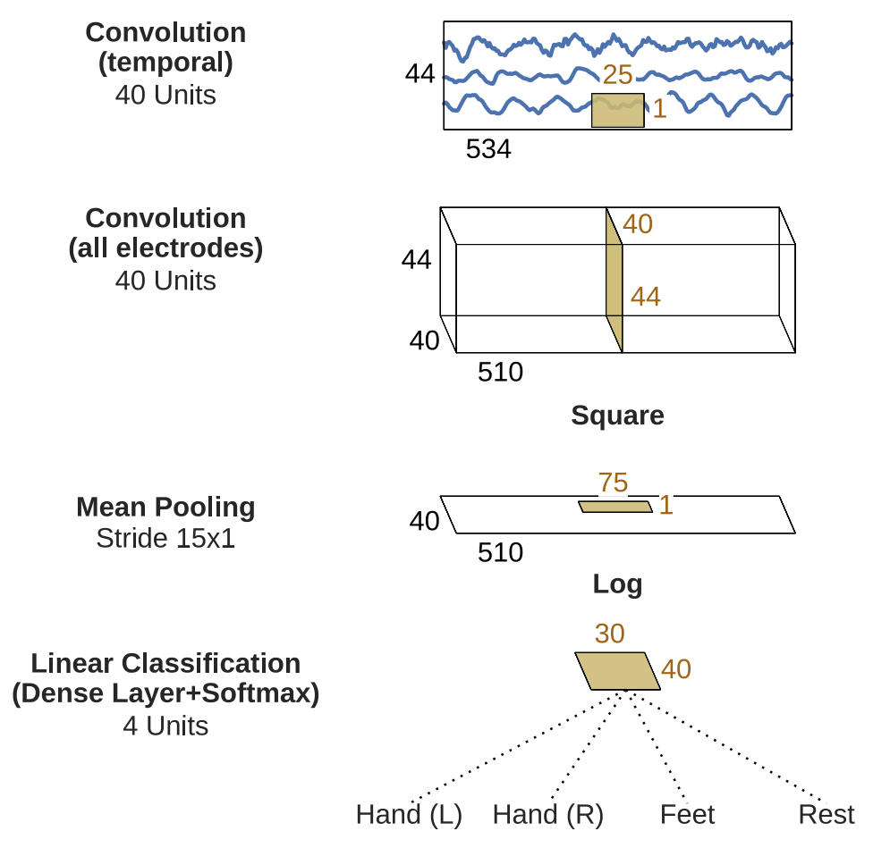

import { Aside , Spoiler } from 'astro-pure/user'

本文旨在汇总一些经典论文中提出的 EEG 解码算法

## 1. EEGNet

### 论文信息

原始论文：[EEGNet: A Compact Convolutional Network for EEG-based Brain-Computer Interfaces](https://arxiv.org/abs/1611.08024)

发表时间：2018

官方代码（基于 Tensorflow）：https://github.com/vlawhern/arl-eegmodels

### 主要贡献

- 提出了一种跨范式的 BCI 解码算法：可用于 P300 视觉诱发电位、错误相关负电位（ERN）、运动相关皮层电位（MRCP）和感觉运动节律（SMR）等范式
- 和同类型基于 CNN 的算法相比，参数量更少
- 具备可解释性

**核心思路：用卷积代替传统的时域、空域滤波器，训练模型自动调整参数；不同卷积分别学习时域、空域特征**

### 算法架构



> 图 1：EEGNet 架构的整体可视化图。线条表示输入与输出（称为特征图）之间的卷积核连接。该网络首先通过时间卷积（第二列）学习频率滤波器，随后使用深度卷积（中间列）——该卷积分别连接到每个特征图——来学习特定频率的空间滤波器。可分离卷积（第四列）由深度卷积和点卷积组合而成：深度卷积为每个特征图单独学习时间摘要，随后点卷积学习如何将特征图进行最优混合。网络架构的完整细节详见表2。

笔者注：<Spoiler>这个架构图不是很清晰，可以结合下面的表格查看每个板块的输入/输出张量形状</Spoiler>



张量传递图：



tensor 形状变化（在上表和以下叙述中，均省略了$\text{batch size}$）：

*Block 1*：

1. Input：输入时形状为$(C,T)$，$C$代表通道（导联），$T$代表采样点。
2. Reshape：改变形状为$(1,C,T)$ -> $1$ 用来“占位”，和“特征图数量”这一变量对齐
3. Conv2D：用$F_{1}$个$(1,64)$的卷积核提取**时域特征**，可以理解为这一步是在用$F_{1}$个不同的滤波器对$C$个通道的、长度为$T$的脑电信号进行**滤波**，得到$F_{1}$个特征图（即输出形状为$(F_{1},C,T)$）
4. BatchNorm：在特征图维度上进行批量归一化，形状不变，仍为$(F_{1},C,T)$
5. DepthwiseConv2D：用$D*F_{1}$个大小为$(C,1)$的卷积核提取**空域特征**。大小为$(C,1)$的卷积核的作用是“跨导联”，相当于把$C$个导联的信息加权到一个“平均导联”上，所以得到的单个特征图大小为$(1,T)$。卷积核数量为$D*F_{1}$，相当于对每个大小为$(C,T)$的特征图，用$D$个滤波器进行**空域滤波**，学习不同的空间信息。因此输出张量的形状是$(D*F_{1},1,T)$
6. BatchNorm：在特征图维度上进行批量归一化，形状不变，仍为$(D*F_{1},1,T)$
7. Activation：非线性激活，这里使用 ELU 单元
8. AveragePool2D：平均池化层，核大小为$(1,4)$，相当于在时域上每隔四个点一采样，输出形状为$(D*F_{1},1,T//4)$
9. Dropout：训练时防止过拟合

*Block 2*：

1. SeparableConv2D：可分离卷积，包括两部分：深度卷积核和$1*1$卷积。先用$(1,16)$的卷积核再提取一次**时域特征**，仍然相当于滤波操作，并保持形状不变，仍为$(D*F_{1},1,T//4)$。再用$F_{2}$个$1*1$卷积将通道数调整为$F_{2}$。$1*1$卷积相当于在整合各个通道的信息。输出形状为$(F_{2},1,T//4)$
>注：论文中提到，通常取$F_{2}=F_{1}*D$，即不改变通道数
2. BatchNorm：在特征图维度上进行批量归一化，形状不变，仍为$(F_{2},1,T//4)$
3. Activation：非线性激活，这里使用 ELU 单元
4. AveragePool2D：平均池化层，核大小为$(1,8)$，相当于在时域上每隔八个点一采样，输出形状为$(F_{2},1,T//32)$
5. Dropout：训练时防止过拟合
6. Flatten：将张量展平为$D*F_{1}*1*T//32$，输入到线性层进行分类

示例代码：
```python
from scipy.io import loadmat
import torch
from torch import nn
import numpy as np

data_path = "./datatsets/kaggle-P300-datatset/P300S01.mat"

def load_mat_data(data_path=data_path, test_cut=False):
    mat_data = loadmat(data_path, struct_as_record=False, squeeze_me=True)
    data_struct = mat_data['data']
    X = data_struct.X  # (358372, 8)  时间点×导联
    y = data_struct.y  # (358372,)    每个时间点的标签
    Fs = 250  # 采样率
    if test_cut:
        X = X[0:8000, :] # 只取前8000个采样点，减少计算量
        y = y[0:8000]
    return X, y, Fs

def preprocessing(X, y, Fs):
    t_pre = int(0.1 * Fs)
    t_post = int(0.6 * Fs)
    window = (-t_pre, t_post)
    epochs = []
    labels = []
    target_idx = np.where(y==1)[0]
    non_target_idx = np.where(y==0)[0]
    for idx in target_idx:
        start = idx + window[0]
        end = idx + window[1]
        if start >= 0 and end <= len(X) and (end - start) == t_pre + t_post:
            X_epoch = X[start:end, :].T
            epochs.append(X_epoch)
            labels.append(torch.tensor(1))
    for idx in non_target_idx:
        start = idx + window[0]
        end = idx + window[1]
        if start >= 0 and end <= len(X) and (end - start) == t_pre + t_post:
            X_epoch = X[start:end, :].T
            epochs.append(X_epoch)
            labels.append(torch.tensor(0))
    epochs = np.array(epochs)[:, None, :, :]
    epochs = torch.tensor(epochs).float()
    labels = torch.tensor(labels).long()
    print(f"epochs形状：{epochs.shape}")
    print(f"labels形状：{labels.shape}")
    return epochs, labels

class EEGNet(nn.Module):
    def __init__(self, batch_size, num_C, num_T, num_F1=4, num_D=2, num_F2=8):
        super().__init__()
        self.batch_size = batch_size
        self.num_C = num_C
        self.num_T = num_T
        self.num_F1 = num_F1
        self.num_D = num_D
        self.num_F2 = num_F2
        self.block1 = nn.Sequential(
            nn.Conv2d(in_channels=1, out_channels=self.num_F1, kernel_size=(1,64), padding='same'), # (1, 4, 8, 175)
            nn.BatchNorm2d(num_features=self.num_F1), # (1, 4, 8, 175)
            nn.Conv2d(in_channels=self.num_F1, out_channels=self.num_D*self.num_F1, kernel_size=(8, 1), padding=0), # (1, 8, 1, 175)
            nn.BatchNorm2d(num_features=self.num_D*self.num_F1),  # (1, 8, 1, 175)
            nn.ELU(),
            nn.AvgPool2d(kernel_size=(1,4)), # (1, 8, 1, 43)
            nn.Dropout(p=0.25)
        )
        self.block2 = nn.Sequential(
            nn.Conv2d(in_channels=self.num_D*self.num_F1, out_channels=self.num_D*self.num_F1, kernel_size=(1,16), padding='same', groups=self.num_D*self.num_F1), # (1, 8, 1, 43)
            nn.Conv2d(in_channels=self.num_D*self.num_F1, out_channels=self.num_F2, kernel_size=(1,1)), # (1, 8, 1, 43)
            nn.BatchNorm2d(num_features=self.num_F2),
            nn.ELU(),
            nn.AvgPool2d(kernel_size=(1, 8)),  # (1, 8, 1, 5)
            nn.Dropout(p=0.25),
        )
        with torch.no_grad():
            dummy = torch.randn(1, 1, num_C, num_T)
            out = self.block2(self.block1(dummy))
            self.in_features = out.numel()

        self.classifier = nn.Sequential(
            nn.Flatten(),
            nn.Linear(self.in_features, 2)
        )
    def forward(self, x):
        # x: (batch_size, num_feature_maps, num_channels, num_times)
        x = self.block1(x)
        x = self.block2(x)
        x = self.classifier(x)
        return x
    
if __name__ == "__main__":
    X, y, Fs = load_mat_data(test_cut=True)
    epochs, labels = preprocessing(X, y, Fs)
    print(epochs[0].shape) # (1,8,175)
    batch_size = 100
    input_epochs = epochs[0:batch_size] # (batch_size,1,8,175)
    model = EEGNet(batch_size=batch_size, num_C=8, num_T=175)
    output = model(input_epochs.float())
    print(output.shape)
```

## 2. Deep ConvNet & Shallow ConvNet

### 论文信息

原始论文：[Deep learning with convolutional neural networks for brain mapping and decoding of movement-related information from the human EEG](https://arxiv.org/abs/1703.05051)

发表时间：2017

官方代码：https://github.com/braindecode/braindecode

### 主要贡献

- 奠定了卷积神经网络用于解码任务的基础，提出的 Deep ConvNet & Shallow ConvNet 算法超越了传统的滤波器组常见空间模式（FBCSP）
- 提出了两种新颖的可视化技术
    1. **输入特征-单元输出相关性映射（Correlation Mapping）**
    - 计算各层单元输出与输入频带功率之间的相关系数
    - 对比训练前后模型的相关系数差异，展示网络逐层学习的过程
    - 可生成地形图展示不同频带特征的贡献空间分布

    2. **输入扰动-网络预测相关性映射（Perturbation Correlation Mapping）**
    - 通过扰动EEG信号中特定频带的功率，观察网络预测值的变化
    - 计算扰动值与预测变化之间的相关系数
    - 可直接解释为特征的因果贡献（而非仅仅是相关性）
    - 首次在非侵入式EEG中揭示gamma频带运动解码的体感拓扑组织

### 算法架构

**Deep ConvNet**


> 深度卷积神经网络架构。脑电图输入（顶部）逐步向下转换，直至最终分类器输出。黑色长方体：输入/特征图；棕色长方体：卷积/池化核。对应的大小分别用黑色和棕色标注。请注意，在此示意图中，特征图与卷积核的比例仅为近似值。

Block 1：
1. 输入：$(1,44,534)$，卷积核$(25,1,10)$ -> 输出：$(25,44,510)$
2. 输入：$(25,44,510)$，卷积核$(25,44,1)$->输出：$(25,1,510)$ ：跨通道（导联）卷积
3. ELU非线性激活
4. 最大池化：消掉“导联”分量，池化核$(1,3)$。输入：$(25,1,510)$->输出：$(25,1,171)$

Block 2：
1. 输入：$(25,1,171)$，卷积核$(50,1,10)$->输出：$(50,1,162)$
2. ELU非线性激活
3. 最大池化：输入：$(50,1,162)$，输出：$(50,1,54)$

Block 3：
1. 输入：$(50,1,54)$，卷积核$(100,1,10)$->输出：$(100,1,45)$
2. ELU非线性激活
3. 最大池化：输入：$(100,1,45)$，输出：$(100,1,15)$

Block 4：
1. 输入：$(100,1,15)$，卷积核$(200,1,10)$->输出：$(200,1,6)$
2. ELU非线性激活
3. 最大池化：输入：$(200,1,6)$，输出：$(200,1,2)$

分类层：
展开$200*2$，分为四类

示例代码：
```python
import torch
from torch import nn

eeg_input = torch.randn(size=(44,534))
eeg_input = eeg_input.unsqueeze(dim=0) # (1,44,534)
eeg_input = eeg_input.unsqueeze(dim=0) # (1,1,44,534)

class DeepConvNet(nn.Module):
    def __init__(self, num_C=44, num_T=534):
        super().__init__()
        self.conv_ch = [25, 50, 100, 200]
        self.kernel = [1, 10] # 卷积核大小
        self.num_C = num_C # 导联数
        self.num_T = num_T # 采样点数
        self.block1 = nn.Sequential(
            nn.Conv2d(in_channels=1, out_channels=self.conv_ch[0], kernel_size=(1,10), stride=1),
            nn.BatchNorm2d(num_features=self.conv_ch[0]),
            nn.Conv2d(in_channels=self.conv_ch[0], out_channels=self.conv_ch[0], kernel_size=(self.num_C,1)),
            nn.BatchNorm2d(num_features=self.conv_ch[0]),
            nn.ELU(),
            nn.MaxPool2d((1,3), stride=3)
        )
        self.block2 = nn.Sequential(
            nn.Conv2d(in_channels=self.conv_ch[0], out_channels=self.conv_ch[1], kernel_size=(1,10), stride=1),
            nn.BatchNorm2d(num_features=self.conv_ch[1]),
            nn.ELU(),
            nn.MaxPool2d((1,3), stride=3)
        )
        self.block3 = nn.Sequential(
            nn.Conv2d(in_channels=self.conv_ch[1], out_channels=self.conv_ch[2], kernel_size=(1,10), stride=1),
            nn.BatchNorm2d(num_features=self.conv_ch[2]),
            nn.ELU(),
            nn.MaxPool2d((1,3), stride=3)
        )
        self.block4 = nn.Sequential(
            nn.Conv2d(in_channels=self.conv_ch[2], out_channels=self.conv_ch[3], kernel_size=(1,10), stride=1),
            nn.BatchNorm2d(num_features=self.conv_ch[3]),
            nn.ELU(),
            nn.MaxPool2d((1,3), stride=3)
        )
        self.classifier = nn.Sequential(
            nn.Flatten(),
            nn.Linear(400, 4)
        )
    def forward(self, x):
        x = self.block1(x)
        print(f"经过 block 1 后的形状：{x.shape}")
        x = self.block2(x)
        print(f"经过 block 2 后的形状：{x.shape}")
        x = self.block3(x)
        print(f"经过 block 3 后的形状：{x.shape}")
        x = self.block4(x)
        print(f"经过 block 4 后的形状：{x.shape}")
        x = self.classifier(x)
        return x

model = DeepConvNet()
output = model(eeg_input)
print(output.shape)
```

**Shallow ConvNet**


1. 输入：$(1,44,534)$，卷积核$(40,1,25)$->输出：$(40,44,510)$
2. 输入：$(40,44,510)$，卷积核$(40,44,1)$->输出：$(40,1,510)$
3. 平均池化，池化核$(1,75)$，输出：$(40,1,30)$
4. 展开，分为4类

示例代码：
```python
import torch
from torch import nn

eeg_input = torch.randn(size=(44,534))
eeg_input = eeg_input.unsqueeze(dim=0) # (1,44,534)
eeg_input = eeg_input.unsqueeze(dim=0) # (1,1,44,534)

class ShallowConvNet(nn.Module):
    def __init__(self, num_C=44, num_T=534):
        super().__init__()
        self.model = nn.Sequential(
            nn.Conv2d(in_channels=1, out_channels=40, kernel_size=(1,25), stride=1),
            nn.Conv2d(in_channels=40, out_channels=40, kernel_size=(44,1), stride=1),
            nn.AvgPool2d(kernel_size=(1,15)),
            nn.Flatten(),
            nn.Linear(40*34,4)
        )
    def forward(self, x):
        x = self.model(x)
        return x
    
model = ShallowConvNet()
output = model(eeg_input)
print(output.shape)
```
