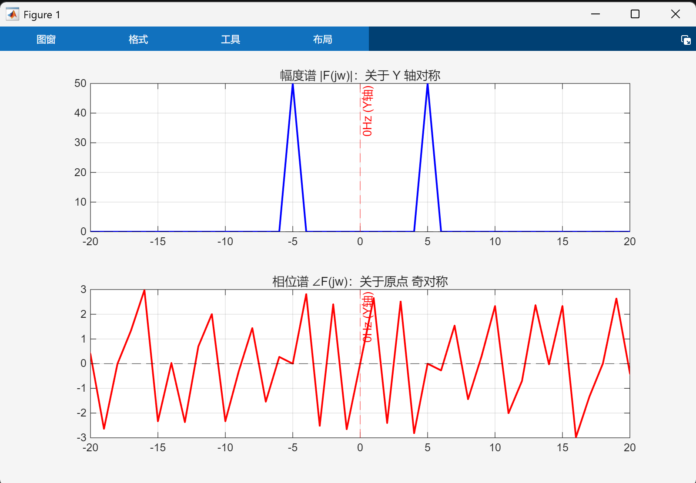
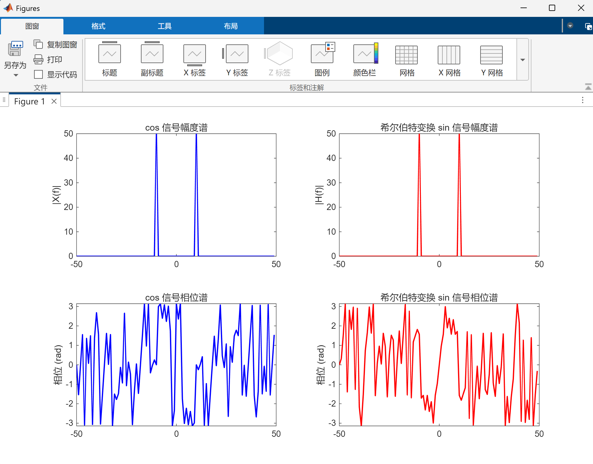
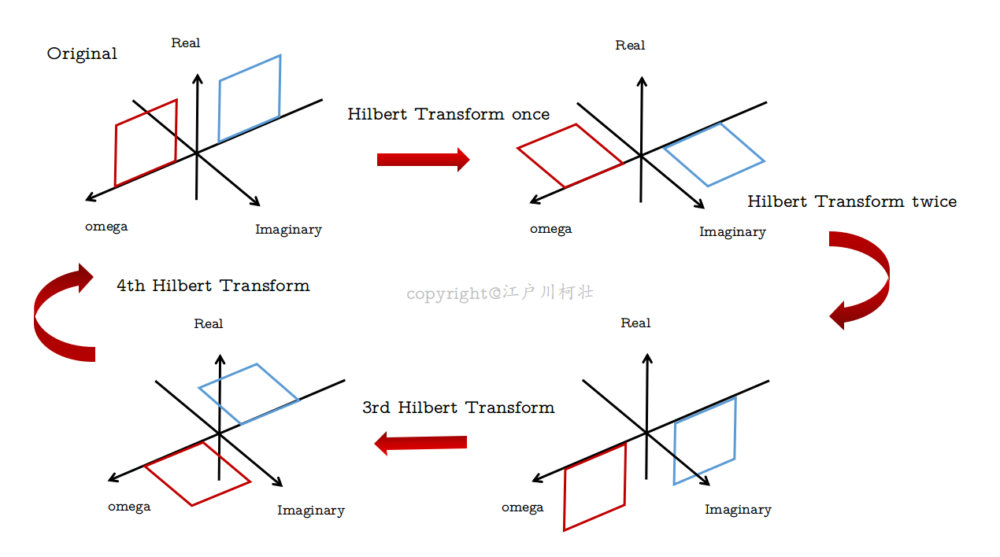

import { Aside } from 'astro-pure/user'

在读论文时看到了这个概念，学习一下。信号与系统的知识都快忘光了...

## 1. 解析信号

已知，实信号$f(t)$的频谱是共轭对称的。也就是说，如果$f(t)$的幅度谱存在$f_{0}$分量，那么也一定存在$-f_{0}$分量

<Aside title="推导">
记$f(t)$的傅里叶变换（$$\mathcal{F}(*)$$）结果为$$F(j\omega)$$，$$f^{*}(t)$$为$$f(t)$$的共轭

根据傅里叶变换，$$\mathcal{F}(f^{*}(t))=F^{*}(-j\omega)$$

由于$f(t)$是实信号，有$$f(t)=f^{*}(t)$$

则$$F(j\omega)=F^{*}(-j\omega)$$

根据共轭的性质，$$F(j\omega)$$和$$F(-j\omega)$$的模长相等（幅度谱关于 0Hz 左右对称），相位相反（相位谱关于原点奇对称）
</Aside>


<p style="text-align: center;font-size: 15px">实信号的频谱</p>

所以当实信号的正谱确定时，负谱也随之确定。因此只需要单边谱即可表示是信号的频率信息。单边谱对应的时域信号通常是一个**复信号**，这个信号就称为**解析信号**，记作$$f_{s}(t)$$

单边谱可以通过将双边谱的负半轴对称叠加到正半轴上获得，即：

$$
F_s(j\omega) = F(j\omega)\left(1 + \text{sgn}\,\omega\right)
=
\begin{cases}
2F(j\omega), & \omega > 0 \\[6pt]
0, & \omega < 0
\end{cases}
$$

对$$F_{s}(j\omega)$$求傅里叶反变换即可得到$$f_{s}(t)$$：

$$f_{s}(t)=f(t)+jf(t)*\frac{1}{\pi t}=f(t)+j\hat{f}(t)$$

将$$f(t)*\frac{1}{\pi t}$$记作$$\hat{f}(t)$$。$$\hat{f}(t)$$就是$$f(t)$$的**希尔伯特变换**

## 2. 希尔伯特变换

信号$$f(t)$$的希尔伯特变换$$\hat{f}(t)=f(t)*\frac{1}{\pi t}$$

频谱函数$$\mathcal{F}(\hat{f}(t))=-jF(j\omega)\text{sgn}(\omega)$$

<Aside title="符号函数 sgn">
$$
\text{sgn}(\omega)
=
\begin{cases}
1, & \omega \geq 0 \\[6pt]
-1, & \omega < 0
\end{cases}
$$
</Aside>

**频域含义**：希尔伯特变换实际上进行了“移相”的操作。对于频率分量为正的部分，使其相位滞后$$90^{\circ}$$；对于频率分量为负的部分，使其相位超前$$90^{\circ}$$

<Aside type="tip">
希尔伯特反变换：

$$f(t)=\hat{f}(t)*(-\frac{1}{\pi t})$$
</Aside>

希尔伯特变换结果：


<p style="text-align: center;font-size: 15px">希尔伯特变换</p>

参考代码：

```matlab
f0 = 10;
fs = 100;
L = 100;
t = (0:L-1)/fs;

x = cos(2*pi*f0*t);
analytic = hilbert(x);
h = imag(analytic);

% FFT + fftshift 得到对称频谱
X = fftshift(fft(x));
H = fftshift(fft(h));
f = (-L/2:L/2-1)*fs/L;

figure('Color','w');

% 1. 幅度谱
subplot(2,2,1);
plot(f, abs(X), 'b','LineWidth',1.5);
title('cos 信号幅度谱');
xlim([-50,50]); ylabel('|X(f)|');

subplot(2,2,2);
plot(f, abs(H), 'r','LineWidth',1.5);
title('希尔伯特变换 sin 信号幅度谱');
xlim([-50,50]); ylabel('|H(f)|');

% 2. 相位谱
subplot(2,2,3);
plot(f, angle(X), 'b','LineWidth',1.5);
title('cos 信号相位谱');
xlim([-50,50]); ylabel('相位 (rad)');
ylim([-pi, pi]);

subplot(2,2,4);
plot(f, angle(H), 'r','LineWidth',1.5);
title('希尔伯特变换 sin 信号相位谱');
xlim([-50,50]); ylabel('相位 (rad)');
ylim([-pi, pi]);
```

最后放一张示意图<sup>[2]</sup>

<p style="text-align: center;font-size: 15px">示意图</p>

参考资源：
- [1][【10分钟速学信号与系统】希尔伯特变换](https://www.bilibili.com/video/BV13qWCznE5d?spm_id_from=333.788.videopod.sections&vd_source=0ea0c7956df75b2935422822b2001158)
- [2][希尔伯特变换（Hilbert Transform）简介及其物理意义](https://blog.csdn.net/edogawachia/article/details/79366444)