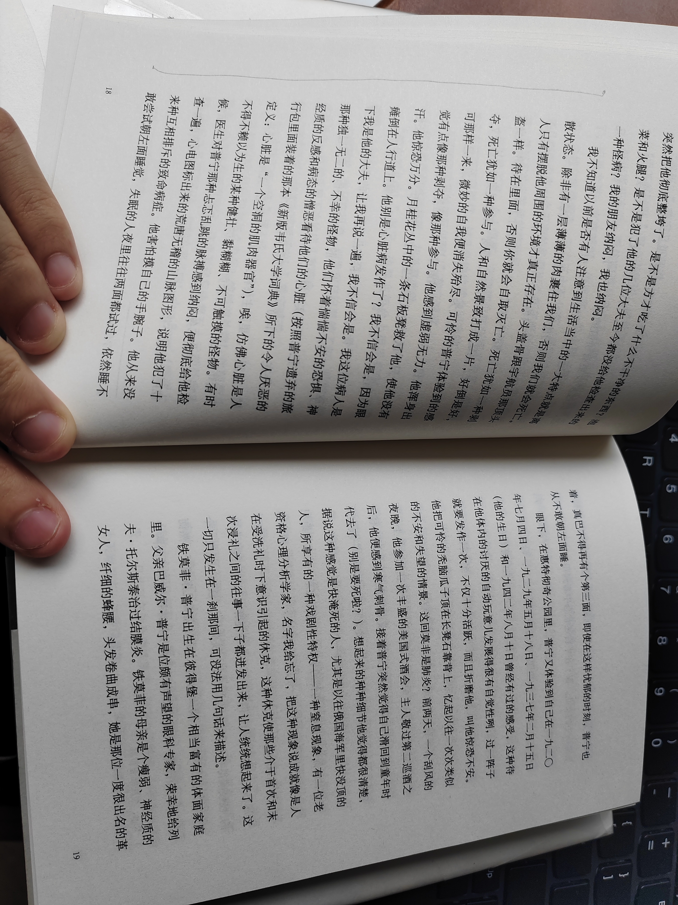
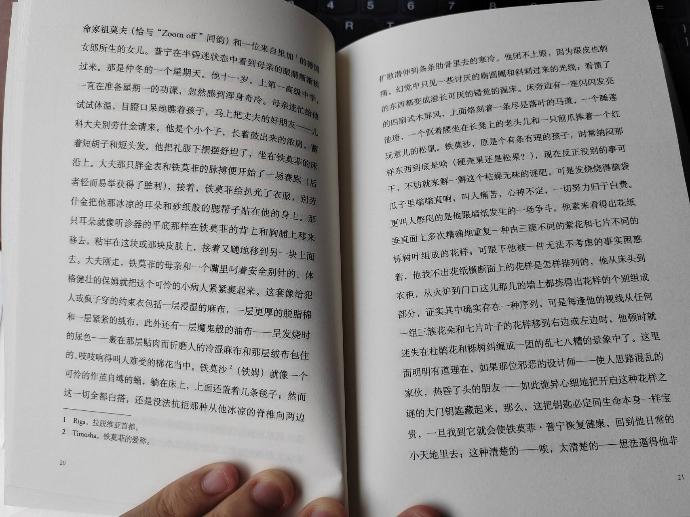
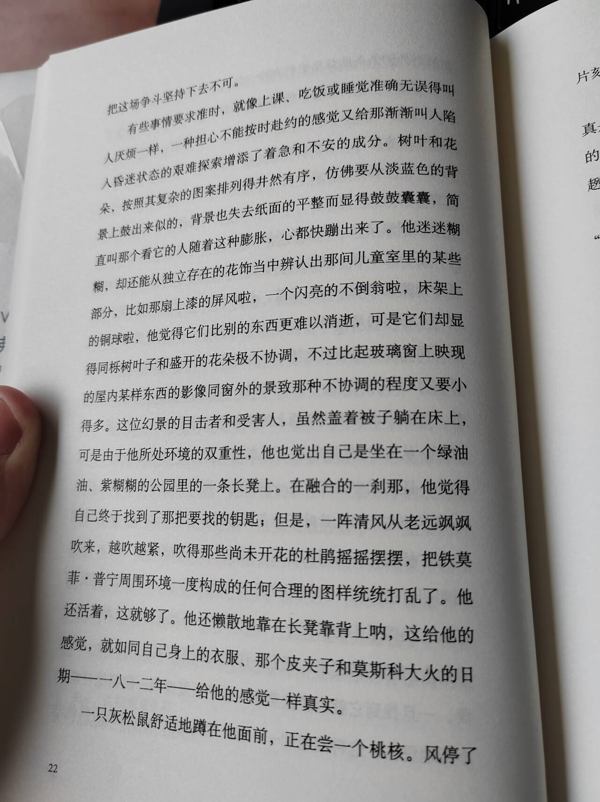

import { Aside } from 'astro-pure/user'

人物表：
- 劳伦斯·格·克莱门茨：温代尔学院的学者
- 琼：劳伦斯的妻子
- 伊莎贝尔：劳伦斯和琼的孩子
- 奥·乔·海姆大夫：劳伦斯和琼的家庭医生
- 罗伯特·特莱博勒博士：温代尔学院音乐系
- 恩特威斯尔教授：戈德温大学
- 安·布劳伦吉：法语系主任
- 查尔斯·麦克白斯：普宁的学生
- 杰克·考克瑞尔：英语系主任
- 贝蒂·勃里斯：普宁协助哈根博士辅导的攻读比较文学方向的研究生
- 丽莎·温德大夫：普宁前妻，精神病学大夫

普宁的流亡形象 —— 纳博科夫的自传性质

利用幻觉将时间点对齐、重合，形成类似于莫比乌斯环的结构，使读者和普宁同时晕眩

语言大量使用长句

