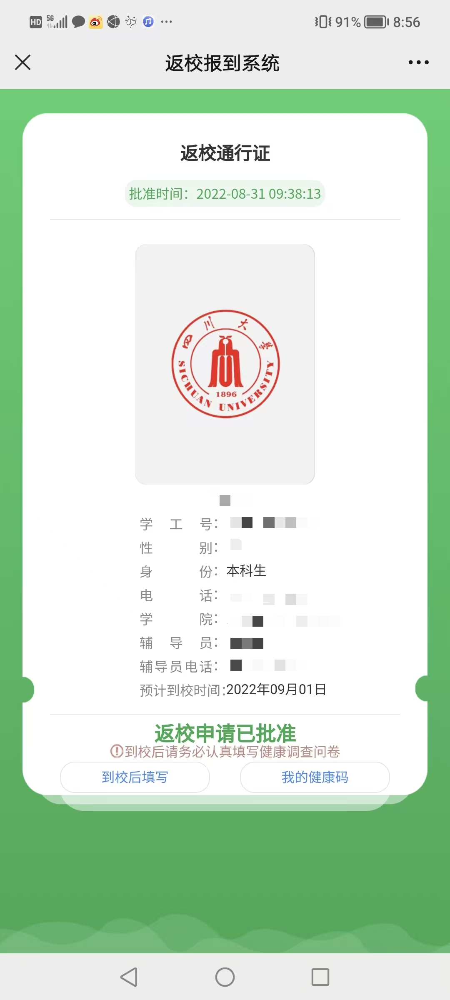
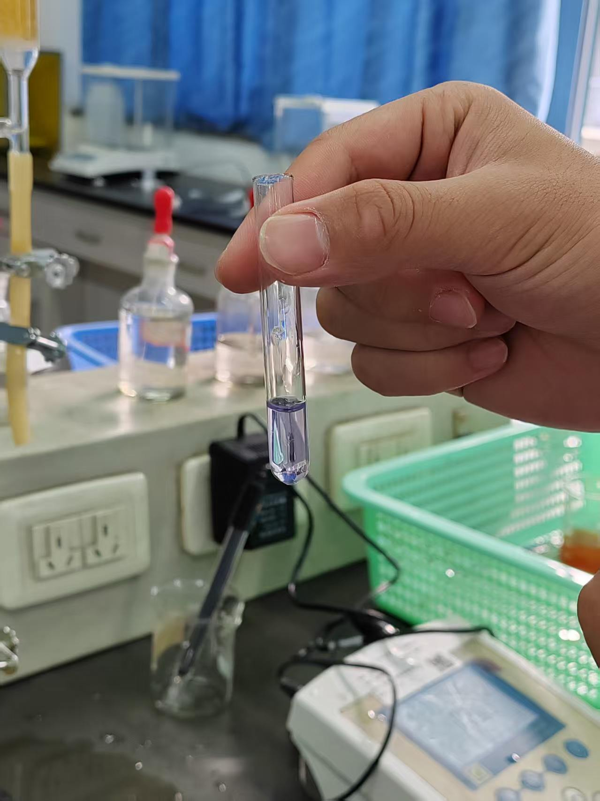
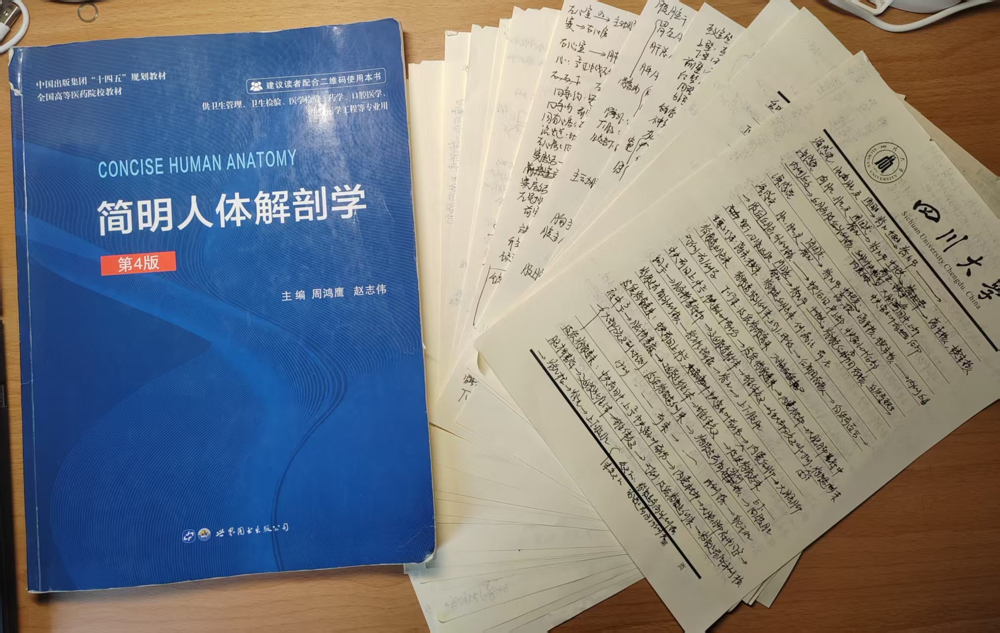
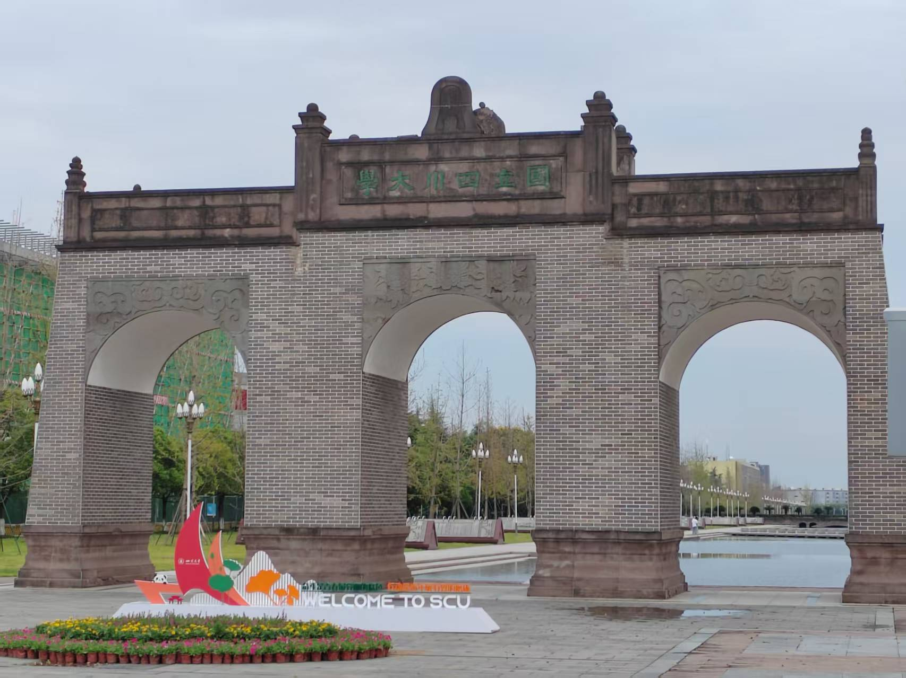
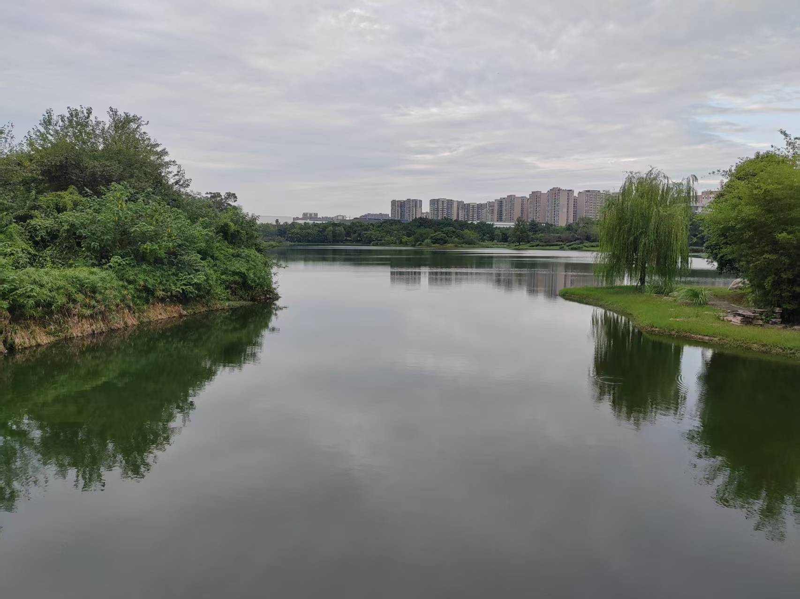
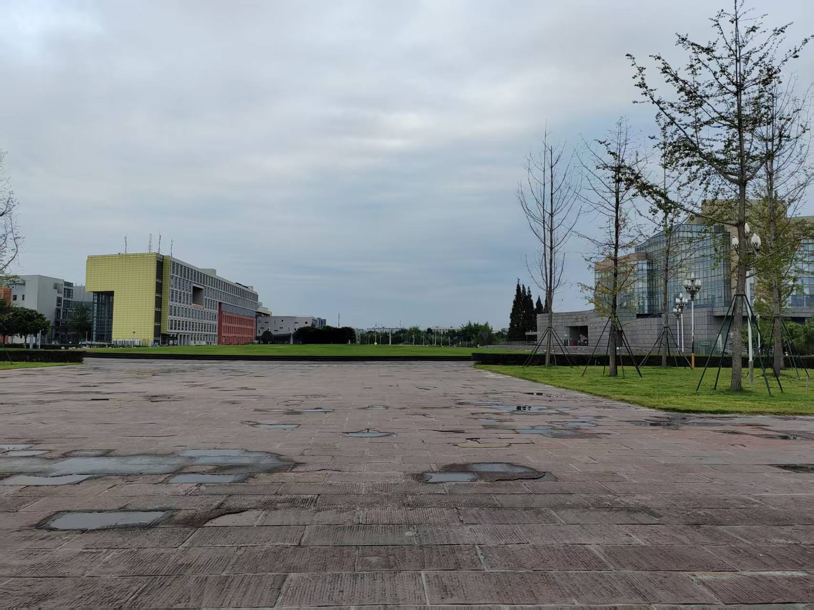

import { Aside } from 'astro-pure/user'

从来没有哪个时刻像现在一样，让我感到时光在真切地流逝。好像上个月才刚刚踏进校门，转眼却要告别这个生活了四年的地方。离别之际，撰此小文留以纪念。

2022 年 9 月，疫情正值尾声。那时的成都还笼罩在新冠的阴影之下，再遇上夏天高温大停电，往日人声鼎沸的春熙路一片寂静。飞机刚降落在天府机场，我们就被拉去做了鼻拭子（之前做的都是咽拭子），然后打车去成都市区。天府机场在简阳市，距离成都市区十分遥远。透过车窗，这个陌生的城市让我感到新奇：爬着藤蔓的南方风格的居民楼，铅灰色的天空，高速上不间断的鸣笛...这就是我对成都的第一印象。受疫情影响，部分市区即将封闭。为避免被隔离而无法报道，我们换了很多家酒店，顺利地在报到日抵达了江安校区。

在上大学前我从未住过集体宿舍，难免有些不适应。再加上江安校区的洗浴设施十分独特：上面是淋浴头，下面是坑位，水龙头还是老式的，我花了几天时间才弄明白怎么用。面对完全陌生的环境和人，心情总是非常低落。不过和高中一起考上来的同学学会了骑自行车，也算是没有浪费时间。

大一刚开始还在上网课，在江安的网球上做核酸。开学第一周就逃课了，当时在上一个关于媒体和传播学的网课，我和室友偷偷跑去打印店打印材料。有关大一的很多记忆都已经缺失，只记得当时学了一门《工程制图》，实在太难，一点也学不会。教微积分的老师一口川普，上课也听不懂。教大学计算机基础的老师讲课时常跑偏，也听不懂他在说啥。除了课业之外，我还加入了围棋社，每周五晚上和棋友们下下棋，确有“闲敲棋子落灯花”的感觉。后来疫情愈发严重，我们上了不到两个月学，十一月份就被遣返回家。在家更没法学习，每天就是打开电脑挂着网课，连期末考试都推到了下学期开学初。大一上学期还学了个口语，上课的是个老外。大一下印象比较深刻的是工程训练，每周最不想上的就是这个课，因为要动手操作，而我动手能力实在有限。这个课每周学习的内容都不一样，从无人机到陶艺什么都有。有一段时间要求用车床（传统的，不是数控车床）切东西，还要打一把锤子，每节课上完都弄一身灰。再就是期末周了，到了大一下我们才真正地体会到了期末周的感觉。由于我平常也跟着学了点，就没觉得这么累。学期结束的时候军训了两周，假期和高中同学去广州、武汉、南京玩了一段时间，大一就这么稀里糊涂地过去了。

那个时候进校还需要通行证

工科化学实验，啥也没学会

大二的时候接任了四川大学围棋协会的会长，除了学业之外还要忙一些社团的事，在干事们的协作下举办了川大大循环、明远杯擂台赛几个赛事，还和隔壁电子科大的棋友交流了一下。学了一门叫《新诗与人生：生命的韵味》的选修课，了解了穆旦、海子、尹丽川一众诗人，在 2023 年末还自己尝试写了一首新诗（图3）。讲课的李怡院长谈吐不凡，给我留下了深刻的印象。这一阶段总去图书馆看小说，精神生活得到了极大的丰富：略萨、科塔萨尔、毛姆、张枣、北岛、苏童、格非、纳博科夫...大二下的系统解剖学学得我相当难受，无比庆幸自己没有学医。总而言之，大二应该是过得最舒服的一年。大二结束时上了两周国际周的水课，就搬去望江校区了。

系解真背不下来啊！

大三时期是小径分叉的花园，我站在岔路口迷茫于每一个可能的选择。本来是打算考研的，但是考研形式实在是不好，便想试试能不能保研。当时我的排名在保研外边缘，能保上真是个奇迹。大三时联系了L老师，想做一篇 SCI 出来加点分，便进了L老师的实验室。那段时间感受到了前所未有的压力：困难的必修课、大创、论文、竞赛一个接一个，每天八点半到十一点十五泡在图书馆，不知道听了多少遍闭馆音乐。磨了六个月，总算把文章发了出来。

大四就基本没有压力了，每天就弄弄毕业论文，等着毕业就行了。毕业论文折腾了挺久，虽然实验早就做的差不多了，但乱七八糟的套表还有一堆。清明前后去北京玩了一圈，还差点进组。不过一周之后就真的要进组了。

原来以为对川大，对成都不会有太多感情。我不喜欢成都连绵的小雨，阴郁的天气，可临别之际却感到依依不舍。无论如何，总要开启下一个篇章了。衷心地祝愿母校，祝愿生物医学工程学院能越来越好吧。

最后在再放几张川大的照片：

江安东门

明远湖畔

教学楼和图书馆

2026 年 6 月 23 日

四川大学望江校区

东园五舍342