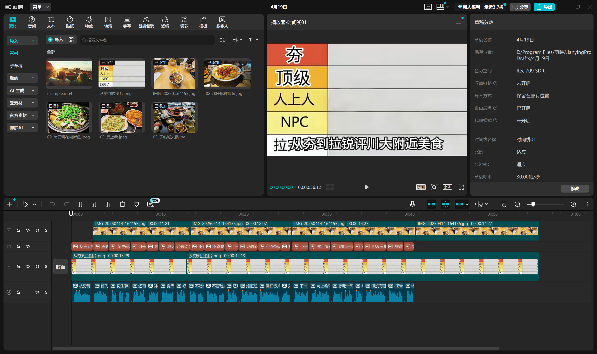

import { Aside } from 'astro-pure/user'

这两天为了准备形势与政策课程的大作业，简单学了一下怎么剪视频。我使用的视频剪辑软件是剪映。这个软件的基础操作比较简单，容易上手，而且功能非常齐全。即使有些功能需要开通VIP才能使用，但在淘宝上也能找到比较便宜的代充/账号租借服务。笔者最后在淘宝上租了一个SVIP账号，租借时长为一天，只花了1.88RMB，还是非常合适的。

我的主题是“从夯到拉锐评川大附近美食”。我没用太多花里胡哨的功能，主要使用了字幕配音和图片切换。简单来说，只要安排好不同时间点上应该出现什么图片、什么字幕，再用软件自带的自动朗读功能就可以了。

最后展示一下剪辑结果吧~

<video controls width="100%" preload="metadata">
  <source src="/从夯到拉锐评川大附近美食.mp4" type="video/mp4" />
  您的浏览器无法播放视频，请检查文件是否存在。
</video>