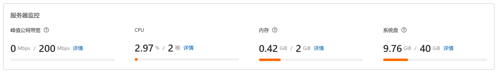
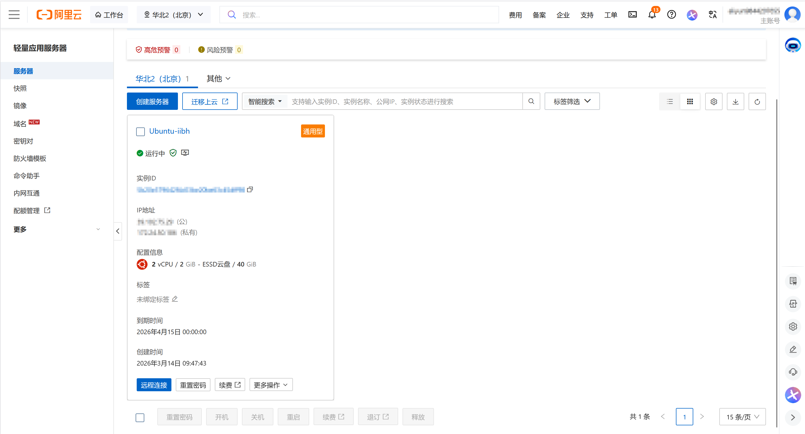
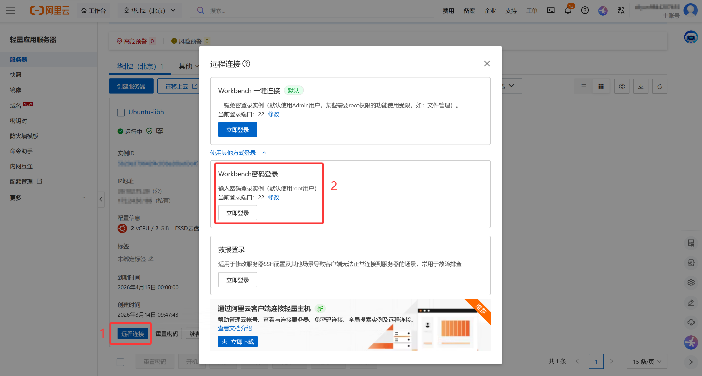
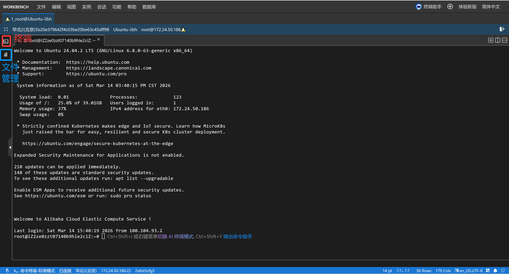
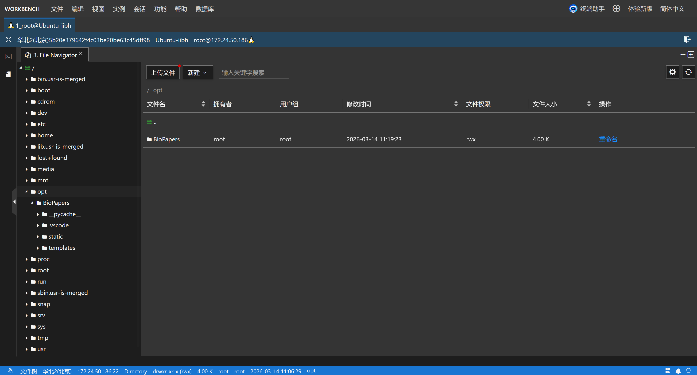
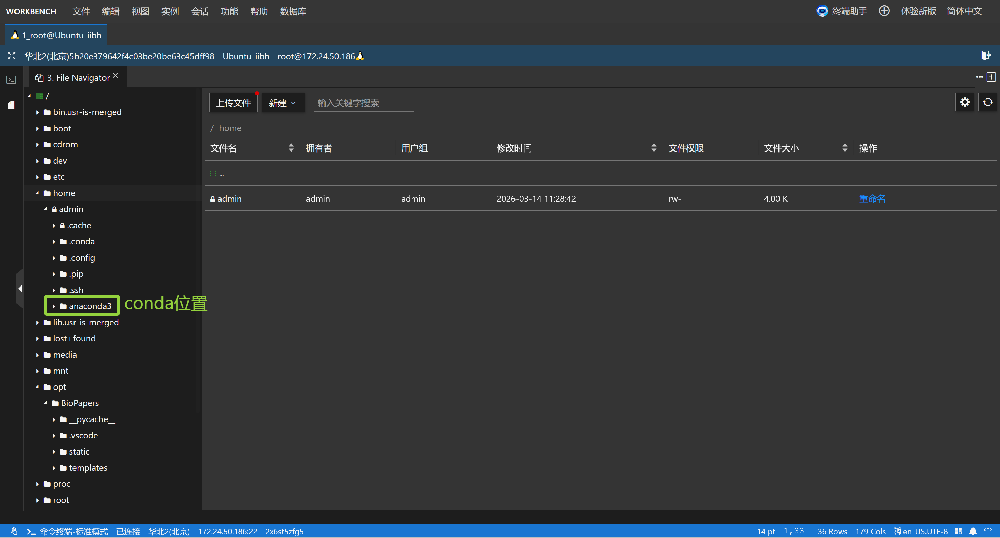
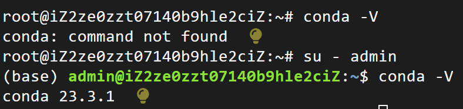
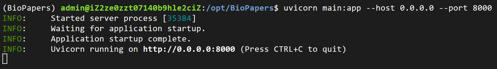
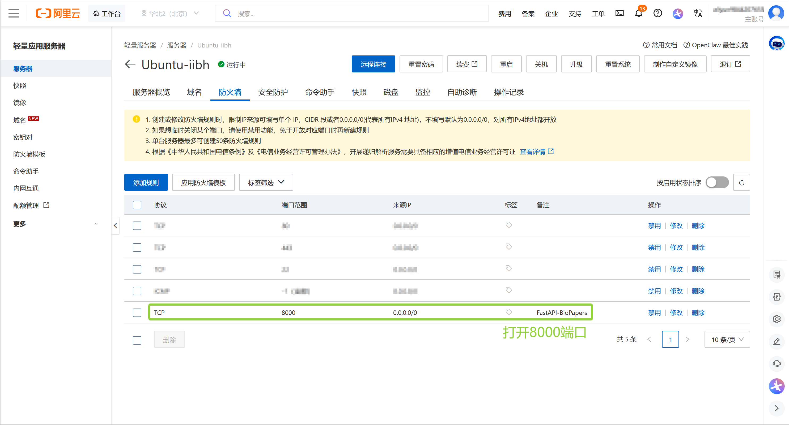
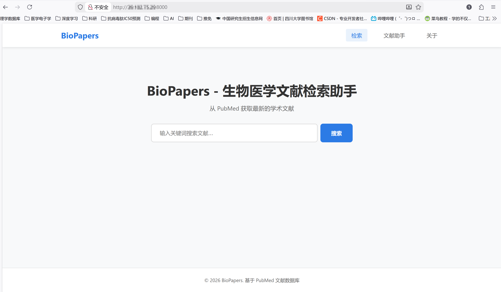

import { Aside } from 'astro-pure/user'

这两天刚好没什么事做，想着把去年暑假开发的生物医学文献检索系统[PaperFinding](https://github.com/WHT0909/PaperFinding)迭代一下，顺便把它部署在服务器上。笔者之前在写论文的时候曾经开发过一个网站，原本想在老师提供的服务器上部署，但最后由于技术欠佳没有完成任务😭，而且急着向出版社交稿，最后干脆提供了 github 的链接作为替代。这次也想趁着这个机会再尝试一下，争取打破心理阴影😂

## 1. 租云服务器

在部署前，笔者已经在本地写好了代码并完成基本的调试工作。想要让别人也能够访问我们的网站，一个简单的流程是：“拥有一台服务器 -> 把程序放在服务器上一直运行 -> 开放对应的端口让别人能访问得到”。当然，后续还有域名绑定等环节，为了方便我们就先省略这些后续的流程了。

服务器可以简单的理解为一台不关机的电脑，只要把程序放在上面就可以一直运行。我们自己使用的笔记本一般都是会关机的，一旦关机，计算机里运行的程序就会停止，只能等到再开机时我们手动运行，十分麻烦。所以第一步就是要先有一台服务器。提供云服务器租借服务的平台有很多，比如阿里云，腾讯云，华为云等。经过价格比较，笔者最终选择了阿里云的 2 核 2G 的云服务器（首月 9.9 元）。在租借服务器时可以选择阿里云提供的一些镜像，比如 Ubuntu，CentOS 等，笔者选择的是 Ubuntu 镜像，服务器信息如下：


<p style="text-align:center;">服务器信息</p>


## 2. 远程连接

选购好之后，可以在控制台里看到我们刚刚购买的实例的具体信息，包括 ID，IP 地址等（这个很重要，一会会用到）


<p style="text-aign:center;">查看控制台</p>

点击下面的“重置密码”进行密码重置，这个密码是我们的 root 权限密码。在准备工作完成之后，我们就可以启动实例了。按照下图的方式操作，在选择连接方式时选择第二个。笔者在这里做了很多尝试，选择第二个是因为这个方式默认使用 root 用户登录，在接下来上传文件时不会出现权限问题。如果使用第一种方式远程连接，还需要用户提升到 root 权限才能上传本地文件（PS：笔者在这里也没有搞明白为什么第一种方式出现了权限问题，还在研究中）。


<p style="text-align:center;">启动实例</p>

在输入密码之后，就可以进入终端页面了。左侧的两个控件分别是终端和文件夹，如下图：


<p style="text-align:center;">终端页面</p>

## 3. 上传代码文件

接下来可以上传我们本地的代码了。上传方法也很简单，点击右侧带红点的“上传文件”就可以了。由于我们现在在 root 权限下操作，应该不会有权限不足的问题。笔者把代码文件上传到了 /opt 这个目录：


<p style="text-align:center;">上传文件</p>

## 4. 运行程序

一切准备就绪后，就可以运行我们的程序了。我的项目是后端 Python FastAPI，前端 HTML + CSS + JS。在此之前我们还需要配置一下环境：我在网上找到了一份 linux 配置 conda 环境的教程，跟着这篇文章操作就可以了：[超详细的linux-conda环境安装教程](https://blog.csdn.net/Alex_81D/article/details/135692506)

由于现在我们的服务器上只有 base 环境，所以需要先创建一个 conda 虚拟环境：

```bash
conda create -n BioPapers python=3.11
conda activate BioPapers
```

在进入 conda 环境后，安装相应的依赖（这里需要提前在本地用 pipreqs 导出所需的依赖放入 requirements.txt）：

```bash
pip install -r requirements.txt
```
<Aside type="caution">
由于我的 conda 是在 /home/admin 下安装的，也就是说 anaconda3 这个目录的位置在 /home/admin 用户下，在使用 root 用户输入 conda 指令时，系统是识别不出来的，会出现`conda: command not found`的报错。可以这么理解：我们在安装 conda 时，是为 admin 用户安的，其他的用户是用不了的，而 root 也只是用户的一个，所以他也用不了其他用户的 conda。
</Aside>


<p style="text-align:center;">conda位置</p>

解决方法也很简单：切换回那个安装了 conda 的用户就可以了：

```bash
su - admin
```


<p style="text-align:center;">切换为admin用户</p>

接下来切换目录到项目文件夹，运行 FastAPI 程序：

```bash
uvicorn main:app --host 0.0.0.0 --port 8000
```

这段代码的意思是：`uvicorn`相当于网站的启动器；`main:app`里的`main`指的是项目的入口文件 main.py，`app`对应着代码里的`app = FastAPI()`，合起来表示运行 main.py 里的 FastAPI 应用；`--host 0.0.0.0`表示允许任何 IP 访问你的网站；`--port 8000`表示网站运行在 8000 端口。如果想让程序一直在后台运行，可以这么写：

```bash
nohup uvicorn main:app --host 0.0.0.0 --port 8000 > server.log 2>&1 &
```


<p style="text-align:center;">运行FastAPI程序</p>

在访问之前，我们还需要在控制台打开我们的 8000 端口，这样别人才能访问的到：


<p style="text-align:center;">打开8000端口</p>

最后，找到我们的主机 IP 地址（注意是公有 IP 不是私有 IP），在浏览器输入：`http://your_ip:8000`即可访问😊注意是 http 不是 https


<p style="text-align:center;">成功访问</p>