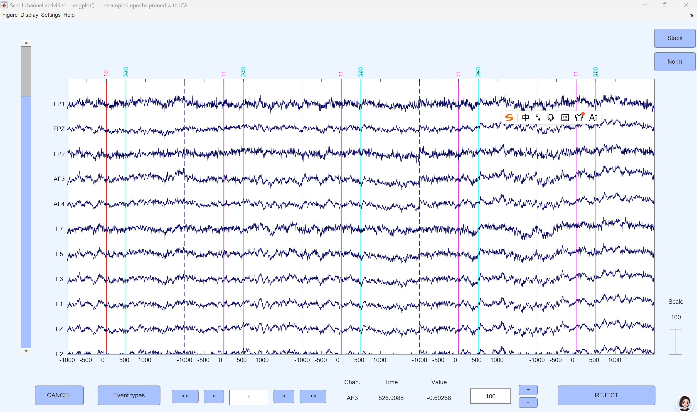
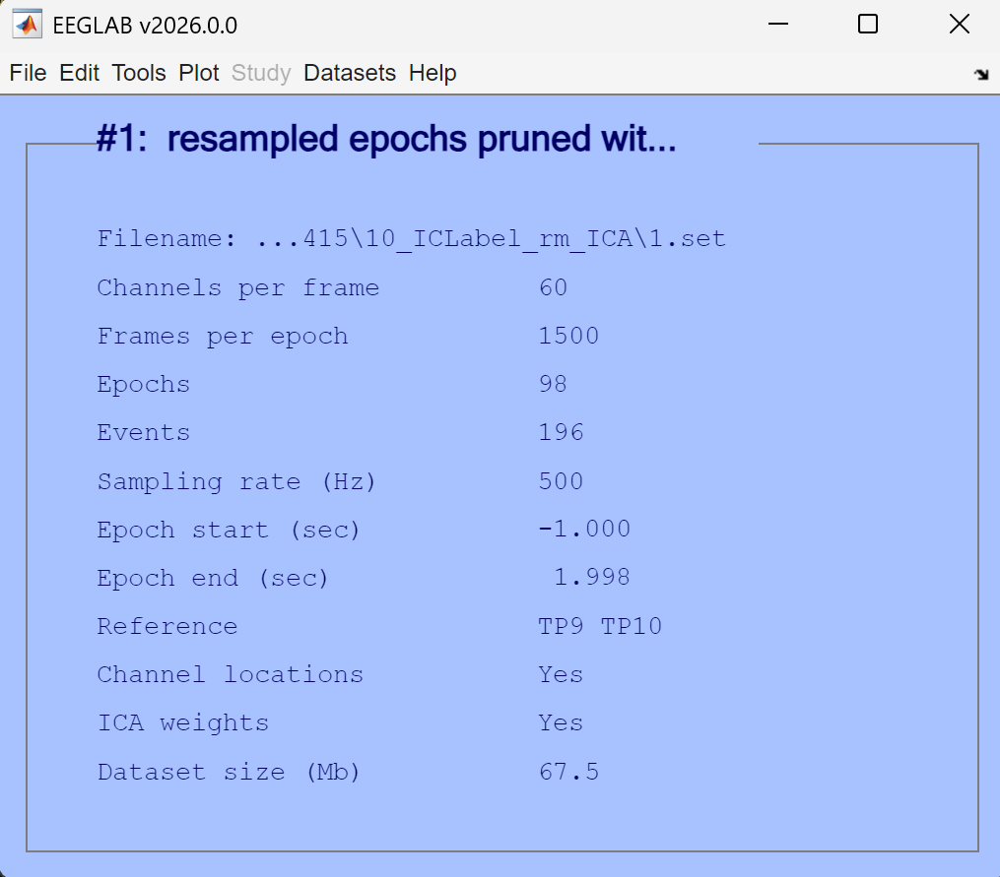
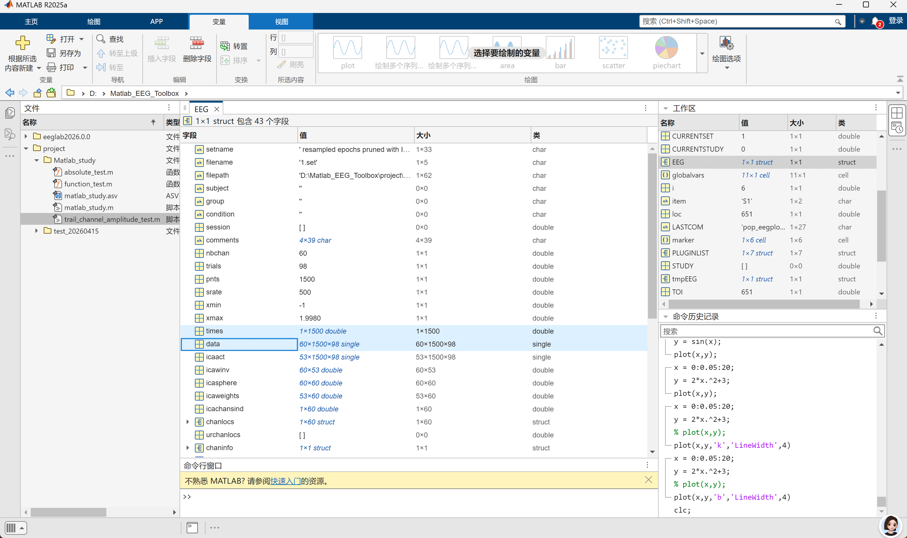
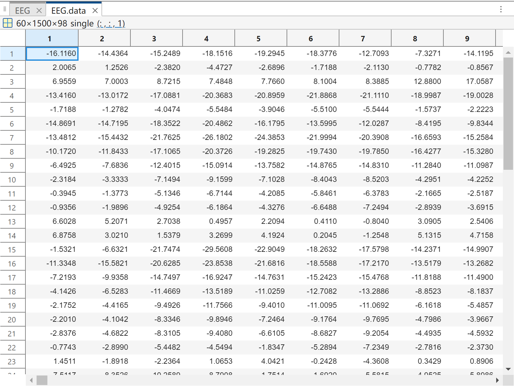
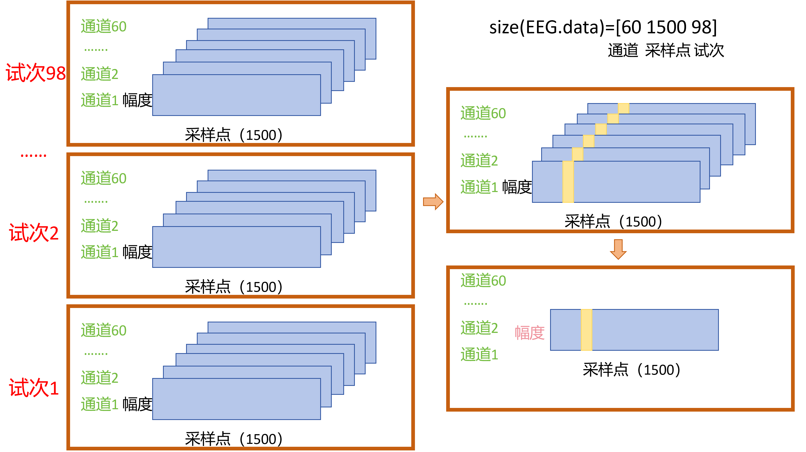

import { Aside } from 'astro-pure/user'

{/* <font size="2">封面摄影作品：Masao Yamamoto([https://www.zhiweiye.com/shan-ben-chang-nan](https://www.zhiweiye.com/shan-ben-chang-nan))</font>
<br/>
<br/> */}

最近在学习EEG信号的预处理，主要是和EEGLAB相关的一些操作。在听[网课](https://www.bilibili.com/video/BV1Gg4y1G7pP?spm_id_from=333.788.videopod.sections&vd_source=0ea0c7956df75b2935422822b2001158)的时候，老师提到了这样一个问题：<strong>在EEGLAB加载数据后，如何在matlab中编写代码来提取出第二个通道第300ms的平均幅值？</strong>当时在这个部分卡住了很久，代码本身难度并不大，只有三四行；但其中的概念很容易搞混。这篇博客将记录解决这个问题的过程。

## 1. 概念辨析：试次、通道与采样点
首先要解决的问题是：这三个名词是什么意思？在BCI研究的过程中，我们通常使用脑电帽从头皮上提取脑电信号（EEG），并对提取出的信号做各种处理。脑电帽通常如下图所示：


<p style="text-align:center;">脑电帽（百度图片里随便找的）</p>

脑电帽上分布有很多电极，他们的排列方式通常依据“10-20国际标准导联系统”<sup>[1]</sup>。头皮上贴的一个电极，就代表一个**通道(channel)**。脑电采集系统通过电极捕捉大脑活动过程中传递到头皮上的电信号，每个电极位置捕捉到的电压随时间变化，在波形上表现为一条“时间-幅度”曲线。由于时间是一个连续变量，在一段时间内，系统只能做有限次测量。也就是说，采集系统会**每隔一段时间采集一次数据**。系统每做一次采集，就称为进行了一次**采样（sample）**。单位时间内（1s）采集的次数，就称为采样率，单位为赫兹（Hz）。例如1000Hz的采样率，就意味着每秒钟采集1000次数据，也就是1ms采集一次数据。最终采集到的脑电信号类似于下图。左侧的（FP1、FPZ...）代表通道，这里展示了10个通道的数据。


<p style="text-align:center;">脑电图</p>

在EEG研究中，给大脑一个刺激，大脑就会产生一个电信号，这个过程称为一个**试次（trial）**。举个例子来说明：人眼每看到一张图片（刺激），大脑会产生一个电信号，这是一个试次；实验过程中一共看到了五十张图片，就是五十个试次。由于事件激发的脑电信号（事件相关电位，ERP）比较微弱，通常需要多个试次叠加平均才能看到清晰的ERP波形。

## 2. 如何提取特定条件下的平均幅值
回到最初的问题：如何在matlab中编写代码来提取出第二个通道第300ms的平均幅值？要解决这个问题，就要先知道试次、通道、幅值、时间这些变量在EEGLAB中是如何存储的。这里我已经提前加载好数据了，我的数据集如下：


<p style="text-align:center;">数据集</p>

在matlab的工作区中，找到EEG这个结构体，双击点开，可以看到其中有很多的字段。我们主要使用的是*EEG.times*和*EEG.data*。*EEG.times*是一个$1\times 1500$的行向量，代表了1500个采样点，和上图数据集中显示的相符。*EEG.data*的大小是$60\times 1500\times 98$。他们代表的含义非常关键：**60代表60个通道，1500代表有1500个采样点，98代表有98个试次**。每个索引对应的值就是EEG信号的**幅度**。


<p style="text-align:center;">工作区</p>


<p style="text-align:center;">EEG.data</p>

分析到这里，我们可以画出一个EEG信号的示意图。要想提取出第二个通道第300ms的平均幅值，我们只需要先把所有试次中的第二个通道全部拿出来，取一个平均，再锁定300ms处的值就可以了。当然，我们也可以直接对所有试次做一个平均（就像上面说的对ERP的处理一样），再锁定第二个通道和第300ms处的数值。这两种方法对应的代码不同，但思路是一样的。


<p style="text-align:center;">示意图</p>

matlab代码如下：
```matlab
clc;clear;
eeglab;
% 这里需要手动加载数据集
% 在matlab中编写代码来提取出第二个通道第300ms的平均幅值
% method1: 先处理第二个通道
TOI = find(EEG.times == 300); % 找300ms对应的索引值。TOI（Time Of Interest）意思是感兴趣的时间点/时间窗口
ans = squeeze(mean(EEG.data(2, TOI, :), 3));

% method2: 先得到ERP
avg_erp = squeeze(mean(EEG.data, 3));
TOI = find(EEG.times == 300);
ans = avg_erp(2, TOI);
```

参考文献与脚注

[1] 10-20系统电极放置法是国际脑电图学会规定的标准电极放置法。额极中点至鼻根的距离和枕点至枕外粗隆的距离各占此连线全长的10％，其余各点均以此连线全长的20％相隔，因此命名为10-20系统。来源：[10-20国际标准导联系统](https://zhuanlan.zhihu.com/p/101329490)