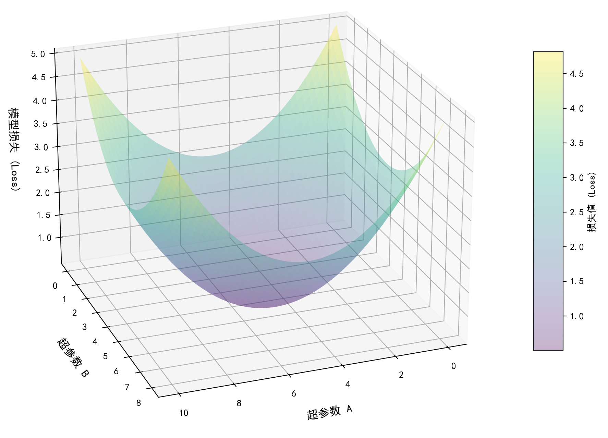
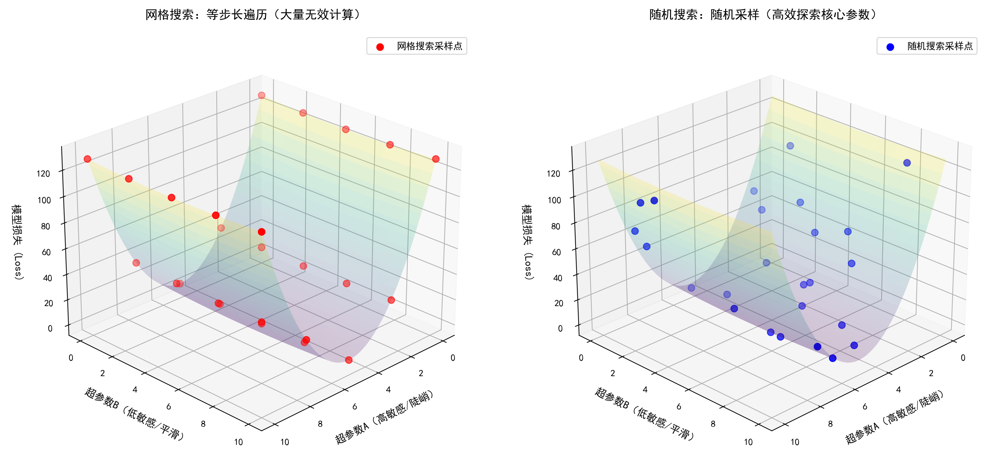
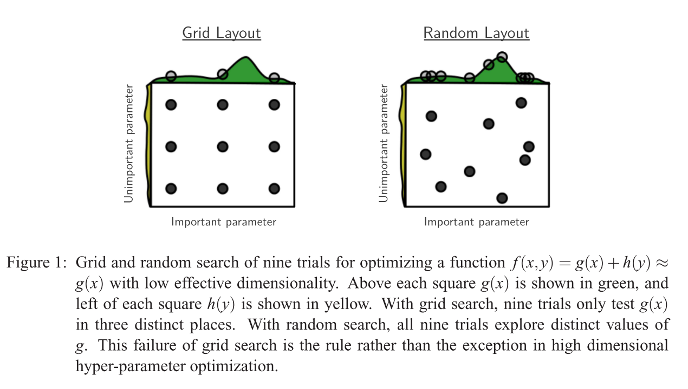

在先前的博客“scikit-learn学习：随机森林”中，我们简要提及了网格搜索。在本系列中，我们将介绍几种超参数优化方法，帮助模型取得更高的性能。作为该系列的第一篇文章，本文会结合原理和代码阐述两种重要的超参搜索方法：网格搜索和随机搜索。


## 1. 前言

机器学习（Machine Learning）通过在大量数据上训练模型，寻找从输入空间（Input）到输出空间（Output）的最优映射，以完成对未知数据的分类或回归任务。模型训练的过程，即是调整模型内部参数以拟合数据的过程。不同机器学习算法具有不同的参数（Parameters），一部分参数无需提前设置，模型将在训练的过程中自主学习最佳的参数组合，例如卷积神经网络（CNN）中的卷积核权重（Weight）；另一部分参数则需要人为设置，称为超参数（Hyperparameters）。超参数用于控制模型的行为，如深度学习算法中的训练周期（Epoch）、学习率（Learning Rate）等。传统的机器学习算法，如支持向量机（SVM），随机森林（RF），分别具有不同的超参数。超参数优化旨在寻找最佳的超参数组合，最大化发挥模型的性能。在该领域的早期研究中，主要通过手动方法寻找最佳的超参数组合，但该方法过于依赖领域经验，且人工搜索的迭代次数十分有限，很难找到数学意义上的最佳组合<a href="#note1">[1]</a>。为解决这一问题，后续研究基于不同的思想提出了一系列的超参数搜索方法。本文将总结两种最常用的超参数搜索方法：网格搜索和随机搜索。值得注意的是，本文的分析对象主要是**有监督学习中的单目标优化**任务，对多目标优化中的粒子群算法（PSO）、遗传算法（GA）等暂不做探讨。

## 2. 网格搜索（Grid Search）

网格搜索（Grid Search）是最简单、最常用的超参数搜索方法。只需在程序中提前设置参数网格，通过穷举每种参数组合训练模型即可实现超参数优化。但这种方法也有明显的缺点：网格搜索浪费了大量的计算资源和计算时间<a href="#note2">[2]</a>。随着参数量的增加，搜索的次数和计算的时间将发生指数级的增长。因此，网格搜索只适用于模型较为简单、参数量较少的情况。但由于其简单性，目前仍是最为主流的调参方法之一。

下面我们将以随机森林模型为例，通过网格搜索寻找最佳的参数组合。在 sklearn 库提供的 GridSearchCV 接口中，需要指定几个必须的参数：机器学习算法的实例`estimator`、搜索网格`param_grid`和优化指标`scoring`，其中搜索网格需要以字典形式给出。

```python
param_grid = {
    'n_estimators': [50, 100, 200],
    'max_depth': [None, 5, 10, 15],
    'min_samples_split': [2, 5, 10],
    'max_features': ['sqrt', 'log2']
}

grid_search = GridSearchCV(
    estimator=RandomForestClassifier(random_state=42),
    param_grid=param_grid,
    cv=5,
    scoring='accuracy',
    n_jobs=-1
)

grid_search.fit(X_train, y_train)
```

## 3. 随机搜索（Random Search）

当模型的参数空间维度过高时，逐一进行网格搜索将导致严重的计算开销：若某个模型的可调超参数有$m$个，每个超参数有$n$种可能的选择，则网格搜索所需的计算次数为$n^{m}$次。随着参数空间维度的增加，计算次数大幅提升。为解决计算量过大的问题，随机搜索（Random Search）应运而生。随机搜索的核心思想是在参数空间中<strong>随机采样</strong>，通过人为约束迭代次数，在限制计算量的同时完成模型优化。随机搜索的有效性已在各种算法中得到验证：2012 年，Bergstra 等人证明在高维参数空间中随机搜索比网格搜索更有效<a href="#note3">[3]</a>；2015 年，Mantovani 等人在训练 SVM 时利用随机搜索降低计算次数，得到了和网格搜索及其他更复杂的调优技术相似的模型性能<a href="#note4">[4]</a>。

随机搜索在 sklearn 中的接口是 RandomizedSearchCV。和 GridSearchCV 相似，RandomizedSearchCV 的核心参数包括估计器`estimator`、参数字典`param_distributions`和迭代次数`n_iter`。其中`param_distributions`的写法与 GridSearchCV 中相似，甚至可以完全照搬上面代码中的`param_grid`，但区别在于：`param_distributions`中允许设置可调参数范围为<strong>连续值</strong>，如指数分布（关于这方面的详细介绍见 sklearn 官方文档用户指南中“3.2.2. 随机参数优化”一节<a href="#note5">[5]</a>）。`n_iter`指定了进行交叉验证时的迭代次数，简单来说，若将`n_iter`设置为 10，则`cv_results_["params"]`将会包含十个列表，即整个训练过程一共尝试 10 种超参数的组合。

```python
param_dist = {
    'n_estimators': range(50, 201, 1),
    'max_depth': [None, 5, 10, 15],
    'min_samples_split': [2, 5, 10],
    'max_features': ['sqrt', 'log2']
}

grid_search = RandomizedSearchCV(
    estimator=RandomForestClassifier(random_state=42),
    param_distributions=param_dist,
    n_iter=20,
    cv=5,
    scoring='accuracy',
    n_jobs=1
)

grid_search.fit(X_train, y_train)
```

### 3.1 随机搜索的数学原理

读到这里，想必细心的读者会产生这样的疑问：随机搜索只是在整个参数空间随机选点，为什么这种极强的随机性不会对调参产生负面影响，反而能找到较好的参数组合呢？Bergstra 等人的工作对这个问题做出了解答<a href="#note3">[3]</a>。实际上，模型优化的过程可由下式表示：
$$
\lambda^{(*)} \approx \underset{\lambda \in \Lambda}{\operatorname{argmin}} \Psi(\lambda)
$$
其中$\lambda$表示超参数，$\Psi(\lambda)$是超参响应函数（Hyper-parameter Response Function）。我们的目标是寻找能使得$\Psi(\lambda)$最小的$\lambda$。我们可以想象这样一个画面，一个简化的模型仅有两个超参数，则整个区域是一个三维空间：x 轴和 y 轴分别表示超参数 A 和 B，z 轴表示某种损失（Loss），也就是上式中的$\Psi(\lambda)$。那么三维空间中的某个曲面（我们暂且认为这个曲面是连续光滑的）便包含了所有的参数组合以及对应的模型损失（见下图，这种可视化同样可以通过二维笛卡尔坐标系中的热力图显示）。我们的目标就是找到这个 Loss 曲面的最低点，它对应着一组超参数。更高维的情况同样如此，只是可视化变得更加困难。事实上，$\Psi(\lambda)$对某些维度比其他维度更加敏感，也就是说总有一些参数比另一些参数更加重要。


<p style="text-align: center">参数空间可视化</p>

铺垫至此，我们可以阐述随机搜索的数学意义了。在可视化图中，我们可以想象这个曲面在某些方向（如向 XOZ 平面的投影）上十分陡峭，而在另一些方向（如向 YOZ 平面的投影）上十分平滑。如果在两种方向上用相同的尺度进行衡量，就必然会出现下面这种情况：在向 XOZ 平面的投影上，模型的超参数 A 只要轻微移动，就会大幅影响模型的性能；而在向 YOZ 平面的投影上，模型的超参数 B 需要较大的移动步长才能让模型的性能有些许变化。这种调整步长的不一致性对网格搜索造成了巨大的影响：在网格搜索过程中，由于需要遍历全部的参数组合，会出现许多“同样的重要参数 A 对应不同的不重要参数 B”的计算，而这种计算显然是无法有效提高性能的 —— 真正的性能决定因素由 A 掌控。而随机搜索借助“随机性”解决了这个问题：正因为选点的随机，在有限的迭代次数内会有更多的重要参数被尝试。


<p style="text-align: center">网格搜索与随机搜索比较</p>

在论文的原文中，作者给出了一个二维可视化的示意图，也一并放在这里了。其实和上面的图是一个意思，读者可以加深理解：


<p style="text-align: center">二者比较的二维可视化</p>

## 4. 小结

这篇博客主要介绍了两种重要的调参策略：网格搜索和随机搜索，并结合数学原理以及代码给出了较为全面的解答，如有错误敬请指正。欢迎交流讨论！

相关资源和参考文献

- [1]&nbsp;&nbsp;A. Priyanshu, R. Naidu, F. Mireshghallah, and M. Malekzadeh, “Efficient Hyperparameter Optimization for Differentially Private Deep Learning,” Aug. 2021, [Online]. Available: http://arxiv.org/abs/2108.03888
- [2]&nbsp;&nbsp;A. R. M. Rom, S. Ibrahim, A. F. A. Fadzil, N. N. A. Mangshor and N. A. M. Ghani, "A Review of Hyperparameter Tuning ethods in Machine Learning," 2025 6th International Conference on Artificial Intelligence and Data Sciences (AiDAS), West Java, Indonesia, 2025, pp. 1-6, doi: 10.1109/AiDAS67696.2025.11213530.
- [3]&nbsp;&nbsp;Bergstra J , Bengio Y .Random Search for Hyper-Parameter Optimization[J].Journal of Machine Learning Research, 2012, 13(1):281-305.DOI:10.1016/j.chemolab.2011.12.002.
- [4]&nbsp;&nbsp;R. G. Mantovani, A. L. D. Rossi, J. Vanschoren, B. Bischl and A. C. P. L. F. de Carvalho, "Effectiveness of Random Search in SVM hyper-parameter tuning," 2015 International Joint Conference on Neural Networks (IJCNN), Killarney, Ireland, 2015, pp. 1-8, doi: 10.1109/IJCNN.2015.7280664.
- [5]&nbsp;&nbsp;sklearn 官方文档中关于随机搜索的说明（3.2.2. 随机参数优化），链接：https://scikit-learn.cn/stable/modules/grid_search.html